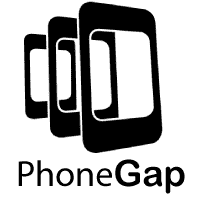
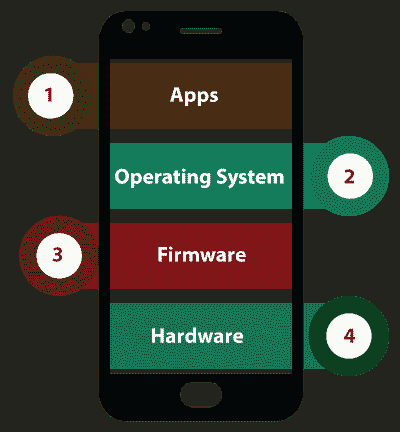
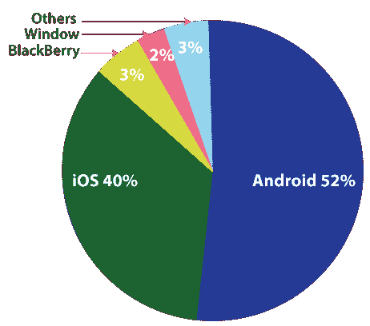
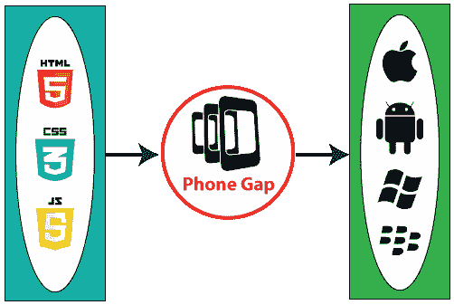

# PhoneGap 教程

> 原文：<https://www.javatpoint.com/phonegap>

我们的 **PhoneGap 教程**是为希望知道如何使用 **PhoneGap** 设计跨平台应用的有志之士设计的。我们的教程涵盖了 PhoneGap 的所有基本概念，包括环境设置、用户界面、存储、地理定位等等。

一种用于跨平台移动应用开发的技术被称为 **PhoneGap** 。 **PhoneGap** 是一个开源的移动应用框架。它允许开发人员使用标准的 web APIs 开发应用程序。 **PhoneGap** 是由 **Nitobe 软件**开发的，被称为 **Adobe** 。

## 什么是 PhoneGap

软件工程的一场新革命始于手机、手持设备和易于携带的设备。这些设备效率高，体积小。这些设备能够运行那些通过高端编程语言设计的应用程序。移动设备架构类似于计算机系统的架构。手机架构包含**应用操作系统固件**、**硬件**。

从图中这四项来看，**操作系统固件**、**硬件**大多是版权。这三个项目是在一个旗舰组织下组装、开发和设计的。应用软件由组织外部和旗舰组织的开发人员设计和开发。

公认的移动操作系统有专有和开源两种。这些是最广泛使用的移动系统:

*   机器人
*   IOS
*   黑莓
*   Windows 操作系统

每个移动操作系统都有自己的开发应用程序的环境和工具。缺点是为一个操作系统开发的应用程序无法在另一个操作系统平台上运行。原因是他们彼此完全不同。为了增加用户之间的可达性，开发人员试图覆盖所有主要的移动操作系统。

设计一个可以在所有主要操作系统上运行的应用程序是非常典型的。我们还必须在所有平台上保持它的感觉、外观和功能相同。为了设计这样的应用程序，开发人员应该了解所有平台和每个操作系统的主要开发工具。

## 什么是 PhoneGap

一种用于跨平台移动应用开发的技术被称为 **PhoneGap** 。上面我们看到的所有问题都可以通过 **PhoneGap** 轻松解决。 **PhoneGap** 是一个开源的移动应用框架。它允许开发人员使用标准的 web APIs 开发应用程序。 **PhoneGap** 由 **Nitobe 软件**开发，被称为 **Adobe** 。

对于开发跨平台应用，开发者应该具备使用 **[HTML](https://www.javatpoint.com/html-tutorial) [CSS](https://www.javatpoint.com/css-tutorial)** 和 **[JavaScript](https://www.javatpoint.com/javascript-tutorial)** 进行 web 开发的知识。其余的工作，像应用的感觉、可移植性和外观，由 **PhoneGap** 维护。

**PhoneGap** 允许我们为最受欢迎的操作系统开发应用程序，比如**安卓 IOS Windows** 和**黑莓**。也不需要在任何平台上拥有专业知识。如果我们不知道如何编程来从头开始编写应用程序，那也没什么大不了的。

通过使用 PhoneGap，网站上传的数据内容会自动转换成各种 App 文件。

以下原因使得 **PhoneGap** 对于构建跨平台应用程序非常重要:

1.  **我们发展不需要额外的训练。**
    使用 PhoneGap 开发应用，不需要学习任何新的编程语言。 **PhoneGap** 使用的是标准语言和技术，即 **HTML CSS** 、 **JavaScript** 。
2.  **允许开发多个设备**
    通过使用标准技术， **PhoneGap** 可以与多个设备协同工作。**JavaScript API**在不同平台上是一致的。
3.  **允许我们专注于功能**
    通过使用 PhoneGap，我们可以使用最新版本的原生 SDK。没有必要对每个平台单独更新软件开发工具包。
4.  **提高协作**
    为了达到最终的结果，团队成员以协作的方式利用他们的优势。
5.  **轻松快速部署**
    我们可以快速将我们的应用部署给用户，因为使用 PhoneGap 开发节省了更多时间。
6.  **应用程序的轻松共享**
    通过使用 PhoneGap Build，我们可以在应用程序开发完成后立即进行共享。我们通过向家人、朋友和同事发送链接来共享该应用程序。

## 先决条件

PhoneGap 是一个设计跨平台应用的框架。用户应该具备使用 HTML、CSS 和 JavaScript 进行网络开发的知识。

## 观众

本教程对那些有兴趣了解我们如何设计跨平台应用程序以及 **PhoneGap** 对此有何帮助的学生或新生很有帮助。

## 问题

我们保证您不会发现这个 **PhoneGap 教程**有任何问题。但是如果有任何错误，请在联系表格中发布问题。

* * *