# PhoneGap 安装

> 原文：<https://www.javatpoint.com/phonegap-installation>

## 桌面应用程序

开发人员喜欢那些为创建应用程序提供拖放界面的桌面应用程序和框架。开发人员发现使用拖放界面很容易。 **PhoneGap 桌面应用**就是这样一类应用。 **PhoneGap 桌面应用程序**是 **PhoneGap 命令行界面**的替代方法。它是为那些喜欢可视化界面而不是命令行界面的用户设计的。

安装 PhoneGap 的桌面应用，首先要选择操作系统，即**Mac OS X**[T3】WindowsT5。以下是在两个操作系统上安装 **PhoneGap** 应用程序的分步过程。](https://www.javatpoint.com/windows)

## Windows:

以下是在 Windows 上安装 **PhoneGap** 应用程序的步骤:

### 1)下载设置

在第一步中，我们将通过点击[窗口安装程序](https://github.com/phonegap/phonegap-app-desktop/releases/download/0.4.5/PhoneGapSetup-win32.exe)来下载**手机间隙**设置。

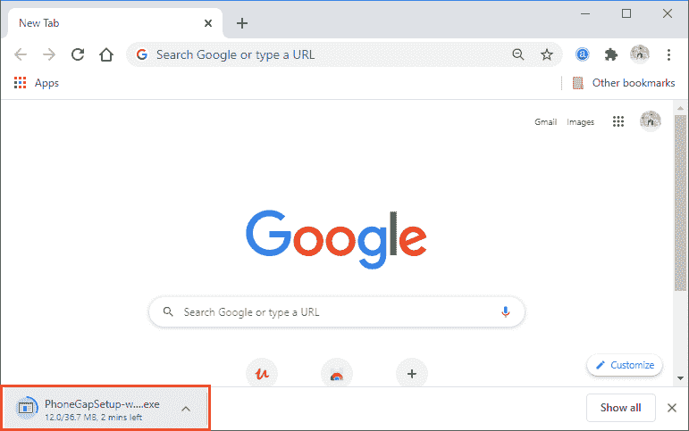

### 2)运行设置

我们双击下载的可执行文件运行 **PhoneGap** 的设置。双击将提示我们使用 **PhoneGap 桌面设置向导**，并要求我们接受许可协议。接受许可协议后，我们将点击弹出框右下角的**下一步**按钮。

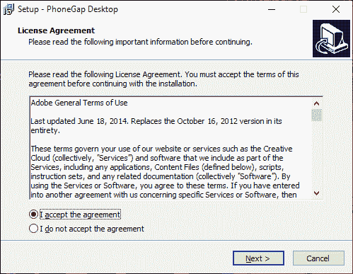

### 3)选择位置

单击“下一步”后，将打开一个新的弹出框来选择目标位置。我们将浏览文件目录，为应用程序选择所需的目标。之后，我们将点击**下一步**。

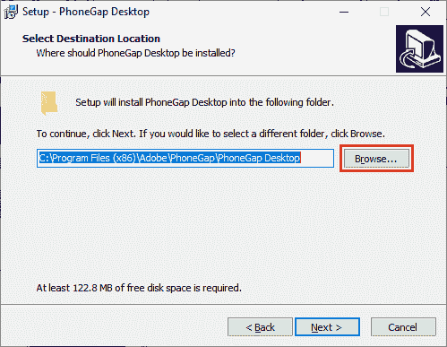
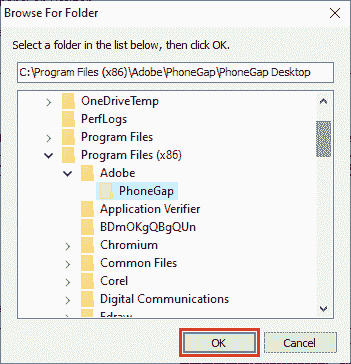
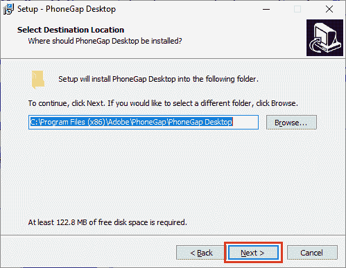

### 4)选择开始菜单的位置

这一点击将打开一个新的弹出窗口来选择快捷方式的位置。我们将浏览文件目录以选择所需的位置。之后，我们将点击下一步继续。

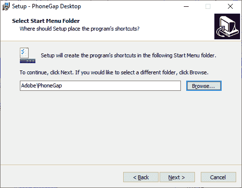
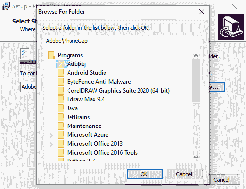

### 5)安装应用程序

单击“下一步”后，将打开一个弹出框来执行应用程序的安装。我们将点击弹出窗口右下角的**安装**按钮。点击将开始安装我们的 **PhoneGap** 桌面应用程序。

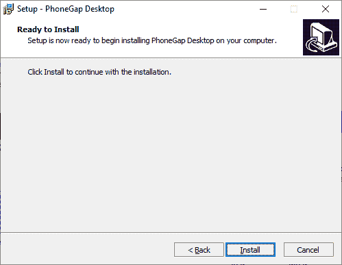
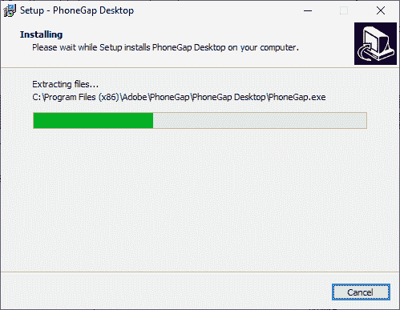
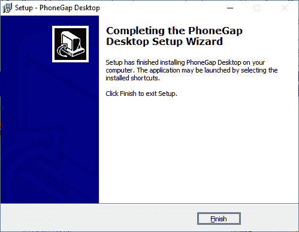

### 6)开放应用

接下来，我们将打开应用程序并安装移动应用程序。在这里，我们将把 PhoneGap 开发者应用程序安装到我们的移动设备上，以便查看我们构建的应用程序。

## Mac OS X:

以下是在 Mac OS X 上安装 **PhoneGap** 应用程序的步骤:

### 1.下载安装程序

在第一步中，我们将通过点击[苹果 OS X 安装程序](https://github.com/phonegap/phonegap-app-desktop/releases/download/0.4.5/PhoneGapDesktop.dmg)来下载**手机间隙**设置。

### 2.运行安装程序

和 Windows 一样，我们会双击下载的可执行文件运行 **PhoneGap** 的设置。双击将提示我们接受许可协议。接受许可协议后，我们将点击弹出框右下角的**下一步**按钮。

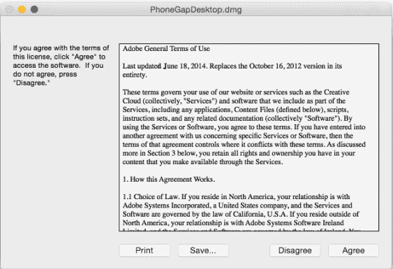

### 3.拖放应用程序

我们将根据提示将应用程序拖放到 Mac OS X 上的**应用程序**文件夹中:

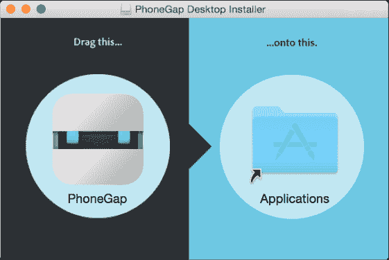

### 4.打开应用程序

接下来，我们将打开应用程序并安装移动应用程序。在这里，我们将把 PhoneGap 开发者应用程序安装到我们的移动设备上，以便查看我们构建的应用程序。

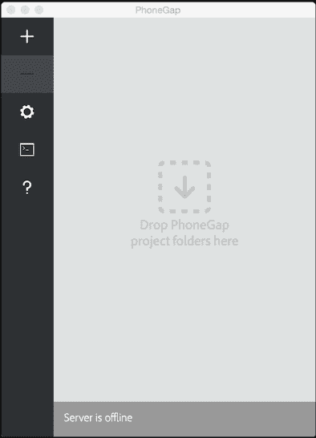

## PhoneGap CLI

创建 PhoneGap 应用程序的命令行界面称为 **PhoneGap CLI** 。它是 PhoneGap 桌面应用程序的替代产品。它是为那些喜欢在命令行界面上工作的用户设计的。与 PhoneGap 桌面应用程序相比，PhoneGap 命令行界面为在多个平台上打包、运行和构建我们的 PhoneGap 应用程序提供了一些额外的功能。如果我们习惯使用命令行界面，我们可以使用 PhoneGap 命令行界面。

以下是安装 PhoneGap 命令行界面的一些要求，如下所示:

1.  我们必须安装 [node.js](https://nodejs.org/) 来构建我们的 JavaScript 代码。它将为我们提供一个 JavaScript 运行时。
2.  我们必须安装 [git](https://git-scm.com/) 来下载资产。它由命令行界面在后台使用。

安装 node.js 和 git 后，按照以下步骤安装 PhoneGap 命令行界面:

1.  我们将在**终端应用程序(Mac)** 或**命令提示符(Win)** 中运行 **$ npm install -g [【电子邮件保护】](/cdn-cgi/l/email-protection)** 命令。我们将使用 **npm** 包安装 **PhoneGap CLI** 。
2.  我们将在命令行上执行 **phonegap** 命令，以确保 **PhoneGap CLI** 安装是否正确。
3.  我们将把 **PhoneGap 开发者应用程序**安装到我们的移动设备上，以便查看我们构建的应用程序。

## 安装 PhoneGap 开发者应用程序

安装 PhoneGap 桌面应用程序后，我们将从以下任何市场将 PhoneGap 开发者应用程序安装到我们的移动设备中:

1.  Windows 电话商店
2.  谷歌游戏
3.  ~iTunes~目前还没有，不过你还是可以自己建的！

我们将通过在主屏幕上点击 PhoneGap 开发者应用程序的图标来启动它。推出其应用后，我们将进行下一步，即创建我们的第一个 PhoneGap 应用。

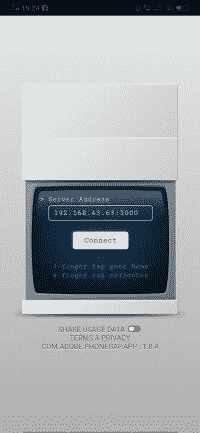

* * *