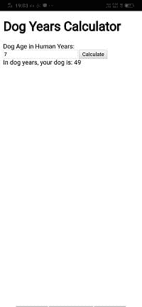

# 制作第一款手机应用

> 原文：<https://www.javatpoint.com/making-first-phonegap-app>

在上一节中，我们学习了如何创建一个新的 PhoneGap 项目，以及如何在桌面浏览器或移动应用程序中预览该项目。在本节中，我们将了解如何创建我们的第一个 PhoneGap 应用程序。以下是创建 PhoneGap 应用程序的步骤:

### 1)创建一个新的 PhoneGap 项目

第一步，我们将创建一个新的 [PhoneGap](https://www.javatpoint.com/phonegap) 项目。我们将把它命名为**我的第一个应用程序**，并给出一个唯一的标识，即**com . javatpoint . My _ First _ App**。


当我们在桌面浏览器或 **PhoneGap Developer** 应用上运行这个时，我们会看到一个空白屏幕。


### 2)打开 index.html 文件

创建 PhoneGap 项目后，我们将转到保存该项目的目录。我们将打开我们项目的文件夹，其中包含许多其他文件夹，如**钩子、平台、插件**和[T3【www】T5。我们将打开包含 index.html 文件的 **www** 文件夹。我们将在首选编辑器中打开该文件进行编码。](https://www.javatpoint.com/www-full-form)


### 3)开始编码

现在，我们将更新这个文件并开始编码。

#### 注意:我们正在创建一个狗龄计算器。您可以创建自己的代码，也可以将以下代码复制到您的 html 文件中。

```

<!DOCTYPE html>
<html>
    <head>
        <meta charset="utf-8">
        <meta name="viewport" content="initial-scale=1, maximum-scale=1, user-scalable=no, width=device-width">
         // adding title
        <title>Dog Years Calculator</title>
        <script>
         //creating window function to initialize the application
        window.onload=function()
        {
            document.getElementById('btnCalc').addEventListener('click', calcAge);
        }
        //creating calcAge function to calculate the age of dog
        function calcAge(e)
        {
	//fetching age
            var age = document.getElementById('dogAge').value;
            age = age *7;
            var result = "In dog years, your dog is: " + age;
          //  console.log(result);
         //alert(result);
            document.getElementById('result').innerHTML = result;
        }
        </script>
    </head>
    <body>
	<script type="text/javascript" src="cordova.js"></script>
	//add heading
<h1>Dog Years Calculator</h1>
	//add lable
<label for="dogAge">Dog Age in Human Years:</label>
	//add input field
<input id="dogAge" type="number" />
	//add button
<button id="btnCalc">Calculate</button>
        	//add a field for result 
<div id="result"></div>
    </body>
</html>

```

我们将保存此文件并转到 PhoneGap 开发者应用程序。我们将连接桌面应用程序和 PhoneGap 开发者应用程序，并在服务器上运行应用程序。

### 桌面浏览器


### PhoneGap 开发者应用

   

[下载完整项目](https://static.javatpoint.com/tutorial/phonegap/download/My_first_application.zip)

* * *