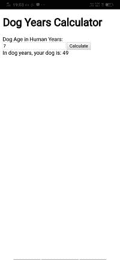
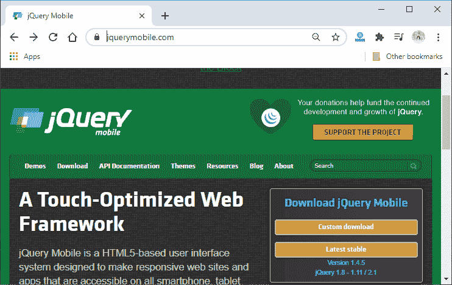
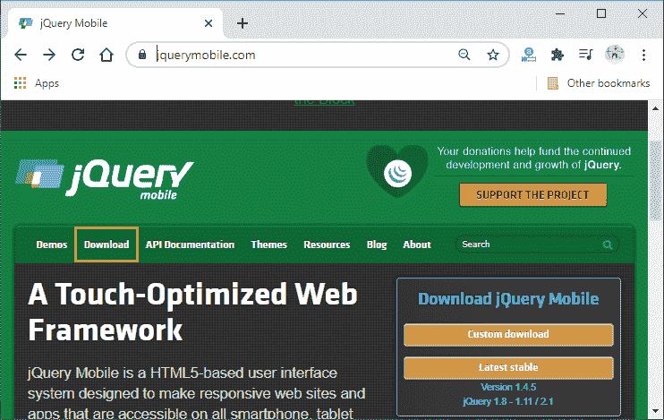
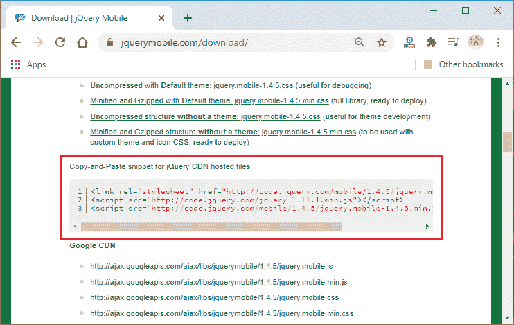
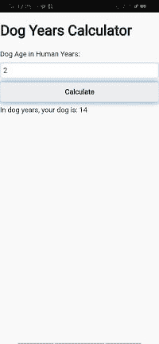
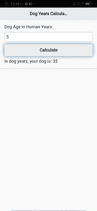

# 在 PhoneGap 应用中包含 JQuery 用户界面模型

> 原文：<https://www.javatpoint.com/including-jquery-ui-model-in-phonegap-app>

在前面的部分中，我们了解了如何创建我们的第一个 PhoneGap 应用程序。本节将讲述 JQuery 用户界面模型，或者我们如何在应用程序中包含 JQuery 用户界面模型。但是这里出现了一个问题，即为什么我们需要在我们的应用程序中包含 JQuery UI 模型。

如果我们看一下我们的应用程序，它看起来不会像移动设备。



看起来他们被扔到屏幕上了。为此，我们将立即使用 [JQuery](https://www.javatpoint.com/jquery-tutorial) 移动库来为我们的应用带来巨大的变化。以下是用于在我们的应用程序中包含 JQuery 移动库的步骤。

### 1)前往现场

第一步，我们会去 [jquerymobile](https://jquerymobile.com/) 官网下载需要的文件。



### 2)转到下载页面。

点击**下载**按钮进入下载页面，向下滚动页面。我们将搜索 CDN 托管的文件。




### 3)复制并粘贴片段

我们将复制这三行 JavaScript 代码或片段，并转到我们的 index.html 文件。我们将在标题标签下面粘贴这三行代码或代码片段。

```

<title>Dog Years Calculator</title>

//connects us to the JQuery stylesheet
<link rel="stylesheet" href="http://code.jquery.com/mobile/1.4.5/jquery.mobile-1.4.5.min.css" />

//connects us to the JQuery core library
<script src="http://code.jquery.com/jquery-1.11.1.min.js"></script>

//connects us to the JQuery mobile library
<script src="http://code.jquery.com/mobile/1.4.5/jquery.mobile-1.4.5.min.js"></script>

```

现在，我们将保存文件并更新手机屏幕。更新手机屏幕后，我们的应用将看起来像一个移动应用。这三行代码会自动重塑 HTML 内容，使其对手机更加友好。



### 4)使用 div 标签

现在，我们将把所有的 [HTML](https://www.javatpoint.com/html-heading) 代码放入带有数据角色属性的 div 中。我们将使用三个 div 标签，即第一个用于页眉，第二个用于主页面，第三个用于页脚。我们还将添加主的 **ui_content** 类。它给某些元素添加了一些样式，并在内容周围创建了一些边距。

```

<body>
        <div data-role="page">
        <div data-role="header">
            <h1>Dog Years Calculator</h1>
        </div> <!-- header -->
        <div data-role="main" class="ui-content">
            <label for="dogAge">Dog Age in Human Years:</label>
        <input id="dogAge" type="number" />
        <button id="btnCalc">Calculate</button>
        <div id="result"></div>
        </div> <!-- main -->
        <div data-role="footer">
        </div> <!-- footer -->
        </div> <!-- page -->
        <script type="text/javascript" src="cordova.js"></script>
    </body>

```

**输出:**



[点击此处下载项目](https://static.javatpoint.com/tutorial/phonegap/download/MyFirstApp.zip)

* * *