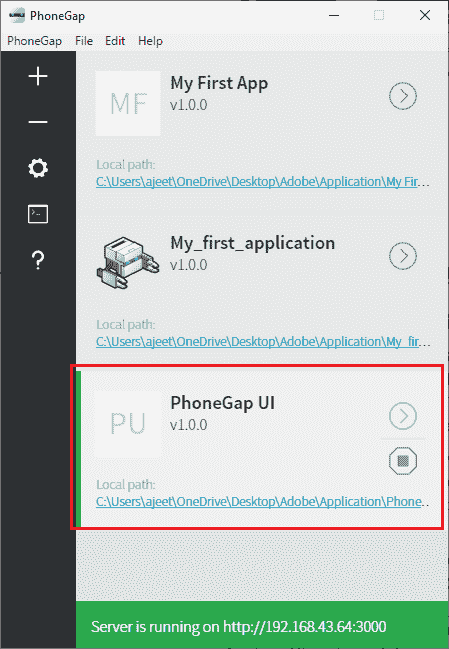
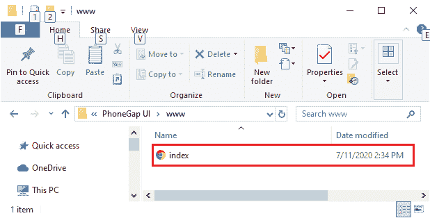
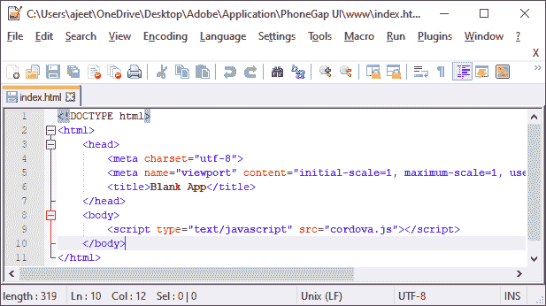
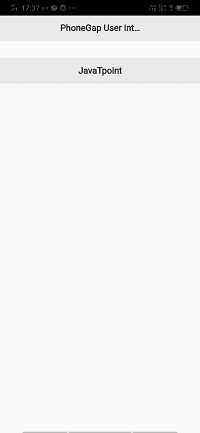
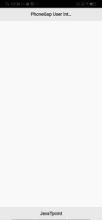
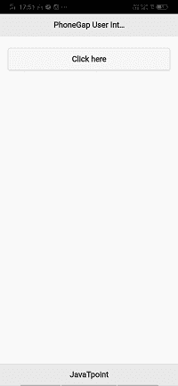
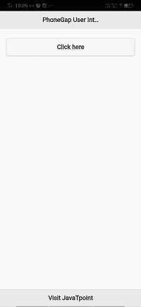
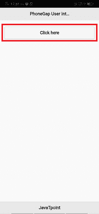

# 在 PhoneGap 中创建多页用户界面

> 原文：<https://www.javatpoint.com/creating-a-multipage-ui-in-phonegap>

我们将使用 **HTML CSS** 和 **JavaScript** 来创建 PhoneGap 应用程序的用户界面。PhoneGap 应用程序的 UI 层占据了 100%的设备高度和 100%的设备宽度。这是一个网页浏览器，我们可以把它想象成一个**“无铬”**网页浏览器。

它向我们展示了 HTML 内容，没有常规网络浏览器的窗口或“chrome”装饰。我们构建我们的应用程序来利用这个空间，我们将导航/交互/内容元素和应用程序 chrome 构建到我们基于 [HTML](https://www.javatpoint.com/html-tutorial) 和 [CSS](https://www.javatpoint.com/css-tutorial) 的用户界面中。

PhoneGap 使用与本机操作系统相同的网络视图。这在 iOS 上作为 **Objective-C UIWebView 类**出现，在安卓上作为 **android.webkit.WebView** 出现。

如果我们从桌面世界转向移动开发，我们可能会发现移动的用户界面开发需要多一点考虑，我们有一个巨大的屏幕和大量的屏幕空间来玩它。在本节中，我们将了解用户界面。我们首先要创建一个多页用户界面。稍后我们将使用可折叠内容块控件组。翻转开关和 JQuery 移动用户界面库中的列表视图。这一部分将帮助我们用手机应用程序为我们的移动应用程序制作真正有吸引力和有用的界面。

#### 注意:我们可以使用几个不同的库。我们将使用 JQuery 移动库。

[JQuery](https://www.javatpoint.com/jquery-tutorial) 移动图书馆是最有效、最古老的图书馆之一。以下是用于创建多页用户界面的步骤:

### 1)创建新项目

首先，我们将使用空白模板创建一个新的 PhoneGap 项目。如果你不知道如何用空白模板创建一个应用，请通过 [PhoneGap 项目](https://www.javatpoint.com/creating-a-new-phonegap-project)链接。



### 2)打开 index.html 文件

使用空白模板创建新项目后，我们将转到计算机上的应用程序目录，并在首选编辑器中打开 index.html 文件。




### 3)创建 div 标签

我们将用 **ui-content** 类将整个页面分为三个部分，即页眉、页脚和主页。我们将创建一个包含这三个 div 标签的 div 标签，如下所示:

```

<body>
        <div data-role="page">
        	<div data-role="header">
        	</div> <!-- header -->
        	<div data-role="main" class="ui-content">
        	</div> <!-- main -->
        	<div data-role="footer">
        	</div> <!-- footer -->
        </div> <!-- page -->
        <script type="text/javascript" src="cordova.js"></script>
    </body>

```

### 4)添加标题和 JQuery 移动库。

现在，我们将在 header div 中添加标题标签，并添加 JQuery 移动库，就像我们在上一节中添加的那样。

```

<!DOCTYPE html>
<html>
<head>
<meta charset="utf-8">
        	<meta name="viewport" content="initial-scale=1, maximum-scale=1, user-scalable=no, width=device-width">
	<title>Dog Years Calculator</title>
	<link rel="stylesheet" href="http://code.jquery.com/mobile/1.4.5/jquery.mobile-1.4.5.min.css" />
	<script src="http://code.jquery.com/jquery-1.11.1.min.js"></script>
	<script src="http://code.jquery.com/mobile/1.4.5/jquery.mobile-1.4.5.min.js"></script>
</head>
<body>
        <div data-role="page">
        <div data-role="header">
            <h1>PhoneGap User Intrface</h1>
        </div> <!-- header -->
        <div id="result"></div>
        </div> <!-- main -->
        <div data-role="footer">
        </div> <!-- footer -->
        </div> <!-- page -->
        <script type="text/javascript" src="cordova.js"></script>
    </body>
</html>

```

### 5)添加锚点

现在，我们要做的是，给我们的项目添加一个锚点。

1.我们会给我们的页脚一个 id。

```

<div data-role="footer" id="footer">
<h2>javatpoint.com</h2>
</div> <!-- footer -->

```



2.我们将使用 [**<样式></样式>**](https://www.javatpoint.com/html-style) 打开样式表，我们将完成页脚中的所有事情。因此，我们将使用 id 选择器转到页脚。我们将位置设置为绝对，底部设置为 0，宽度设置为 100%。

```

<style>
            #footer
            {
                position: absolute;
                bottom: 0;
                width: 100%;
            }
</style>

```



3)我们将为该页面提供唯一的 id。

```

<div data-role="page" id="page1">

```

4.我们还将通过在**主分区**中添加 [**<按钮></按钮>** 标签](https://www.javatpoint.com/html-button-tag)来为屏幕添加一个按钮。

```

<div data-role="main" class="ui-content">
	<button>Click here</button>
</div> <!-- main -->

```



### 6)创建新页面

现在，我们将在第二个屏幕上重复页面的整个结构。我们将复制第 1 页的代码，并粘贴到这一页下面。我们会给它一个 id 页 2。

```

<div data-role="page" id="page2">
<div data-role="header">
         <h1>PhoneGap User Interface 2</h1>
            </div> <!-- header -->

            <div data-role="main" class="ui-content">
         <button>Click here</button>
            	</div> <!-- main -->

<div data-role="footer" id="footer">
         <h2>Visit JavaTpoint</h2>
            </div> <!-- footer -->
</div> <!-- page -->

```



### 7)连接页面

现在，我们将通过超级引用来连接页面，这样我们就可以从一个页面移动到另一个页面。为此，我们将转到按钮，使用 **onclick** 切换页面。

```

<div data-role="main" class="ui-content">
	<button onclick="location.href='index.html#page2'">Click here</button>
 </div> <!-- main -->

 <div data-role="main" class="ui-content">
            <button onclick="location.href='index.html#page1'">Click here</button>
 </div> <!-- main -->

```

 

* * *