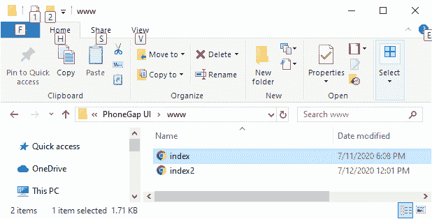
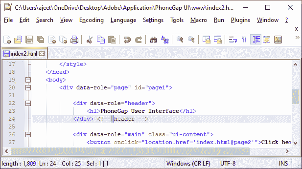
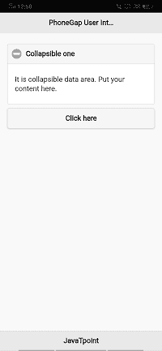
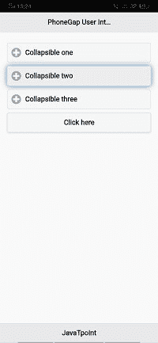
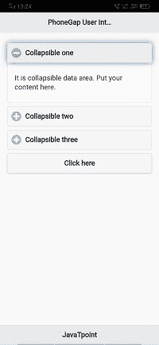
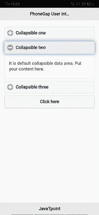
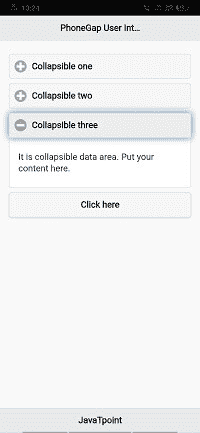
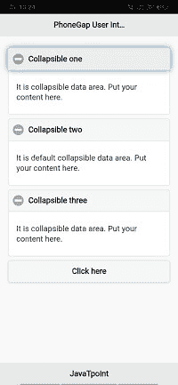

# 可折叠内容块

> 原文：<https://www.javatpoint.com/collapsible-content-blocks-in-phonegap>

在前一节中，我们学习了如何在 PhoneGap 中创建多页面用户界面。现在，我们将了解**可折叠内容块**以及如何在 PhoneGap 应用程序中使用它。

以前，我们在处理移动应用开发中的有限房地产，我们没有足够的屏幕来占用它。为此，用户界面中使用了不同的技术，以便尽可能多地利用屏幕上的额外空间。在这种情况下，我们将向其交付**“可折叠内容块”**。这些区块只是可以折叠的区块，让我们在屏幕上有更多的空间。

我们将使用前面的例子中的**可折叠内容块**。以下是在我们的应用程序中包含**可折叠内容块**的步骤:

### 1)创建 index2.html 文件

我们将创建一个新文件**index2.html**，其代码与**index.html**中预设的相同。我们稍后将在**index2.html**文件中进行更改，而不是在**index.html**中。




### 2)创建可折叠块

现在，我们将为**创建一个 div 标签，这是一个可折叠的集合**，它将包含几个用于创建不同块的标签。我们将创建一个包含一些内容的块，这些内容将在数据折叠设置为 false 时执行。

```

 <div data-role="main" class="ui-content">
	<div data-role="collapsible" data-collapsed="false">
		<h3>Collapsible one</h3>
		<p> It is collapsible data area. Put your content here.</p>
	</div> <!--collapsible set -->
	<button onclick="location.href='index.html#page2'">Click here</button>
</div> <!-- main -->

```



### 3)创建另一个可折叠块

接下来，我们将创建另外两个可折叠块。第一个可折叠将设置为默认值，第二个设置为 true。我们将复制第一个可折叠块，并以下列方式用于两者:

```

<div data-role="main" class="ui-content">
<div data-role="collapsible" data-collapsed="false">
		<h3>Collapsible one</h3>
		<p> It is collapsible data area. Put your content here.</p>
	</div> <!--collapsible set -->

	<div data-role="collapsible">
		<h3>Collapsible two</h3>
		<p> It is default collapsible data area. Put your content here.</p>
		</div> <!--collapsible set -->

	<div data-role="collapsible" data-collapsed="true">
		<h3>Collapsible three</h3>
		<p> It is collapsible data area. Put your content here.</p>
	</div> <!--collapsible set -->
<button onclick="location.href='index.html#page2'">Click here</button>
</div> <!-- main -->

```

    

#### 注意:一次只能打开一个可折叠的。

在 JQuery mobile 中处理我们屏幕上的大量数据确实是一个不错的方法。我们的屏幕区域非常有限，而**可折叠内容块**将帮助我们最大限度地利用该区域。

* * *