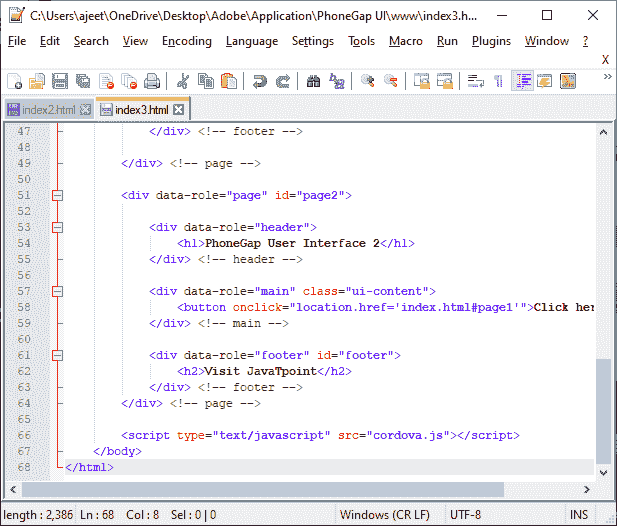
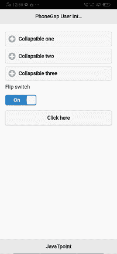

# 控制组和翻转开关

> 原文：<https://www.javatpoint.com/control-groups-and-flip-switch-in-phonegap>

在前一节中，我们学习了如何通过使用可折叠内容块来完全使用最小屏幕区域。现在，我们将学习如何在 PhoneGap 中使用**控制组**和**翻转开关**。我们将逐一解释**控制组**和**翻转开关**。

## 控制组

**控制组**是使用 [JQuery](https://www.javatpoint.com/jquery-tutorial) 移动库组织内容的最简单方式之一。以下步骤用于在 PhoneGap 中创建控制组:

### 1)创建 index3.html 文件

我们将创建一个新文件**index3.html**，其代码与**index2.html**中预设的相同。我们稍后将在**index3.html**文件中进行更改，而不是在**index2.html**中。




### 2)创建字段集

我们将在第二页的主 div 中创建字段集。是常规的 [HTML](https://www.javatpoint.com/html-tutorial) 标签。创建此字段集的原因是它将包含我们所有的控制组。

```

<div data-role="main" class="ui-content">
<fieldset data-role="controlgroup">
</fieldset>	
<button onclick="location.href='index.html#page1'">Click here</button>
</div> <!-- main --> 

```

### 3)创建控制组

我们将在[**<></field set>**标签](https://www.javatpoint.com/html-fieldset-tag)中添加图例方法。之后，我们将使用 [**<输入></输入>** 标记](https://www.javatpoint.com/html-input-tag)并使用 [**<标记></标记>** 标记](https://www.javatpoint.com/html-label-tag)以下列方式添加带有 id 的复选框:

```

<div data-role="main" class="ui-content">
<fieldset data-role="controlgroup">
<legend>Fruits</legend>
<input type="checkbox" name="Mango" id="Mango"/>
<label for ="Mango">Mango</label>
</fieldset> <!-- controlgroup -->
<button onclick="location.href='index.html#page1'">Click here</button>
</div> <!-- main -->   

```


### 4)创建更多复选框

现在，我们将添加更多复选框，以查看控制组的确切功能，如下所示:

```

<div data-role="main" class="ui-content">
<fieldset data-role="controlgroup">
		<legend>Fruits</legend>
		<input type="checkbox" name="Mango" id="Mango"/>
		<label for ="Mango">Mango</label>
		<input type="checkbox" name="Banana " id="Banana"/>
		<label for ="Banana">Banana</label>
		<input type="checkbox" name="Graps" id="Graps"/>
		<label for ="Graps">Graps</label>	
		<input type="checkbox" name="Papaya" id="Papaya"/>
		<label for ="Papaya">Papaya</label>	
	</fieldset>		
            <button onclick="location.href='index.html#page1'">Click here</button>
</div> <!-- main -->

```


### 5)使用数据迷你属性

我们还可以使用 JQuery 的数据迷你属性来获得一组更小的复选框。我们将以下列方式使用它:

```

<fieldset data-role="controlgroup" data-mini="true">
</fieldset>

```


## 翻转开关

**翻转开关**是一个双选项选择菜单。这是复选框的新外观。当我们点按或滑动翻转开关时，它会被切换。我们将创建一个翻转开关，只需在复选框输入中添加一个**数据角色=“翻转开关”**属性。

### 主题

**翻转开关**使用 jQuery Mobile CSS 框架来设计外观。如果**翻转开关**需要特定的样式，我们将使用以下 CSS 类名来覆盖或作为[类](https://api.jquerymobile.com/flipswitch/#option-classes)选项的键:

1.  **ui-翻转开关**
    它是翻转开关的最外层容器。
2.  **ui-flips switch-on**
    是翻转开关的 on 状态标签。
3.  **ui-flips switch-off**
    是翻转开关的 off 状态标签。
4.  **用户界面-翻转开关-输入**
    它是翻转开关的一个输入复选框元素。

以下是在 PhoneGap 中创建**翻转开关**的步骤:

### 1)创建 index4.html 文件

我们将创建一个新文件**index4.html**，其代码与**index3.html**中预设的相同。我们稍后将在**index4.html 文件**中进行更改，而不是在**index3.html**中。


### 2)创建标签并翻转开关

我们将到达第 1 页可折叠部分的末尾。我们将为翻转开关创建一个标签。我们将使用输入标签来创建翻转开关，并给出类型=“复选框”、标识和数据角色=“翻转开关”。这个数据角色属性改变了复选框的外观，并创建了一个翻转开关。我们将以下列方式排列所有这些属性:

```

<label for="myflip">Flip switch</label>
<input type="checkbox"id="myflip" data-role="flipswitch"/> 

```



* * *