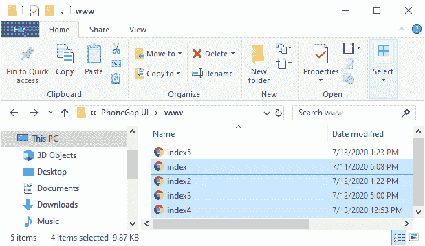

# PhoneGap 中的列表视图

> 原文：<https://www.javatpoint.com/list-view-in-phonegap>

JQuery listview 被设计成一个简单的无序列表，其中包含链接列表项。它是使用属性 data-role =“listview”创建的。为了将列表转换成移动友好的列表视图， [JQuery](https://www.javatpoint.com/jquery-tutorial) 移动库应用了所有需要的样式。它将转换一个带有右箭头指示器的列表。该指示器填满浏览器窗口的整个宽度。当我们点击列表项时，将执行以下操作:

1.  该框架将触发点击列表项内的第一个链接
2.  为链接中的网址发出一个 Ajax 请求
3.  在 DOM 中创建新页面
4.  开始页面转换

以下是在 PhoneGap 中创建列表视图的步骤:

### 1)创建 index4.html 文件

我们将创建一个新文件**index5.html**，其代码与**index4.html**中预设的代码相同，除了页面 1 部分中的可折叠内容部分和按钮。我们稍后将在**index5.html**文件中进行更改，而不是在**index4.html**中。




### 2)创建标签

列表视图以无序有序的列表开始。无序列表会给我们一个没有编号的列表视图，有序列表会给我们一个有编号的列表视图。我们将使用[**<【ul】></ul>**以如下方式用**数据-角色**属性标记](https://www.javatpoint.com/html-unordered-list):

```

<div data-role="main" class="ui-content">
<ul data-role="listview">

	</ul>
</div> <!-- main -->

```

### 3)在列表视图中添加列表项

现在，我们将使用 **< li > < /li >** 标记在列表视图中添加列表项。我们将在**<【ul】>**和 **< /ul >** 标签之间使用这些标签。我们可以使用更多的**<Li></Li>**标签添加多个列表项。这将是一个默认列表视图，编码为:

```

<div data-role="main" class="ui-content">
	<ul data-role="listview">
		<li> Apple </li>
		<li> Banana /li>
		<li> Graps </li>
		<li> Papaya </li>
		<li> Orange </li>
		<li> Litchi </li>
	</ul>
</div> <!-- main -->

```


### 4)包含链接

现在，如果这些列表项被每个列表项内的链接包围，列表视图将是交互式的，并且这些项中的每一个都将作为一个按钮来转到链接中的 **href** [属性](https://www.javatpoint.com/html-attributes)内的单个地址。我们将以以下方式对其进行编码:

```

<div data-role="main" class="ui-content">
	<ul data-role="listview">
		<li><a href="#"> Apple </a></li>
		<li><a href="#"> Banana </a></li>
		<li><a href="#"> Graps </a></li>
		<li><a href="#"> Papaya </a></li>
		<li><a href="#"> Orange </a></li>
		<li><a href="#"> Litchi </a></li>
	</ul>
</div> <!-- main -->

```


### 5)创建编号列表

如果要创建有序列表视图，我们将使用[**<></ol>**标记](https://www.javatpoint.com/html-ordered-list)而不是使用**<ul></ul>**标记，方法如下:

```

<div data-role="main" class="ui-content">
	<ol data-row="listview">
		<li><a href="#"> Apple </a></li>
		<li><a href="#"> Banana </a></li>
		<li><a href="#"> Graps </a></li>
		<li><a href="#"> Papaya </a></li>
		<li><a href="#"> Orange </a></li>
		<li><a href="#"> Litchi </a></li>
	</ol>
</div> <!-- main -->

```


### 6)向列表项添加描述

如果我们想要格式化列表项，我们也可以这样做。我们可以使用[标题标签](https://www.javatpoint.com/html-heading) ( < h1 > < /h1 >)和[段落标签](https://www.javatpoint.com/html-paragraph)(<p>T10】/p>)按照以下方式格式化我们的列表项:

```

<div data-role="main" class="ui-content">
	<ol data-row="listview">
		<li><a href="#"><h3> Apple </h3><p> It is good for diabetics and blood sugar regulation </p></a></li>
		<li><a href="#"><h3> Banana </h3><p> It is respectable source of vitamin C and good for our heart </p></a></li>
		<li><a href="#"> Graps </a></li>
		<li><a href="#"> Papaya </a></li>
		<li><a href="#"> Orange </a></li>
		<li><a href="#"> Litchi </a></li>
	</ol>
</div> <!-- main -->

```


### 7)列表分隔符属性

现在，我们将使用列表分隔符属性将列表分成两部分。我们将使用**<></Li>**标签，如下所示:

```

<div data-role="main" class="ui-content">
<ol data-role="listview">
            <li><a href="#"><h3> Apple </h3><p> It is good for diabetics and blood sugar regulation </p></a></li>
		<li><a href="#"><h3> Banana </h3><p> It is respectable source of vitamin C and good for our heart </p></a></li>
		<li><a href="#"> Graps </a></li>
		<li data-role="list-divider"> List is divided from here </li> 
		<li><a href="#"> Papaya </a></li>
		<li><a href="#"> Orange </a></li>
		<li><a href="#"> Litchi </a></li>
	</ol>
</div> <!-- main -->

```


[下载完整项目](https://static.javatpoint.com/tutorial/phonegap/download/PhoneGapUI.zip)

* * *