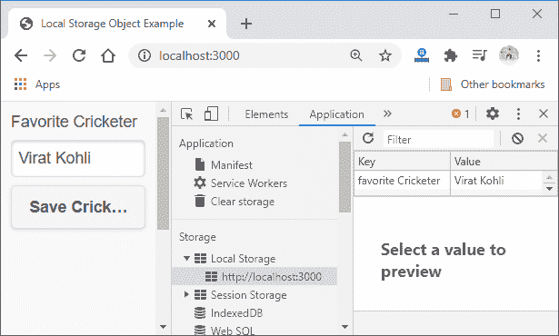

# 本地存储对象

> 原文：<https://www.javatpoint.com/local-storage-object-in-phonegap>

在前一节中，我们已经介绍了**存储**的所有理论部分。我们快速浏览了所有的存储方法，我们将使用这些方法。因此，在本节中，我们将了解如何在 PhoneGap 中创建和使用**本地存储对象**。下面是创建和使用本地存储对象的分步过程。

### 1)创建新项目

首先，我们将使用空白模板创建一个新的 PhoneGap 项目。如果你不知道如何用空白模板创建一个应用，请通过 [PhoneGap 项目](https://www.javatpoint.com/creating-a-new-phonegap-project)链接。


创建 [PhoneGap](https://www.javatpoint.com/phonegap) 项目后，我们将打开其包含在**[www](https://www.javatpoint.com/www-full-form)**文件夹中的 index.html 文件。


### 2)添加 JQuery 移动库

创建项目后，我们将添加 **JQuery 移动库**，就像我们在前面的示例中添加的那样。我们将转到 [JQuery](https://jquerymobile.com/download/) ，从那里，我们将复制三行代码，即 CDN 托管文件。我们将把这段代码粘贴到我们的 index.html 文件中，并按照以下方式更改标题:

```

<!DOCTYPE html>
<html>
     <head>
<meta charset="utf-8">
<meta name="viewport" content="initial-scale=1, maximum-scale=1, user-scalable=no, width=device-width">
<title>Local Storage Object Example</title>
<link rel="stylesheet" href="http://code.jquery.com/mobile/1.4.5/jquery.mobile-1.4.5.min.css" />
	<script src="http://code.jquery.com/jquery-1.11.1.min.js"></script>
	<script src="http://code.jquery.com/mobile/1.4.5/jquery.mobile-1.4.5.min.js"></script>
    </head>
    <body>
        <script type="text/javascript" src="cordova.js"></script>
    </body>
</html>

```

### 3)创建表单

我们将首先通过在[正文部分](https://www.javatpoint.com/html-body-tag)创建标签和输入字段来创建表单。之后，我们将使用此表单存储信息。我们将以下面的方式写所有这些东西:

```

<body>
<label for="crick">Favorite Cricketer</label>
       	<input type="text" id="crick" />
        	<script type="text/javascript" src="cordova.js"></script>
</body>  

```


### 4)添加样式/边距并划分容器

我们的应用现在看起来不那么酷了。因此，我们将使用[**<></div>**标记](https://www.javatpoint.com/html-div-tag)来划分容器，并按照以下方式设置容器的边距:

#### 注意:我们将在头部的标签中进行样式和边距的编码。

```

    <head>
	<style>
    	#container
    	{
        		margin: 10px;
    	}
    	</style>
    </head>
    <body>
        <div id="container">
        <label for="crick"> Favorite Cricketer </label>
        <input type="text" id="crick" />
        <script type="text/javascript" src="cordova.js"></script>
    </body>	

```


### 5)添加按钮保存数据。

现在，我们将在表单中添加一个按钮，将数据保存到浏览器中。所以，当我们点击按钮时，数据会存储到我们的浏览器中。我们将在**下方创建一个按钮，使用 [**<按钮></按钮>** 标签](https://www.javatpoint.com/html-button-tag)以下列方式输入**字段:

```

<div id="container">
	<label for="crick"> Favorite Cricketer </label>
	<input type="text" id="crick" />
	<button id="btnSave"> Save Cricketer </button>
	<script type="text/javascript" src="cordova.js"></script>
</div>

```


### 6)从表单中获取数据

现在，我们将获取表单数据。为此，我们将使用 [**<脚本></脚本>** 标签](https://www.javatpoint.com/html-script-tag)来创建自定义脚本下方的 [**<样式></样式>** 标签](https://www.javatpoint.com/html-style)。我们将使用 **window.onload** 函数，该函数在屏幕加载时调用。在这个函数中，我们将获得按钮，并使用**事件监听器**以下列方式回调自定义函数 **storeData** :

```

<script>
window.onload = function()
{
        document.getElementById('btnSave').addEventListener('click', storeData);
}
</script> 

```

### 7)创建存储数据自定义功能

现在，我们将通过传递一个参数来创建一个自定义函数 **storeData** 。我们将使用 ID 从表单中获取板球运动员的姓名。之后，我们将按照以下方式将提取的数据设置到本地存储中:

```

function storeData(e)
{
var cricketer = document.getElementById('crick').value;
	localStorage.setItem("favorite Cricketer", cricketer);
}

```


我们可以使用浏览器检查本地存储数据。



我们还可以通过以下方式将其他数据保存在不同的键下:

```

var date = new Date();
localStorage.setItem("TimeStamp", date);

```


### 8)检索数据

现在，我们将创建另一个按钮来检索数据，方式与我们之前创建的获取数据的方式相同。之后，我们将使用将使用函数调用的 ID 获取按钮，即**获取数据**。我们还将使用**<></div>**标记为结果添加一个字段，如下所示:

**窗口加载功能:**

```

window.onload = function()
{
	document.getElementById('btnSave').addEventListener('click', storeData);		document.getElementById('btnRetrieve').addEventListener('click', getData)
}

```

**车身断面:**

```

<body>
	<div id="container">
		<label for="crick"> Favorite Cricketer </label>
		<input type="text" id="crick" />
		<button id="btnSave"> Save Cricketer </button>
		<script type="text/javascript" src="cordova.js"></script>
		<div id="result"></div>
		<button id="btnRetrieve"> Retrieve Cricketer </button>
	</div>
</body>

```


### 9)创建获取数据功能

我们将在 **<脚本></脚本>** 标签中创建**获取数据**功能，该功能将由检索按钮调用。我们将使用 **localStorage.getItem()** 函数从本地存储中获取数据，并使用 ID 显示结果。完整的自定义脚本如下所示。

```

<script>
	window.onload = function()
	{
		document.getElementById('btnSave').addEventListener('click', storeData);
		document.getElementById('btnRetrieve').addEventListener('click', getData)
	}
        function storeData(e)
	{
		var cricketer = document.getElementById('crick').value;
		localStorage.setItem("favorite Cricketer", cricketer);
		var date = new Date();
		localStorage.setItem("TimeStamp", date);
	}
	function getData(e)
	{
		var crick = localStorage.getItem('favorite Cricketer');
		document.getElementById('result').innerHTML = crick;
	}
</script>

```


[下载完整项目](https://static.javatpoint.com/tutorial/phonegap/download/LocalStorageObject.zip)

* * *