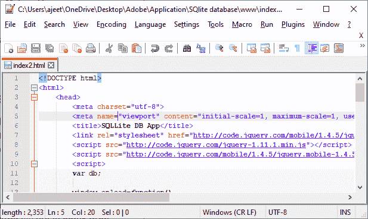

# 从 SQLite 数据库中检索数据

> 原文：<https://www.javatpoint.com/retrieving-data-from-sqlite-database-in-phonegap>

在前一节中，我们学习了如何在 SQLite 数据库中创建一个表，以及如何将数据插入到数据库表中。在本节中，我们将了解如何从数据库中获取数据，以及如何在用户界面上显示这些数据。

我们将使用 select 语句从表中获取数据，并将无序列表用作显示数据的列表视图:

以下是从 [SQLite](https://www.javatpoint.com/sqlite-tutorial) 数据库中获取数据的步骤:

### 1)创建 index2.html 文件

我们将创建一个新文件**index2.html**，其代码与**index.html**中的代码相同。我们稍后将在**index2.html**文件中进行更改，而不是在**index.html**中。




### 2)创建列表视图

现在，我们将首先使用[**<ul></ul>**标签](https://www.javatpoint.com/html-unordered-list)创建列表视图。该列表视图将在用户界面上显示所有结果。我们将在 [**<正文></正文>** 标签](https://www.javatpoint.com/html-body-tag)之间给这个列表视图和代码一个 id，如下所示:

```

<body>
        <div data-role="page">
        <div data-role="header"><h1> SQLite database example </h1></div>
        <div data-role="main" class="ui-content">
        <label for="name"> Name </label>
        <input type="text" id="name" />
        <label for="email"> Email </label>
        <input type="text" id="email" />
        <button id="btnSave" type="submit"> Save </button>
        <ul id="members" data-role="listview">
        </ul>
        <script type="text/javascript" src="cordova.js"></script>
        </div><!-- main-->
        </div><!-- page -->
</body>

```


### 3)创建并执行 select 语句

现在，我们将转到我们的**保存记录**功能，并在此进行修改。我们将使用**的 transaction.executeSql** 函数添加一个 select 语句。这个函数还会有四个参数，分别是 **select 语句数组 getSuccess** 回调函数， **getError** 回调函数。我们将以下列方式添加 select 语句:

```

transaction.executeSql("SELECT * FROM employeesList", [], getSuccess, getError);

```

### 4)创建获取成功功能

现在，我们将在 [**<脚本></脚本>** 标签](https://www.javatpoint.com/html-script-tag)之间创建 **getSuccess** 功能。getSuccess 函数会有两个参数，即**交易**和**结果**。在这个函数中，我们将创建一个 row 对象，并创建一个循环来显示每个记录的名称和电子邮件。我们将为名称和电子邮件创建一个变量，然后我们将以下列方式将此名称和电子邮件添加到我们的列表视图中:

```

        function getSuccess(tx, result)
        {
            var rows = result.rows;
            for(var x=0; x< rows.length; x++)
{
                var name = result.rows[x].Name; <!--Fetching name -->
                var email = result.rows[x].Email; <!?Fetching Email -->
                var out = "<li>" + name + "<br/>" + email + "</li>"; <!?Store data in list-->
                document.getElementById('members').innerHTML += out; <!?Adding list in the list view -->
            } 

            $('#members').listview('refresh'); <!--Refreshing list view -->
        }

```

### 5)创建获取错误函数

如果出现错误，getError 函数将用于在控制台上显示错误。getError 函数将以下列方式创建:

```

        function getError(e)
        {
            console.log(e);
        }

```

### 完整代码:

```

<!DOCTYPE html>
<html>
    <head>
        <meta charset="utf-8">
        <meta name="viewport" content="initial-scale=1, maximum-scale=1, user-scalable=no, width=device-width">
        <title>SQLLite DB App</title>
        <link rel="stylesheet" href="http://code.jquery.com/mobile/1.4.5/jquery.mobile-1.4.5.min.css" />
        <script src="http://code.jquery.com/jquery-1.11.1.min.js"></script>
        <script src="http://code.jquery.com/mobile/1.4.5/jquery.mobile-1.4.5.min.js"></script>
        <script>
        var db;

        window.onload=function()// it is a function call.
        {
            document.getElementById('btnSave').addEventListener('click', saveData);
            db = window.openDatabase("employees",  "1.0", "LearnToProgram", 200000);
        }

        function saveData(e)
        {
            db.transaction(saveRecord, onSuccess, onError);
        }

        function saveRecord(transaction)
        {
            var name= document.getElementById('name').value;
            var email = document.getElementById('email').value;
            transaction.executeSql('CREATE TABLE IF NOT EXISTS employeesList (id INTEGER PRIMARY KEY AUTOINCREMENT, Name TEXT NOT NULL, Email TEXT NOT NULL) ');

            var sql= "INSERT INTO employeesList (Name,Email) VALUES ('" + name +"', '" + email + "')";
            console.log(sql);
            transaction.executeSql(sql);
            transaction.executeSql("SELECT * FROM employeesList", [], getSuccess, getError);
        }
        function getSuccess(tx, result)
        {
            var rows = result.rows;
            for(var x=0; x< rows.length; x++){
                var name = result.rows[x].Name;
                var email = result.rows[x].Email;
                var out = "<li>" + name + "<br/>" + email + "</li>";
                document.getElementById('members').innerHTML += out;
            }

            $('#members').listview('refresh');
        }
        function getError(e)
        {
            console.log(e);
        }

        function onSuccess()
        {
            console.log("Record Saved");
        }

        function onError(error)
        {
            console.log(error);
        }
        </script>
    </head>
    <body>
        <div data-role="page">
        <div data-role="header"><h1> SQLite Database Example</h1></div>
        <div data-role="main" class="ui-content">
        <label for="name">Name</label>
        <input type="text" id="name" />
        <label for="email">Email</label>
        <input type="text" id="email" />
        <button id="btnSave" type="submit">Save</button>
        <ul id="members" data-role="listview">
        </ul>
        <script type="text/javascript" src="cordova.js"></script>
        </div><!-- main-->
        </div><!-- page -->
    </body>
</html>

```

**输出:**


[点击此处下载项目](https://static.javatpoint.com/tutorial/phonegap/download/SQlitedatabase.zip)

* * *