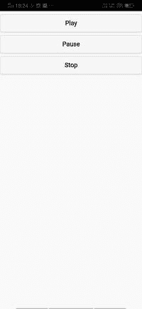
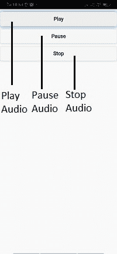

# 使用 JavaScript 控制媒体播放

> 原文：<https://www.javatpoint.com/controlling-playback-of-media-using-javascript-in-phonegap>

在上一节中，我们学习了如何播放音频和视频内容。以前，我们使用浏览器的内置 HTML 控件来播放音频和视频内容。在本节中，我们将学习如何使用 [JavaScript](https://www.javatpoint.com/javascript-tutorial) 自己创建这些控件。我们将使用以下步骤来创建播放、暂停和停止音频的自定义控制按钮:

### 1)删除音频标签的控件属性，添加 JQuery 移动库

我们将使用相同的项目，从 [HTML](https://www.javatpoint.com/html-tutorial) 代码中，我们将删除**控件**属性。我们还将通过简单地在标题下面添加 CDN 托管的文件来添加 JQuery 移动库。

```

<!DOCTYPE html>
<html>
    <head>
        	<meta charset="utf-8">
        	<meta name="viewport" content="initial-scale=1, maximum-scale=1, user-scalable=no, width=device-width">
        	<title> Audio and Video Example </title>
<link rel="stylesheet" href="http://code.jquery.com/mobile/1.4.5/jquery.mobile-1.4.5.min.css" />
	<script src="http://code.jquery.com/jquery-1.11.1.min.js"></script>
	<script src="http://code.jquery.com/mobile/1.4.5/jquery.mobile-1.4.5.min.js"></script>
    </head>
    <body>	
	<audio>
		<source src="media/Saki.mp3"/>
	</audio>	
        	<script type="text/javascript" src="cordova.js"></script>
    </body>
</html>

```

### 2)给音频一个标识

现在，我们将给我们的 [**<【音频】>** 标签](https://www.javatpoint.com/html-audio)一个 Id，因为 JavaScript 对 HTML 一无所知。我们将按以下方式给它一个 Id:

```

<audio id="mysong">
<source src="media/Saki.mp3"/>
</audio>

```

### 3)创建播放、暂停和停止按钮

我们现在将在用户界面中创建三个按钮，即播放、暂停和停止。这些按钮是通过在 HTML 代码的主体部分使用 [**<按钮></按钮>** 标签](https://www.javatpoint.com/html-button-tag)创建的。我们会给每个按钮一个 Id，让它们进入**窗口。**

```

<body>
	<audio id="mysong">
		<source src="media/Saki.mp3"/>
	</audio>
	<button id="play"> Play </button>
	<button id="Pause"> Pause </button>
	<button id="Stop"> Stop </button>
       	<script type="text/javascript" src="cordova.js"></script>
</body>

```



### 4)创建窗口加载功能

现在，我们将创建一个窗口加载功能。在这个函数中，我们将使用 Id 获得音频内容，在同一个函数中，我们将获得我们在用户界面中创建的所有这三个按钮。在此功能中，我们将通过以下方式获取音频内容和按钮:

1)我们首先创建一个全局变量**播放器**，并在其中存储音频内容。我们将使用我们给 [**<【音频】></音频>** 标签](https://www.javatpoint.com/html-audio)的 Id，通过以下方式获取音频内容:

```

<script>
var player;

	window.onload = function()
	{
		player = document.getElementById('mysong');
	}
</script>

```

2)我们将使用播放按钮的 Id 获得它，并添加一个用于调用匿名函数的侦听器。这个匿名功能将播放播放器中可用的内容。

```

window.onload = function()
{
	player = document.getElementById('mysong');
	document.getElementById('play').addEventListener('click', function(){
		player.play();
	});
}

```

3)我们将以同样的方式获得这两个按钮，并用剩下的两个按钮连接监听器。暂停播放器内容可以使用暂停()功能，但没有停止()功能。为此，我们将首先使用 pause()函数，然后通过以下方式将当前时间设置为 0:

```

<script>
	var player;	
	window.onload = function()
	{
		player = document.getElementById('mysong');
		document.getElementById('Pause').addEventListener('click', function(){
		player.pause();
		});
		document.getElementById('Stop').addEventListener('click', function(){
		player.pause();
		player.currentTime = 0;
		});
	}
</script>

```

### 完整代码:

```

<!DOCTYPE html>
<html>
    <head>
        <meta charset="utf-8">
        <meta name="viewport" content="initial-scale=1, maximum-scale=1, user-scalable=no, width=device-width">
        <title> Audio and Video Example </title>
		<link rel="stylesheet" href="http://code.jquery.com/mobile/1.4.5/jquery.mobile-1.4.5.min.css" />
		<script src="http://code.jquery.com/jquery-1.11.1.min.js"></script>
		<script src="http://code.jquery.com/mobile/1.4.5/jquery.mobile-1.4.5.min.js"></script>
		<script>
		var player;

		window.onload = function()
		{
			player = document.getElementById('mysong');
			document.getElementById('Play').addEventListener('click', function(){
				player.play();
			});
			document.getElementById('Pause').addEventListener('click', function(){
				player.pause();
			});
			document.getElementById('Stop').addEventListener('click', function(){
				player.pause();
				player.currentTime = 0;
			});
		}
		</script>
	</head>
    <body>
		<audio id="mysong">
		<source src="media/Saki.mp3"/>
		</audio>
		<button id="Play"> Play </button>
		<button id="Pause"> Pause </button>
		<button id="Stop"> Stop </button>
        <script type="text/javascript" src="cordova.js"></script>
    </body>
</html>

```

**输出:**



* * *