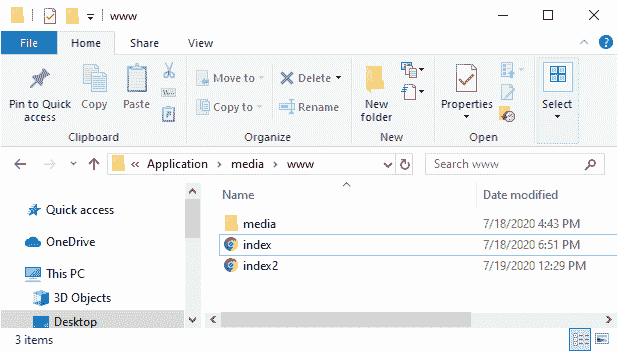

# 在 PhoneGap 中使用 JavaScript 调整媒体的音量

> 原文：<https://www.javatpoint.com/adjust-the-volume-of-media-using-javascript-in-phonegap>

在前一节中，我们使用 JavaScript 制作了自己的控制按钮。在本节中，我们将学习如何使用 PhoneGap 中的 [JavaScript](https://www.javatpoint.com/javascript-tutorial) 来调整音量。我们将创建一个音量滑块来控制媒体的音量。音量是我们播放器的属性，可以通过用户界面轻松控制。

以下步骤用于在 PhoneGap 中创建音量滑块:

### 1)创建 index2.html 文件

我们将创建另一个 html 文件**index2.html**。该文件将包含与**index.html**文件中相同的代码。我们将对此文件进行更改，以便我们的**index.html**文件保持不变。



### 2)创建输入标签

现在，我们将在用户界面中使用 [**<输入></输入>** 标记](https://www.javatpoint.com/html-input-tag)创建滑块，并将类型设置为范围。我们也会给它一个 Id。我们将设置最大值和最小值，并设置步长和值。

```

<input type="range" id="rngVolume" min="0" max="1" step=".01" value=".5"/>

```

### 3)抓住音量滑块

现在，我们将使用 [JQuery](https://www.javatpoint.com/jquery-tutorial) 符号抓取音量滑块。我们还将使用事件滑动停止来调用匿名函数。我们将使用**文档获取滑块。我们将使用 console.log()和播放器音量以下列方式设置控制台音量:**

```

$('#rngVolume').on("slidestop", function(){
                    var volume = document.getElementById('rngVolume').value;
                    console.log(volume);
                    player.volume = volume;

});

```


### 完成项目

```

<!DOCTYPE html>
<html>
    <head>
        <meta charset="utf-8">
        <meta name="viewport" content="initial-scale=1, maximum-scale=1, user-scalable=no, width=device-width">
        <link rel="stylesheet" href="http://code.jquery.com/mobile/1.4.5/jquery.mobile-1.4.5.min.css" />
        <script src="http://code.jquery.com/jquery-1.11.1.min.js"></script>
        <script src="http://code.jquery.com/mobile/1.4.5/jquery.mobile-1.4.5.min.js"></script>
        <title>Media</title>
        <script>
        var player;

        window.onload=function()
        {
            player = document.getElementById('myMusic');
            document.getElementById('btnPlay').addEventListener('click', function(){
               player.play(); 
            });
            document.getElementById('btnPause').addEventListener('click' ,function(){
                player.pause();   
            });
            document.getElementById('btnStop').addEventListener('click', function(){
                player.pause();
                player.currentTime = 0;
            });
            $('#rngVolume').on("slidestop", function(){
                    var volume = document.getElementById('rngVolume').value;
                    console.log(volume);
                    player.volume = volume;

                });

        }

        </script>
    </head>
    <body>
        <audio id="myMusic">
            <source src="media/camera.mp3"/>
        </audio>
        <button id="btnPlay">Play</button>
        <button id="btnPause">Pause</button>
        <button id="btnStop">Stop</button>
        <input type="range" id="rngVolume" min="0" max="1" step=".01" value=".5"/>
        <script type="text/javascript" src="cordova.js" ></script>
    </body>
</html>

```

* * *