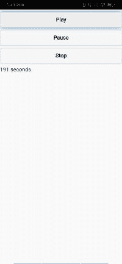

# 媒体位置和持续时间

> 原文：<https://www.javatpoint.com/media-position-and-duration-in-phonegap>

之前，我们学习了如何播放音频和视频内容、控制媒体回放以及调整媒体音量。在本节中，我们将了解媒体位置和持续时间。当我们与媒体合作时，我们也经常想知道一个特定的媒体片段有多长，以及我们在那个特定的媒体片段中的位置。

以下是获取媒体位置和持续时间的步骤。

### 1)创建 index3.html

我们将创建一个新的 html 文件，即**index3.html**，其内容与**index.html**相同。我们将在不影响**index.html**中的代码的情况下对**index3.html**文件进行更改。


### 2)在用户界面中创建输出字段

现在，我们将使用 [**<输出></输出>** 标签](https://www.javatpoint.com/html-output-tag)创建位置和持续时间的输出字段。这些输出标签用于以下列方式显示媒体位置和持续时间:

```

<output id="outPosition"></output>/<output id="outDuration"></output>

```

### 3)过期

现在，我们将使用 Id 获得**超时**字段，并通过以下方式将分钟转换为秒来分配玩家的持续时间:

```

document.getElementById('outDuration').innerHTML = Math.round(player.duration) + " seconds";

```



### 4)外派

现在，我们将通过使用 setInterval()函数找到间隔。该函数包含两个参数，即**显示时间**和持续时间。我们将在**窗口外创建显示时间功能，通过以下方式加载**功能:

```

intv = setInterval(displayTime, 500);<!?This line will be added in onload function-->
function displayTime(e)
{
            document.getElementById('outPosition').innerHTML = Math.round(player.currentTime);
}

```


### 完整代码:

```

<!DOCTYPE html>
<html>
    <head>
        <meta charset="utf-8">
        <meta name="viewport" content="initial-scale=1, maximum-scale=1, user-scalable=no, width=device-width">
        <title>Audio and Video Example</title>
		<link rel="stylesheet" href="http://code.jquery.com/mobile/1.4.5/jquery.mobile-1.4.5.min.css" />
		<script src="http://code.jquery.com/jquery-1.11.1.min.js"></script>
		<script src="http://code.jquery.com/mobile/1.4.5/jquery.mobile-1.4.5.min.js"></script>
		<script>
		var player;

		window.onload = function()
		{
			player = document.getElementById('mysong');
			document.getElementById('Play').addEventListener('click', function(){
				player.play();
				document.getElementById('outDuration').innerHTML = Math.round(player.duration) + " seconds";
				intv = setInterval(displayTime, 500);
			});
			document.getElementById('Pause').addEventListener('click', function(){
				player.pause();
			});
			document.getElementById('Stop').addEventListener('click', function(){
				player.pause();
				player.currentTime = 0;
			});

			$('#rngVolume').on("slidestop", function(){
            var volume = document.getElementById('rngVolume').value;
            console.log(volume);
            player.volume = volume;

            });
		}
		function displayTime(e)
        {
            document.getElementById('outPosition').innerHTML = Math.round(player.currentTime);
        }
		</script>
	</head>
    <body>
		<audio id="mysong">
		<source src="media/Saki.mp3"/>
		</audio>
		<button id="Play">Play</button>
		<button id="Pause">Pause</button>
		<button id="Stop">Stop</button>
		<output id="outPosition"></output>
		<output id="outDuration"></output>
        <script type="text/javascript" src="cordova.js"></script>
    </body>
</html>

```

[下载完整项目](https://static.javatpoint.com/tutorial/phonegap/download/media.zip)

* * *