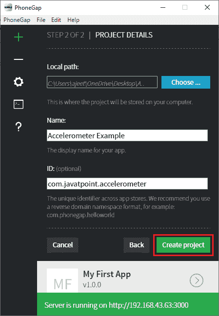

# 读取加速度计

> 原文：<https://www.javatpoint.com/phonegap-reading-the-accelerometer>

我们知道 PhoneGap 旨在使开发跨平台应用程序变得容易。如果 PhoneGap 不具备与设备硬件交互的能力，它的功能就不会太强大。在本节中，我们将使用加速度计来确定设备在空间中的位置。在 PhoneGap 中使用加速度计时，将采用以下步骤:

### 1)创建新项目

首先，我们将用空白模板创建一个新的 [PhoneGap](https://www.javatpoint.com/phonegap) 项目。如果你不知道如何用空白模板创建一个应用，请通过 [PhoneGap 项目](https://www.javatpoint.com/creating-a-new-phonegap-project)链接。




### 2)创建窗口加载功能

现在，我们将用我们喜欢的标题来更改标题标签。我们将在[**<></脚本>** 标签](https://www.javatpoint.com/html-script-tag)之间创建 window.onload 函数。在这个窗口中，我们将打开加速度计。为此，我们将调用导航器并持续观察加速度。当加速度改变时，它将返回 x、y 和 z 轴的新值。

**watchAcceleration** 函数有三个回调函数，即成功、失败和频率。最后一个功能是我们发送给加速度计的选项。这将被编码为:

```

<script>
window.onload=function(){
              var watch_id = navigator.accelerometer.watchAcceleration(success, fail, {frequency: 1000});
 	}
</script>

```

### 3)创建回调函数

现在，我们将创建**成功**和**失败**回调函数。当任何类型的故障发生时，将调用 fail 函数。该功能仅包含报警功能。之后，我们将创建一个**成功**功能。在这个函数中，我们将得到一个包含加速度信息的对象。该函数以加速度信息为参数。

我们将首先处理实际的 X 值。因此，我们将在用户界面中创建一个输出字段，并使用 **id** 属性以下列方式给 id 一个 Id:

```

<output id="outX"></output>

```


现在，在成功函数中，我们将使用**文档获取 **outX** 元素。getElementById()** 并按照以下方式从加速度信息中设置 X 值:

```

document.getElementById('outX').innerHTML = "X:" + accel.x;

```

同样，我们将对 Y 和 z 进行操作。我们将为它们创建输出字段，并获得两个元素。

为 Y 和 Z 创建输出字段

```

<output id="outY"></output>
<output id="outZ"></output>

```

获取 outY 和 outZ 元素

```

document.getElementById('outY').innerHTML = "<br/>Y:" + accel.y;
document.getElementById('outZ').innerHTML = "<br/>Z:" + accel.z;

```

### 完整代码:

```

<!DOCTYPE html>
<html>
    <head>
        <meta charset="utf-8">
        <meta name="viewport" content="initial-scale=1, maximum-scale=1, user-scalable=no, width=device-width">
        <title> Accelerometer </title>
        <script>
            window.onload = function()
            {
                var watchID = navigator.accelerometer.watchAcceleration(success, fail, {frequency: 100});   
            }            
            function success(accel)
            {   
                document.getElementById('outX').innerHTML = "X:" + accel.x;
                document.getElementById('outY').innerHTML = "<br/>Y:" + accel.y;
                document.getElementById('outZ').innerHTML = "<br/>Z:" + accel.z;
            }
            function fail(e)
            {
                alert("Accelerometer Error");
            }
        </script>
    </head>
    <body>
        <output id="outX"></output>
        <output id="outY"></output>
        <output id="outZ"></output>
        <script type="text/javascript" src="cordova.js"></script>
    </body>
</html>

```

**输出:**


* * *