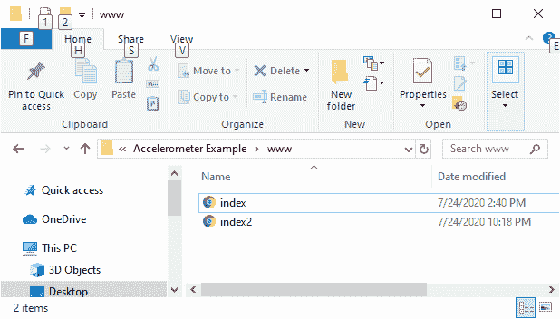
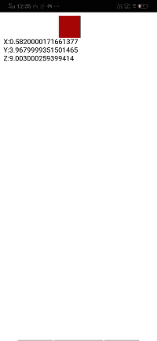

# 用加速度计移动物体

> 原文：<https://www.javatpoint.com/moving-an-object-with-the-accelerometer-in-phonegap>

在前一节中，我们使用 PhoneGap 读取了设备加速度计。在这一节中，我们将看看环绕的加速度计，并使用它来做一些建设性的事情，比如在屏幕上移动一个物体。我们将对前面的示例进行一些更改。以下是使用加速度计移动物体的步骤:

### 1)创造 index2.html

我们将创建一个新文件**index2.html**，其代码与**index.html**中预设的相同。我们稍后将在**index2.html**文件中进行更改，而不是在**index.html**中。



### 2)为移动创建红色块

现在，我们将使用[**<></div>**标记](https://www.javatpoint.com/html-div-tag)创建一个移动块。我们将使用 **id 属性**给它一个 Id，因为 [JavaScript](https://www.javatpoint.com/javascript-tutorial) 不知道 [HTML 标签](https://www.javatpoint.com/html-tags)。

```

<div id="blockRed"></div>

```

### 3)更改红色块的样式

我们将使用 [**<样式></样式>** 标记](https://www.javatpoint.com/html-style)来更改红色块的样式。我们将通过以下方式设置[背景颜色](https://www.javatpoint.com/html-background-color)、宽度和高度:

```

<style>
        #blockRed
        {
                background-color: #aa0000;
                width: 50px;
                height: 50px;
         }
</style>

```

### 4)在窗口中进行更改。加载功能

我们将在**成功**功能中进行更改。如果 X 加速度小于 0，我们将取 X 位置变量，标记 X 轴上红色方块的 X 位置，并将加速度 X 值的绝对值加到该位置。

```

if(accel.x < 0)
{
                    xPos = xPos + (Math.abs(accel.x));
                    document.getElementById('blockRed').style.marginLeft = xPos + "px";
}

```

否则，我们将通过以下方式乘以负 1，使 xPos 为负数:

```

else
{
           xPos = xPos + (accel.x * -1);
           document.getElementById('blockRed').style.marginLeft = xPos + "px";
} 

```

### 完整代码:

```

<!DOCTYPE html>
<html>
    <head>
        <meta charset="utf-8">
        <meta name="viewport" content="initial-scale=1, maximum-scale=1, user-scalable=no, width=device-width">
        <title>Accelerometer</title>
        <style>
        #blockRed
            {
                background-color: #aa0000;
                width: 50px;
                height: 50px;
            }
        </style>
        <script>
            var xPos=0;
            window.onload = function()
            {
                var watchID = navigator.accelerometer.watchAcceleration(success, fail, {frequency: 100});

            }

            function success(accel)
            {   

                if(accel.x < 0){
                    xPos = xPos + (Math.abs(accel.x));
                    document.getElementById('blockRed').style.marginLeft = xPos + "px";
                } else
                {
                    xPos = xPos + (accel.x * -1);
                    document.getElementById('blockRed').style.marginLeft = xPos + "px";
                }

                document.getElementById('outX').innerHTML = "X:" + accel.x;
                document.getElementById('outY').innerHTML = "<br/>Y:" + accel.y;
                document.getElementById('outZ').innerHTML = "<br/>Z:" + accel.z;
            }

            function fail(e)
            {
                alert("Accelerometer Error");
            }
        </script>
    </head>
    <body>
        <div id="blockRed"></div>
        <output id="outX"></output>
        <output id="outY"></output>
        <output id="outZ"></output>

        <script type="text/javascript" src="cordova.js"></script>

    </body>
</html> 

```

**输出**



[下载完整项目](https://static.javatpoint.com/tutorial/phonegap/download/AccelerometerExample.zip)

* * *