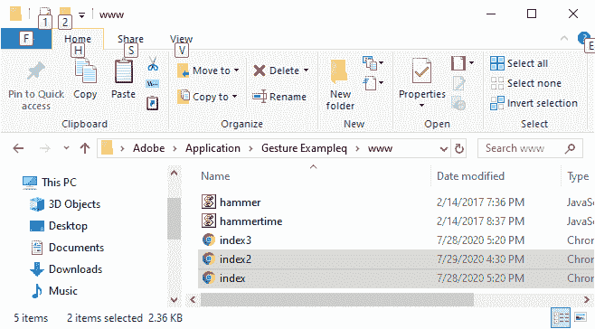
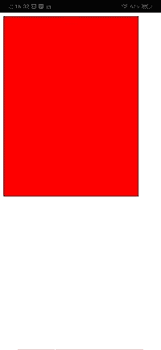
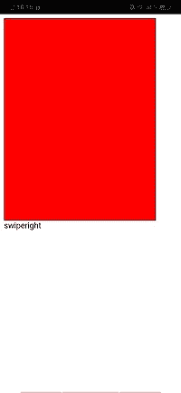
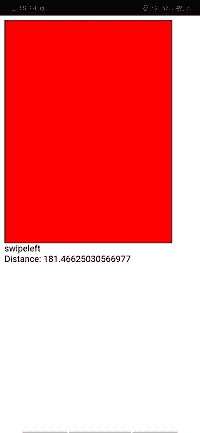
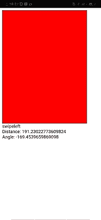

# PhoneGap 中的刷卡和平底锅

> 原文：<https://www.javatpoint.com/swipes-and-pans-in-phonegap>

在手势的前几节中，我们学习了锤子库、敲击、触摸以及如何在 PhoneGap 中检测手势。在这一节中，我们将学习**刷**和**锅**的手势。我们将仔细看看这些手势是如何工作的。我们将使用我们前面的例子，并对轻击和触摸手势进行一些更改。以下是用于开发**轻击**和**触摸**手势应用的步骤:

### 1)创建 index2.html

我们将创建一个新文件**index3.html**，其代码与**index.html**中预设的相同。我们稍后将在**index3.html**文件中进行更改，而不是在**index.html**中。




### 2)获取手势分区

现在，我们将通过使用 id 获得手势 div，并创建锤子对象。我们将获得手势元素，并使用 [**<脚本></脚本>** 标签](https://www.javatpoint.com/html-script-tag)在身体部分创建锤子对象。这与**窗口加载**功能的工作方式相同。

```

<body>
        <div id="gestureDiv"></div>
        <div id="resultDiv"></div>
        <script type="text/javascript" src="cordova.js"></script>
        <script>
          	    var myElement = document.getElementById('gestureDiv');
                var mc = new Hammer(myElement);
        </script>
</body>

```

### 3)找出事件的类型

当我们向左或向右滑动屏幕时，将调用匿名函数。这个函数将返回事件，然后我们将事件类型存储到一个变量中。之后，我们将以如下方式将该变量设置为我们的结果 div:

```

var out = ev.type + "<br/>";
document.getElementById('resultDiv').innerHTML = out;

```



### 4)更多信息

我们有很多信息，而不仅仅是手势的类型。我们可以通过以下方式添加手势移动的距离:

```

out += "Distance: " + ev.distance + "<br/>";

```



我们还可以得到刷卡的角度。下面提到的代码行告诉我们刷卡发生在什么角度。

```

out += "Angle: " + ev.angle + "<br/>";

```



我们还可以得到δx 和δy，δx 和δy 分别是沿 x 轴和 y 轴移动的距离。

```

out += "DeltaX: " + ev.deltaX + "<br/>";
out += "DeltaY: " + ev.deltaY + "<br/>";

```


### 完全码

```

<!DOCTYPE html>
<html>
    <head>
        <meta charset = "utf-8" >
        <meta name = "viewport" content = "initial-scale = 1, maximum-scale = 1, user-scalable = no, width = device-width" >
        <script src = "hammer.js" ></script>
        <script src = "hammertime.js" ></script>
        <style>
        #gestureDiv
            {
                width : 300px;
                height : 400px;
                background-color : red;
                border : 1px solid black;
            }
        </style>
        <title> Gesture Example </title>
    </head>
    <body>
        <div id = "gestureDiv" ></div>
        <div id = "resultDiv" ></div>
        <script type = "text/javascript" src = "cordova.js" ></script>
        <script>
          var myElement = document.getElementById('gestureDiv');
                var mc = new Hammer(myElement);
                mc.on("swipeleft swiperight", function(ev) {
	    	var out = ev.type + "<br/>";
                	out += "Distance: " + ev.distance + "<br/>";
	    	out += "DeltaX: " + ev.deltaX + "<br/>";
	    	out += "DeltaY: " + ev.deltaY + "<br/>";				
	    	document.getElementById('resultDiv').innerHTML = out;
            });	
        </script>
    </body>
</html>

```

[下载完整项目](https://static.javatpoint.com/tutorial/phonegap/download/GestureExample.zip)

* * *