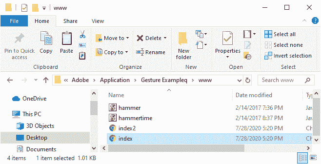
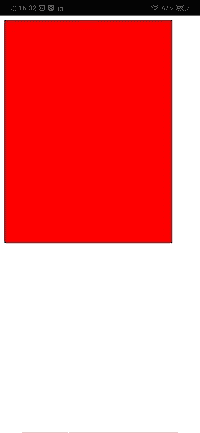
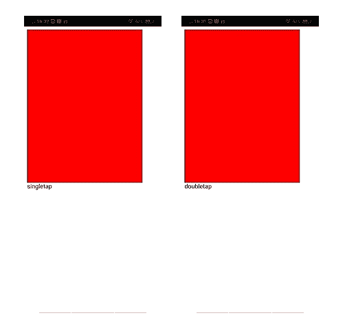

# 在 PhoneGap 中点击并触摸手势

> 原文：<https://www.javatpoint.com/tap-and-touch-gestures-in-phonegap>

在前一节中，我们了解了锤子库，以及如何在 PhoneGap 中检测手势。在本节中，我们将学习**轻击**和**触摸**手势。我们将仔细看看这些手势是如何工作的。我们将使用我们前面的例子，并对轻击和触摸手势进行一些更改。以下是开发**点击**和**触摸**手势应用的步骤:

### 1)创建 index2.html

我们将创建一个新文件**index2.html**，其代码与**index.html**中预设的相同。我们稍后将在**index2.html**文件中进行更改，而不是在**index.html**中。




### 3)获取手势分区

现在，我们将通过使用 id 获得手势 div，并创建锤子管理器对象。锤子管理器对象没有任何预先保存的事件。所以，我们需要自己定义事件。

```

var myElement = document.getElementById('gestureDiv');
var mc = new Hammer.Manager(myElement);

```

### 3)添加事件

现在，我们将添加单击和双击事件，因为锤子管理器对象没有任何预先保存的事件。我们将使用锤子管理器的添加功能，传递我们想要添加的事件。我们将以下列方式添加事件:

```

//Events Hammer will detect
mc.add(new Hammer.Tap({ event: 'doubletap', taps: 2 }));
mc.add(new Hammer.Tap({ event: 'singletap' }));

```

### 4)附上两个事件

现在，我们将把这两个事件相互关联或协调起来，因为当我们轻敲一次已经在事件中的事件时，除非我们让这两个事件一起工作，否则我们永远无法达到双击。我们将使用锤子管理器的**获取**功能以下列方式附加这两个事件:

```

//Make them work together
mc.get('doubletap').recognizeWith('singletap');
mc.get('singletap').requireFailure('doubletap');

```

### 5)检测事件

当我们按下单击或双击时，匿名函数将被调用。在这个函数中，我们将以如下方式将事件类型设置为我们的结果 div:

```

mc.on("singletap doubletap", function(ev){
        document.getElementById("resultDiv").innerHTML = ev.type;
})

```

现在，我们将使用本地主机在 [PhoneGap](https://www.javatpoint.com/phonegap) 开发者应用程序或网站上运行我们的应用程序。

### 完全码

```

<!DOCTYPE html>
<html>
    <head>
        <meta charset= "utf-8" >
        <meta name = "viewport" content = "initial-scale = 1, maximum-scale = 1, user-scalable = no, width = device-width" >
        <script src = "hammer.js" ></script>
        <script src = "hammertime.js" ></script>
        <style>
        #gestureDiv
            {
                width : 300px;
                height : 400px;
                background-color : red;
                border : 1px solid black;
            }
        </style>
        <title> Gesture Example </title>
    </head>
    <body>
        <div id = "gestureDiv" ></div>
        <div id = "resultDiv" ></div>
        <script type = "text/javascript" src = "cordova.js" ></script>
		<script>
          var myElement = document.getElementById('gestureDiv');
          var mc = new Hammer.Manager(myElement);

          //Events Hammer will detect
          mc.add(new Hammer.Tap({event : 'doubletap', taps : 2}));
          mc.add(new Hammer.Tap({event : 'singletap'}));

          //Make them work together
          mc.get('doubletap').recognizeWith('singletap');
          mc.get('singletap').requireFailure('doubletap');

          mc.on("singletap doubletap", function(ev){
              document.getElementById("resultDiv").innerHTML = ev.type;
          })
        </script>
    </body>
</html>

```

**输出**



* * *