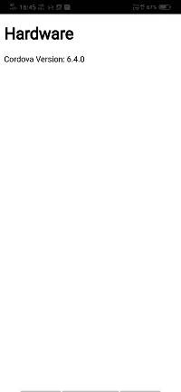
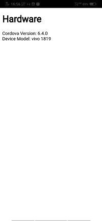

# 设备插件

> 原文：<https://www.javatpoint.com/device-plugin-in-phonegap>

在前一节中，我们学习了许多关于 PhoneGap 的有趣话题。现在，在本节中，我们将讨论设备硬件。我们不知道我们的应用程序将在什么类型的硬件上运行。我们可以获得一些关于硬件的信息，并在我们的程序中使用它。在本节中，我们将了解设备信息插件，它告诉我们关于设备以及我们的应用程序在哪个设备上运行。之后，我们将了解设备方向，它将告诉我们设备面向哪个方向，网络信息插件，它将告诉我们我们的设备所连接的网络，以及电池状态插件，在我们在另一部分的 [PhoneGap](https://www.javatpoint.com/phonegap) 中进行某种类型的高级或冗长操作之前，它将检查电池状态。

现在，我们将使用以下步骤来使用设备插件并获取设备信息:

#### 注意:出于安全原因，不同的制造商可能允许也可能不允许我们实施某些部分。

### 1)创建新项目

首先，我们将使用空白模板创建一个新的 PhoneGap 项目。如果你不知道如何用空白模板创建一个应用，请通过 [PhoneGap 项目](https://www.javatpoint.com/creating-a-new-phonegap-project)链接。


### 2)创建窗口加载功能

成功创建新项目后，我们将在项目标题下创建 window.onload 函数。在这个函数中，我们将获得我们的应用程序使用的科尔多瓦版本，如下所示:

```

<script>
window.onload=function()
            {
                alert(device.cordova);
</script>

```

### 3)为结果创建一个字段

现在，我们将使用[**<div></div>**标签](https://www.javatpoint.com/html-div-tag)为结果创建一个字段。 [JavaScript](https://www.javatpoint.com/javascript-tutorial) 不知道 [HTML 标签](https://www.javatpoint.com/html-tags)。因此，我们将在 onload 函数中给它一个 id 来访问它。

```

<body>
        <h1>Hardware</h1>
        <div id="result"></div>
        <script type="text/javascript" src="cordova.js"></script>
</body>

```

### 4)创建输出字符串

现在，我们将创建一个输出字符串来查看大量可用信息。我们将创建一个字符串变量，然后在其中添加所有信息。之后，我们将以如下方式在结果 div 上显示结果:

```

var out="";
out += "Cordova Version: " + device.cordova;
document.getElementById('result').innerHTML = out;

```



之后，我们将使用换行符在这个字符串变量中添加以下信息:

1)如果我们设备的制造商和特定的安卓系统允许，我们也可以获得设备型号的信息。我们将使用**设备模型**获取设备模型，并通过以下方式将其添加到输出字符串中:

```

out += "<br/>Device Model: " + device.model;

```



2)我们还可以获得关于设备平台的信息。我们将使用**设备平台**获取设备平台，并通过以下方式将其添加到输出字符串中:

```

out += "<br/>Device Platform: " + device.platform;

```


3)我们可以得到 UUID，即通用唯一标识符。我们将使用**设备. uuid** 获取 UUID，并以下列方式将其添加到输出字符串中:

```

out += "<br/>UUID: " + device.uuid;

```


4)我们可以获得关于我们设备版本的信息。我们将使用**设备. version** 获取设备版本，并通过以下方式将其添加到输出字符串中:

```

out += "<br/>Version: " + device.version;

```


5)我们可以获得关于我们设备制造商的信息。我们将使用**设备. version** 获取设备制造商，并通过以下方式将其添加到输出字符串中:

```

out += "<br/>Manufacturer: " + device.manufacturer;

```


6)我们还可以获得移动设备的序列号。我们将使用**设备获取序列号。序列号**并通过以下方式将其添加到输出字符串中:

```

out += "<br/>Serial: " + device.serial;

```


### 完全码

```

<!DOCTYPE html>
<html>
    <head>
        <meta charset = "utf-8" >
        <meta name = "viewport" content = "initial-scale = 1, maximum-scale = 1, user-scalable= no, width= device-width">
        <title> Hardware </title>
        <script>
            window.onload=function()
            {
                var out="";
                out += "Cordova Version: " + device.cordova;
                out += "<br/> Device Model: " + device.model;
                out += "<br/> Device Platform: " + device.platform;
                out += "<br/> UUID: " + device.uuid;
                out += "<br/> Version: " + device.version;
                out += "<br/> Manufacturer: " + device.manufacturer;
                out += "<br/> Serial: " + device.serial;
                document.getElementById('result').innerHTML = out;   
           }
	</script>
    </head>
    <body>
        <h1> Hardware </h1>
        <div id = "result" ></div>
        <script type = "text/javascript" src = "cordova.js" ></script>
    </body>
</html>

```

**输出**


* * *