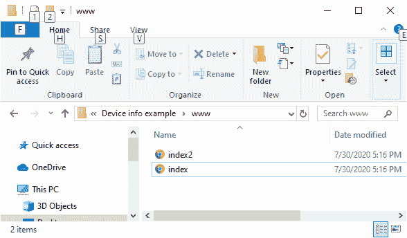
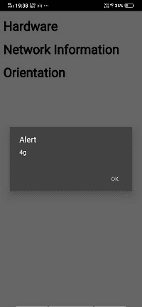
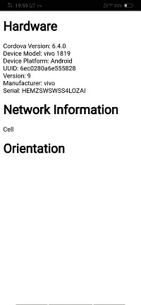

# 方向、网络和电池状态插件

> 原文：<https://www.javatpoint.com/orientation-network-and-battery-status-plugin-in-phonegap>

在前一节中，我们了解了**设备信息**插件。在这一部分，我们将了解其余的插件，即**设备定位插件、【网络信息插件】T3、**电池状态插件**。每个插件的完整描述如下:**

### 设备定位插件

对于设备方向，我们将使用我们之前的示例，即**设备信息示例**。我们将使用以下步骤在我们的 [PhoneGap](https://www.javatpoint.com/phonegap) 应用程序中使用设备定位插件:

### 1)创建 index2.html 文件

我们将创建一个新文件**index2.html**，其代码与**index.html**中预设的相同。我们稍后将在**index2.html**文件中进行更改，而不是在**index.html**中。



### 2)创建一个字段来显示用户界面上的方向

我们将在应用程序中使用 **< h1 > < /h1 >** 标签添加标题。之后，我们将使用[**<div></div>**标签](https://www.javatpoint.com/html-div-tag)在用户界面上显示方位信息。

```

<body>
        <h1> Hardware </h1>
        <div id="result"></div>
        <h1> Orientation </h1>
        <div id="orientation"></div>
        <script type="text/javascript" src="cordova.js"></script>
</body>

```

### 3)在窗口中进行更改。加载功能

现在，我们将对**窗口进行一些更改。我们将创建一个手表 Id，因为指南针会一直工作，直到我们停止它。所以最终，我们想清除那个手表 Id。我们将使用 navigator.compass.watch heading()访问它。这个函数接受三个回调函数，即成功、错误和频率。我们将通过以下方式访问观察标识:**

```

var watchId = navigator.compass.watchHeading(success, error, {frequency: 100});

```

### 4)创建成功和错误回调函数

我们将制作成功和错误回调函数。成功和错误函数分别以标题和错误作为参数。在错误回调函数中，我们将简单地使用 alert 函数，而在 success 函数中，我们将通过以下方式在 orientation div 中设置方向数据:

```

function success(heading)
{
          document.getElementById('orientation').innerHTML = heading.magneticHeading;
}

function error(error)
{
          alert("Compass Error: " + error.code);
}

```

#### 注:我们可以看到或看不到方向信息。只有当设备制造商允许时，我们才能看到它。

## 网络信息插件

现在，我们来看看网络信息插件。我们将在我们的**index2.html**中添加一些代码行。以下是我们使用**网络信息插件**将执行的步骤。通过使用这个插件，我们可以准确地找到我们所连接的网络类型。

### 1)在用户界面上创建一个显示网络信息的字段

我们将在我们的应用程序中使用 **< h1 > < /h1 >** 标签添加一个标题。之后，我们将使用**<></div>**标签在用户界面上显示方位信息的字段。

```

<body>
        <h1> Hardware </h1>
        <div id = "result" ></div>
        <script type="text/javascript" src="cordova.js"></script>
        <h1> Network Information </h1>
        <div id = "networkResult" ></div>
        <h1> Orientation </h1>
        <div id = "orientation" ></div>
</body>

```

### 2)在窗口中添加网络信息

我们将创建一个变量，并存储 navigator.connection.type 返回的数据，然后通过以下方式将该变量传递给 alert 函数:

```

//Network Information
var networkType = navigator.connection.type;
alert(networkType);	

```



它看起来真的很好，但是还有很多其他类型需要知道。连接可以是未知的，以太网、 [Wi-Fi](https://www.javatpoint.com/wifi-full-form) 、2G、3G、4G 等。我们可以使用枚举来访问不同类型的连接。我们将创建一个枚举类型。我们将使用 id 访问该元素，在该元素中，我们以如下方式在用户界面上显示结果:

```

var conType = {};
conType[ Connection.UNKOWN ] = "Connection Unknown";
conType[ Connection.ETHERNET ] = "Ethernet";
conType[ Connection.WIFI ] = "wifi";
conType[ Connection.CELL_2G ] = "Cell";
conType[ Connection.CELL_3G ] = "Cell";
conType[ Connection.CELL_4G ] = "Cell";
conType[ Connection.CELL ] = "Cell";
conType[ Connection.NONE ] = "None";
document.getElementById('networkResult').innerHTML = conType[networkType]; 

```

现在，我们将在 PhoneGap 开发者应用程序上运行我们的应用程序:



### 电池状态插件

电池状态是 **PhoneGap** 可以交互的另一个硬件。如果我们要执行关键操作，需要查看电池状态。我们希望确保它在运行过程中不会耗尽电池。有几种不同的方法可以获取电池状态。我们将使用以下步骤在应用程序中获取电池状态:

### 1)创建电池状态事件监听器

现在，我们将在窗口中附加一个名为 batterystatus 的事件侦听器。此事件侦听器将调用 onBatteryStatusChange 函数。该函数将电池状态作为参数。batteryStatus 事件侦听器将以以下方式编写:

```

//Battery Status
window.addEventListener('batterystatus', onBatteryStatusChange, false);

```

### 2)创建 onBatteryStatusChange 函数

现在，我们将创建 **onBatteryStatusChange** 回调函数。这个回调函数包含一个报警函数，它告诉我们状态的级别以及状态是否接通。 **onBatteryStatusChange** 功能设计如下:

```

function onBatteryStatusChange(status)
{
               alert("Battery Level: " + status.level + " Plugged in: " + status.isPlugged);
} 

```

我们也可以使用 batterylow 和 batterycritical 事件侦听器，而不是使用 batterystatus。它们的工作方式与电池状态工作方式相同。batterylow 和 batterycritical 事件侦听器的设计方式如下:

```

window.addEventListener('batterylow', onBatteryStatusLow, false);
window.addEventListener('batterycritical', onBatteryCritical, false);

```

### 完全码

```

<!DOCTYPE html>
<html>
    <head>
        <meta charset="utf-8">
        <meta name="viewport" content="initial-scale=1, maximum-scale=1, user-scalable=no, width=device-width">
        <title>Hardware</title>
        <script>
            window.onload=function()
            {
                var out="";
                out += "Cordova Version: " + device.cordova;
                out += "<br/>Device Model: " + device.model;
                out += "<br/>Device Platform: " + device.platform;
                out += "<br/>UUID: " + device.uuid;
                out += "<br/>Version: " + device.version;
                out += "<br/>Manufacturer: " + device.manufacturer;
                out += "<br/>Serial: " + device.serial;
                document.getElementById('result').innerHTML = out;

                //Network Information
                var networkType = navigator.connection.type;
                var conType = {};
                conType[Connection.UNKOWN] = "Connection Unknown";
                conType[Connection.ETHERNET] = "Ethernet";
                conType[Connection.WIFI] = "wifi";
                conType[Connection.CELL_2G] = "Cell";
                conType[Connection.CELL_3G] = "Cell";
                conType[Connection.CELL_4G] = "Cell";
                conType[Connection.CELL] = "Cell";
                conType[Connection.NONE] = "None";
                document.getElementById('networkResult').innerHTML = conType[networkType];

                var watchId = navigator.compass.watchHeading(success, error, {frequency: 100});

                //Battery Status
                window.addEventListener('batterystatus', onBatteryStatusChange, false);

//                window.addEventListener('batterylow', onBatteryStatusLow, false);
//                
//                window.addEventListener('batterycritical', onBatteryCritical, false);
//                
                function onBatteryStatusChange(status)
                {
                    alert("Battery Level: " + status.level + " Plugged in: " + status.isPlugged);
                }

            }

            function success(heading)
            {
                document.getElementById('orientation').innerHTML = heading.magneticHeading;
            }

            function error(error)
            {
                alert("Compass Error: " + error.code);
            }

        </script>
    </head>
    <body>
        <h1>Hardware</h1>
        <div id="result"></div>
        <script type="text/javascript" src="cordova.js"></script>
        <h1>Network Information</h1>
        <div id="networkResult"></div>
        <h1>Orientation</h1>
        <div id="orientation"></div>
    </body>
</html>

```

**输出**


[下载完整项目](https://static.javatpoint.com/tutorial/phonegap/download/Deviceinfoexample.zip)

* * *