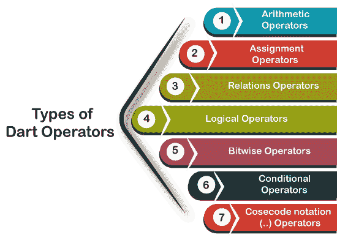

# Dart 操作员

> 原文：<https://www.javatpoint.com/dart-operators>

运算符是用于操作值或对其操作数执行操作的符号。给定的表达式:5+4，在这个表达式中，5 和 4 是操作数，“+”是运算符。

Dart 提供了一组广泛的内置操作符来完成各种类型的操作。运算符可以是一元或二元的，这意味着一元只接受操作数，二元用运算符接受两个操作数。有几种类型的运算符。以下是 Dart 操作员列表。

## 运算符的类型

[Dart](https://www.javatpoint.com/dart-programming) 支持以下类型的操作符。

*   算术运算符
*   赋值运算符
*   关系运算符
*   类型测试运算符
*   逻辑运算符
*   按位运算符
*   条件运算符
*   Casecade 符号(..)操作员



### Dart 算术运算符

算术运算符是最常见的运算符，用于执行加法、减法、乘法、除法等。假设变量 a 保持 20，变量 b 保持 10，然后-

| Sr | 操作员名 | 描述 | 例子 |
| 1. | 加法(+) | 它将左操作数与右操作数相加。 | a+b 将返回 30 |
| 2. | 减法(-) | 它从左操作数中减去右操作数。 | a-b 将返回 10 |
| three | 除(/) | 它将第一个操作数除以第二个操作数，并返回商。 | a/b 将返回 2.0 |
| 4. | 乘法(*) | 它将一个操作数乘以另一个操作数。 | a*b 将返回 200 |
| 5. | 模量(%) | 它在将一个操作数除以另一个操作数后返回一个提醒。 | a%b 将返回 0 |
| 6. | 除法(~/) | 它将第一个操作数除以第二个操作数，并返回整数商。 | a/b 将返回 2 |
| 7. | 一元减号(-expr) | 它与单个操作数一起使用时会改变它的符号。 | -(a-b)将返回-10 |

**示例-**

```

void main(){
  print("Example of Assignment operators");
  var n1 = 10;
  var n2 = 5;

  print("n1+n2 = ${n1+n2}");
  print("n1-n2 = ${n1-n2}");
  print("n1*n2 = ${n1*n2}");
  print("n1/=n2 = ${n1/n2}"); 
  print("n1%n2 = ${n1%n2}");   
}

```

**输出:**

```
Example of Arithmetic operators 
n1+n2 = 15 
n1-n2 = 5 
n1*n2 = 50 
n1/=n2 = 2 
n1%n2 = 0

```

*   **镖形一元运算符(后置和前置)**

在 [Java](https://www.javatpoint.com/java-tutorial) 中，有**+**和 **-** 运算符，分别称为增量运算符和减量运算符，也称为一元运算符。一元运算符，对单个操作数进行运算，其中++分别对操作数加 1 和对操作数减 1。

一元运算符有两种用法——后缀和前缀。如果++用作后缀(如 x++)，它首先返回操作数的值，然后增加 x 的值。如果-用作前缀(如++x)，它增加 x 的值。

| Sr | 操作员名 | 描述 | 例子 |
| 1. | ++(前缀) | 它增加操作数的值。 | ++x |
| 2. | ++(后缀) | 它返回递增前操作数的实际值。 | x++ |
| 3. | -(前缀) | 它减少操作数的值。 | ［加在以-u 结尾的法语词源的名词之后构成复数］ |
| 4. | -(后缀) | 它返回减量前操作数的实际值。 | x - |

让我们理解下面的例子-

**示例-**

```

void main() { 
   var x = 30; 
   print(x++);                  //The postfix value

var y = 25;
print(++y);                 //The prefix value,

var z = 10;
print(--z);                  //The prefix value

var u = 12;                                         
   print(u--);    }           //The postfix value

```

**输出:**

```
30
26
9
12

```

### 赋值运算符

赋值运算符用于给变量赋值。我们也可以把它和算术运算符结合使用。赋值运算符列表如下所示。假设 a 值为 20，b 值为 10。

| 经营者 | 名字 | 描述 |
| =(赋值运算符) | 它将右表达式赋给左操作数。 |
| +=(添加和分配) | 它将右操作数的值加到左操作数上，并将结果赋回左操作数。例如- a+=b → a = a+b → 30 |
| -=(减法和赋值) | 它从左操作数中减去右操作数值，并将结果赋回左操作数。例如- a-=b → a = a-b → 10 |
| *=(乘法和赋值) | 它将操作数相乘，并将结果分配回左操作数。例如- a*=b → a = a*b → 200 |
| /=(除法和赋值) | 它将左操作数除以右操作数，并将结果分配回左操作数。例如- a%=b → a = a%b → 2.0 |
| ~/=(除法和赋值) | 它将左操作数除以右操作数，并将整数余数商返回到左操作数。例如- a%=b → a = a%b → 2 |
| %=(修改和分配) | 它将左操作数除以右操作数，余数分配回左操作数。例如- a%=b → a = a%b → 0 |
| < < =(左移并赋值) | 表达式 a<<=3 等于 a = a<<3 |
| > > =(右移并赋值) | 表达式 a>>=3 等于 a = a>>3 |
| &=(按位“与”赋值) | 表达式 a&=3 等于 a = a&3 |
| ^=(Bitwise 独家或和分配) | 表达式 a^=3 等于 a = a^3 |
| &#124;=(按位包含或和赋值) | 表达式 a&#124;=3 等于 a = a&#124;3 |

让我们理解下面的例子-

**示例-**

```

void main(){
 print("Example of Assignment operators");

  var n1 = 10;
  var n2 = 5;

  n1+=n2;
  print("n1+=n2 = ${n1}");

  n1-=n2;
  print("n1-=n2 = ${n1}");

  n1*=n2;
  print("n1*=n2 = ${n1}");

  n1~/=n2;
  print("n1~/=n2 = ${n1}");
  n1%=n2;
  print("n1%=n2 = ${n1}");  
}

```

**输出:**

```
Example of Assignment operators 
n1+=n2 = 15 
n1-=n2 = 10 
n1*=n2 = 50 
n1~/=n2 = 10 
n1%=n2 = 0 

```

### 关系运算子

关系运算符或比较运算符用于比较两个表达式和操作数。两个表达式的比较返回布尔值 true 和 false。假设 a 持有 20，b 持有 10，然后考虑下表。

| Sr | 操作员 | 描述 |
| 1. | >(大于) | b 将返回真。 |
| 2. |  | a |
| 3. | > =(大于或等于) | a>=b 将返回真。 |
| 4. | < =(小于或等于) | a<=b 将返回 FALSE。 |
| 5. | ==(等于) | a==b 将返回 FALSE。 |
| 6. | ！=(不等于) | a！=b 将返回 TRUE。 |

让我们理解下面的例子-

**示例-**

```

void main() { 
var a = 30;
var b = 20;

print("The example of Relational Operator");

var res = a>b;
print("a is greater than b: "+res. toString());  // We will learn the toString in next tutorial

var res0 = a=b;
print("a is greater than or equal to b: "+res1\. toString());

var res2 = a<=b;
print("a is less than and equal to b: "+res2\. toString());

var res3 = a!= b;
print("a is not equal to  b: "+res3\. toString());

var res4 = a==b;
print("a is  equal to  b: "+res4\. toString());
} 
```

**输出:**

```
The example of Relational Operator
a is greater than b: true
a is less than b: false
a is greater than or equal to b: true
a is less than and equal to b: false
a is not equal to  b: true
a is  equal to  b: false

```

### Dart 类型测试操作员

类型测试运算符用于在运行时测试表达式的类型。请考虑下表。

| Sr | 操作员 | 描述 |
| 1. | 如同 | 它用于类型转换。 |
| 2. | 存在 | 如果对象具有指定的类型，则返回真。 |
| 3. | 是！ | 如果对象没有指定类型，则返回真。 |

让我们理解下面的例子。

```

void main()
{
  var num = 10;
  var name = "JavaTpoint";
  print(num is int);  
  print(name is! String );
}

```

**输出:**

```
true
false

```

### Dart 逻辑运算符

逻辑运算符用于评估表达式并做出决策。Dart 支持以下逻辑运算符。

| Sr | 操作员 | 描述 |
| 1. | &&(逻辑与) | 如果所有表达式都为真，则返回。 |
| 2. | &#124;&#124;(逻辑或) | 如果任何表达式为真，则返回真。 |
| 3. | ！(逻辑非) | 它返回表达式的补码。 |

让我们理解下面的例子。

```

void main(){
  bool bool_val1 = true, bool_val2 = false; 
  print("Example of the logical operators");

  var val1 = bool_val1 && bool_val2;
  print(val1);

  var val2 = bool_val1 || bool_val2;
  print(val2);

  var val3 = !(bool_val1 || bool_val2);
  print(val3); 
}

```

**输出:**

```
Example of the logical operators 
false 
true 
false

```

### Dart 位运算符

按位运算符对两个操作数的值逐位执行运算。下面是按位运算符表。

让我们理解下面的例子。

```

If a = 7
b = 6
then binary(a) = 0111
binary(b) = 0011
Hence a & b = 0011, a|b = 0111 and a^b = 0100

```

| Sr | 经营者 | 描述 |
| 1. | &(二进制与) | 如果两位都是 1，则返回 1。 |
| 2. | &#124;(二进制或) | 如果任一位为 1，则返回 1。 |
| 3. | ^(Binary 异或) | 如果两位不同，则返回 1。 |
| 4. | ~(别人的称赞) | 它返回位的反方向。如果位为 0，则补语为 1。 |
| 5. | < | 左操作数的值向左移动右操作数中的位数。 |
| 6. | > >(右移) | 右操作数的值向左移动左操作数中的位数。 |

让我们理解下面的例子-

**示例-**

```

void main(){
  print("Example of Bitwise operators");

  var a  = 25;
  var b = 20;
  var c = 0;

  // Bitwise AND Operator
  print("a & b = ${a&b}");

  // Bitwise OR Operator
  print("a | b = ${a|b}");

  // Bitwise XOR
  print("a ^ b = ${a^b}");

  // Complement Operator
  print("~a = ${(~a)}");

  // Binary left shift Operator
  c = a <<2;
  print("c<<1= ${c}");

  // Binary right shift Operator
  c = a >>2;
  print("c>>1= ${c}");
}

```

**输出:**

```
Example of Bitwise operators 
a & b = 16
 a | b = 29
 a ^ b = 13
 ~a = 4294967270
 c<<1= 100
 c>>1= 6

```

### Dart 条件运算符(？:)

条件运算符与 if-else 语句相同，并提供与条件语句相似的功能。是 **if-else 语句**的第二种形式。也被认定为**“三元算子”**。语法如下。

**语法 1 -**

```

condition ? exp1 : exp2

```

如果给定条件为真，则返回 exp1，否则返回 exp2。

**语法 2 -**

```

exp1 ?? expr2

```

如果 exp1 不为-null，则返回其值，否则返回 exp2 的值。

让我们理解下面的例子。

**示例- 1**

```

void main() { 
   var x = null; 
   var y = 20; 
   var val = x ?? y; 
   print(val); 
}

```

**输出:**

```
20

```

让我们看看另一个场景。

示例-2

```

void main() { 
   var a = 30; 
   var output = a > 42 ? "value greater than 10":"value lesser than equal to 30"; 
   print(output); 
}

```

**输出:**

```
value lesser than or equal to 30

```

### Dart 级联符号运算符

级联符号运算符(..)用于评估同一对象上的一系列操作。它与方法链相同，避免了几个步骤，并且我们不需要将结果存储在临时变量中。

* * *