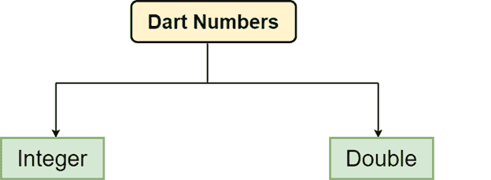

# Dart号

> 原文：<https://www.javatpoint.com/dart-number>

数字是用于保存数值的数据类型。在达特，它可以是两种类型-

*   整数
*   两倍



**Dart integer -** 整数是整数，表示可以不加小数而写成。例如- 20，30，-3215，0 等。整数可以是有符号的，也可以是无符号的。整数值的表示形式介于-263 到 263 个非十进制数字之间。 **int** 关键字用于在 [Dart](https://www.javatpoint.com/dart-programming) 中声明整数值。

```

int id = 501; 

```

**Dart Double-**Double 数字是可以用浮点数或者小数点大一点的数字来写的数字。 **double** 关键字用于在 Dart 中声明 double 值。

```

double root = 1.41234;
or
double rupees  = 100000;

```

### 整数值的规则

*   整数值必须是数字。
*   小数点不应包含在整数中。
*   无符号数总是正数。数字可以是负数，也可以是正数。
*   整数值的大小取决于平台，但整数值不应超过 64 位。

让我们看看下面的例子-

示例-

```

void main(){  
 int r = 5;
 double pi = 3.14;
 double res = 4*pi*r*r;  
 print("The area of sphere = ${(res)}");
}

```

**输出:**

```
The area of sphere 314 

```

### Dart parse()函数

parse()函数将数字字符串转换为数字。考虑下面的例子-

示例-

```

void main(){
var a = num.parse("20.56");
var b = num.parse("15.63");

var c = a+b; 
print("The sum is = ${c}");
}

```

**输出:**

```
The sum is = 36.19

```

**解释-**

在上面的例子中，我们使用 parse()方法将数字字符串转换成数字，然后存储在变量中。转换成功后，我们执行添加操作，并将输出打印到屏幕上。

## 数字属性

| 性能 | 描述 |
| hashcode(哈希代码) | 它返回给定数字的哈希代码。 |
| 完了吗 | 如果给定的数字是有限的，那么它返回真。 |
| 是无限的 | 如果这个数是无限的，它就会返回真。 |
| 是楠 | 如果数字非负，则返回真。 |
| 是负的 | 如果数字为负，则返回真。 |
| 符号 | 它根据给定数字的符号返回-1、0 或 1。 |
| 是甚至 | 如果给定的数字是偶数，那么它返回真。 |
| isOdd | 如果给定的数字是奇数，那么它返回真。 |

## 数字方法

下面给出了常用的编号方法。

| 方法 | 描述 |
| abs() | 它给出给定数字的绝对值。 |
| 天花板() | 它给出了给定数字的最高值。 |
| 楼层() | 它给出了给定数字的底价。 |
| compareTo() | 它将该值与其他数字进行比较。 |
| 余数() | 它给出了两个数相除后的截断余数。 |
| 圆形() | 它返回数字的整数。 |
| toDouble（） | 它给出了数字的双重等价表示。 |
| toInt（） | 返回数字的等效整数表示形式。 |
| toString() | 返回数字的等效字符串表示形式 |
| 截断() | 丢弃小数后返回整数。 |

* * *