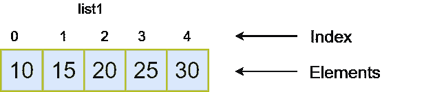

# 省道列表

> 原文：<https://www.javatpoint.com/dart-lists>

Dart List 类似于数组，它是对象的有序集合。数组是任何其他编程语言中最流行和最常用的集合。Dart 列表看起来像 JavaScript 数组文字。下面给出了声明列表的语法。

```

var list1 = [10, 15, 20,25,25]

```

Dart 列表是通过将所有元素存储在方括号([])中并用逗号(，)分隔来定义的。

让我们理解列表的图形表示-



**列表 1** -引用列表对象的是**列表变量**。

**索引-** 每个元素都有自己的索引号，指示元素在列表中的位置。索引号用于访问列表中的特定元素，如 list_name[index]。列表索引从 **0** 到**长度-1** 开始，其中长度表示列表中元素的编号。例如，-上面列表的长度是 4。

**元素-** 列表元素是指存储在给定列表中的实际值或镖对象。

## 列表类型

[镖](https://www.javatpoint.com/dart-programming)列表可以分为两种类型-

*   固定长度列表
*   可增长列表

### 固定长度列表

固定长度列表是用指定长度定义的。我们不能在运行时更改大小。语法如下。

**语法-创建固定大小的列表**

```

var list_name = new List(size)

```

以上语法用于创建固定大小的列表。我们不能在运行时添加或删除元素。如果有人试图修改它的大小，它将抛出一个异常。

下面给出了初始化固定大小列表元素的语法。

**语法-初始化固定大小列表元素**

```

list_name[index] = value;

```

让我们理解下面的例子。

**示例-**

```

void main() { 
   var list1 = new List(5); 
   list1[0] = 10; 
   list1[1] = 11; 
   list1[2] = 12; 
   list1[3] = 13;
   list1[4] = 14;  
   print(list1); 
}

```

**输出:**

```
[10, 11, 12, 13, 14]

```

**解释-**

在上面的例子中，我们已经创建了一个引用固定大小列表的变量**列表 1** 。列表的大小是 5，我们插入了对应于其索引位置的元素，其中 0 <sup>第</sup>索引包含 10，1 <sup>第</sup>索引包含 12，以此类推。

### 可增长列表

没有指定大小的列表称为可增长列表。可增长列表的大小可以在运行时修改。下面给出了声明可增长列表的语法。

**语法-声明列表**

```

// creates a list with values
var list_name = [val1, val2, val3]
Or 
// creates a list of the size zero
var list_name = new List()

```

**语法-初始化列表**

```

list_name[index] = value;

```

考虑下面的例子-

**示例- 1**

```

void main() { 
   var list1 = [10,11,12,13,14,15];
   print(list1); 
}

```

**输出:**

```
[10, 11, 12, 13, 14, 15]

```

在下面的示例中，我们使用空列表或 **List()** 构造函数创建一个列表。 **add()** 方法用于在给定列表中动态添加元素。

**示例- 2**

```

void main() { 
   var list1 = new List(); 
   list1.add(10); 
   list1.add(11); 
   list1.add(12); 
   list1.add(13);
   print(list1); 
}

```

**输出:**

```
[10, 11, 12, 13]

```

## 列表属性

以下是该列表的属性。

| 财产 | 描述 |
| 第一 | 它返回第一个元素大小写。 |
| 伊西普西伊普西伊普西伊普西伊普西伊普西伊普西伊普西伊普西伊普西伊普西伊普西伊普西伊普西伊普西伊普西 | 如果列表为空，则返回 true。 |
| 不是空的 | 如果列表至少有一个元素，则返回 true。 |
| 长度 | 它返回列表的长度。 |
| 最后的 | 它返回列表的最后一个元素。 |
| 颠倒的 | 它以相反的顺序返回一个列表。 |
| 单一的 | 它检查列表是否只有一个元素并返回它。 |

## 将元素插入列表

Dart 提供了四种用于将元素插入列表的方法。下面给出了这些方法。

*   添加()
*   阿德拉()
*   插入()
*   插入全部()

### add()方法

此方法用于在列表末尾插入指定的值。它可以一次添加一个元素，并返回修改后的列表对象。让我们理解下面的例子-

**语法-**

```

list_name.add(element);

```

**示例-**

```

void main() {
    var odd_list = [1,3,5,7,9];
    print(odd_list);
    odd_list.add(11);
    print(odd_list);
} 

```

**输出:**

```
[1, 3, 5, 7, 9]
[1, 3, 5, 7, 9, 11]

```

**解释-**

在上面的例子中，我们有一个名为 **odd_list 的列表，**保存奇数。我们使用 **add()** 函数插入了一个新的元素 11。 **add()** 函数将元素追加到列表末尾，并返回修改后的列表。

### addAll()方法

此方法用于将多个值插入给定列表。每个值都用逗号分隔，并用方括号([])括起来。语法如下。

**语法-**

```

list_name.addAll([val1,val2,val3,?..valN]);

```

让我们理解下面的例子-

```

void main() {
    var odd_list = [1,3,5,7,9]
     print(odd_list);
      odd_list.addAll([11,13,14]);
      print(odd_list);
}

```

**输出:**

```
[1, 3, 5, 7, 9]
[1, 3, 5, 7, 9, 11, 13, 14]

```

**解释-**

在上面的例子中，我们不需要多次调用 **add()** 函数。 **addAll()** 一次追加多个值，返回修改后的列表对象。

### 插入()方法

**insert()** 方法提供了在指定索引位置插入元素的功能。我们可以指定要插入列表的值的索引位置。语法如下。

```

list_name.insert(index,value);

```

让我们理解下面的例子-

```

void main(){
    List lst = [3,4,2,5];
    print(lst);
    lst.insert(2,10);
    print(lst);
}

```

**输出:**

```
[3, 4, 2, 5]
[3, 4, 10, 2, 5]

```

**解释-**

在上面的例子中，我们有一个随机数列表。我们调用了 insert()函数，并将索引 2 <sup>和</sup>值 10 作为参数传递。它在第 2 <sup>和第</sup>索引处追加了值，并返回修改后的列表对象。

### insertAll()方法

函数的作用是:在指定的索引位置插入多个值。它接受索引位置和值列表作为参数。语法如下。

**语法-**

```

list_name.insertAll(index, iterable_list_of_value)

```

让我们理解下面的例子-

**示例-**

```

void main(){
    List lst = [3,4,2,5];
     print(lst);
     lst.insertAll(0,[6,7,10,9]);
     print(lst);
}

```

**输出:**

```
[3, 4, 2, 5]
[6, 7, 10, 9, 3, 4, 2, 5]

```

**解释-**

在上面的例子中，我们已经使用 **insertAll()** 函数在第 0<sup>索引位置追加了值列表。它返回修改后的列表对象。</sup>

## 更新列表

Dart 提供了更新列表的工具，我们可以通过简单地访问它的元素并为它分配一个新值来修改列表。语法如下。

**语法-**

```

list_name[index] = new_value;

```

让我们理解下面的例子-

**示例-**

```

void main(){
      var list1 = [10,15,20,25,30];
      print("List before updation: ${list1}");
      list1[3] = 55;
      print("List after updation:${list1}");
}

```

**输出:**

```
List before updation: [10, 15, 20, 25, 30]
List after updation: [10, 15, 20, 55, 30]

```

**解释-**

在上面的例子中，我们已经访问了 3 <sup>rd</sup> 索引，并分配了新值 55，然后打印结果。先前的列表用新值 55 更新。

**replaceRange() -** 飞镖提供 **replaceRange()** 功能，用于在给定的列表项范围内进行更新。它用指定的范围更新元素的值。语法如下。

**语法-**

```

list_name.replaceRange(int start_val, int end_val, iterable);

```

让我们理解下面的例子-

**示例-**

```

void main(){
      var list1 = [10,15,20,25,30];
      print("List before updation: ${list1}");
      list1.replaceRange(0,4,[1,2,3,4]) ;
      print("List after updation using replaceAll() function : ${list1}");
}

```

**输出:**

```
List before updation: [10, 15, 20, 25, 30]
List after updation using replaceAll() function : [1, 2, 3, 4, 30]

```

**解释-**

在上面的例子中，我们将 **replaceRange()** 调用到接受三个参数的列表中。我们传递了起始索引 0 <sup>第</sup>，结束索引 4 和要替换的元素列表作为第三个参数。它从给定范围返回带有替换元素的新列表。

## 删除列表元素

Dart 提供以下功能来删除列表元素。

*   移除()
*   removeAt（）
*   removeLast()
*   removeRange()

### 移除()方法

它一次从给定列表中移除一个元素。它接受元素作为参数。如果有多个相同的元素，它将删除列表中指定元素的第一个匹配项。语法如下。

**语法-**

```

list_name.remove(value)

```

让我们理解下面的例子-

**示例-**

```

void main(){
      var list1 = [10,15,20,25,30];
      print("List before remove element : ${list1}");
      list1.remove(20) ;
      print("List after removing element : ${list1}");
}

```

**输出:**

```
List before remove element : [10, 15, 20, 25, 30]
List after removing element : [10, 15, 25, 30]

```

**解释-**

在上面的例子中，我们对列表调用了 **remove()** 函数，并传递了值 20 作为参数。它从给定列表中删除了 20，并返回新的修改列表。

### 移除 At()方法

它从指定的索引位置移除一个元素并返回它。语法如下。

**语法-**

```

list_name.removeAt(int index)

```

**示例-**

```

void main(){
      var list1 = [10,11,12,13,14];
      print("List before remove element : ${list1}");
      list1.removeAt(3) ;
      print("List after removing element : ${list1}");
}

```

**输出:**

```
List before remove element : [10, 11, 12, 13, 14]
List after removing element : [10, 11, 12, 14]

```

**解释-**

在上面的例子中，我们将第 3 个<sup>第 3 个</sup>索引位置作为参数传递给 **removeAt()** 函数，它从列表中移除了元素 13。

### removeLast()方法

removeLast()方法用于从给定列表中移除最后一个元素。语法如下。

**语法-**

```

list_name.removeLast()

```

让我们理解下面的例子。

**示例-**

```

void main(){
     var list1 = [12,34,65,76,80];
     print("List before removing element:${list1}");
     list1.removeLast();
     print("List after removed element:${list1}");

}

```

**输出:**

```
List before removing element:[12, 34, 65, 76, 80]
List after removed element:[12, 34, 65, 76]

```

在上面的例子中，我们调用了 removeLast()方法，从给定的列表中移除并返回了最后一个元素 **80** 。

### 移除范围()方法

此方法移除指定范围内的项。它接受两个参数- **开始指数**和**结束指数。**消除指定范围内的所有元素。语法如下。

**语法-**

```

list_name. removeRange();

```

**示例-**

```

void main(){
     var list1 = [12,34,65,76,80];
     print("List before removing element:${list1}");
     list1.removeRange(1,3);
     print("List after removed element:${list1}");
}

```

**输出:**

```
List before removing element:[12, 34, 65, 76, 80]
List after removed element:[12, 76, 80]

```

**解释-**

在上面的例子中，我们调用了 **removeRange()** 方法，并传递了起始索引位置 1 和结束索引位置 3 作为参数。它删除了属于指定位置之间的所有元素。

## 省道迭代列表元素

飞镖列表可以使用**或**方法迭代。让我们看看下面的例子。

**示例-**

```

void main(){
     var list1 = ["Smith","Peter","Handscomb","Devansh","Cruise"];
     print("Iterating the List Element");
     list1.forEach((item){
     print("${list1.indexOf(item)}: $item");
 });
}

```

**输出:**

```
Iterating the List Element
0: Smith
1: Peter
2: Handscomb
3: Devansh
4: Cruise

```

#### 注意——我们将在 Dart 部分的循环中学习 forEach 方法。

* * *