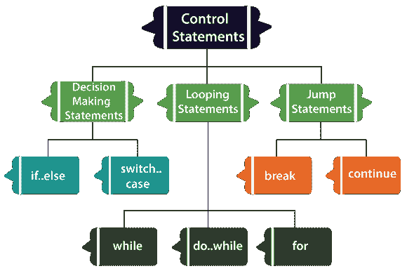

# Dart控制流程说明

> 原文：<https://www.javatpoint.com/dart-control-flow-statement>

**控制语句**或**控制语句流程**用于控制 Dart 程序的流程。在任何编程语言中，这些语句对于决定是否执行其他语句都非常重要。代码语句通常以顺序方式运行。我们可能需要根据给定的条件执行或跳过某组语句，跳到另一条语句，或者重复执行这些语句。

在 Dart 中，控制语句允许程序流畅运行。通过使用控制流语句，Dart 程序可以根据应用程序逻辑进行更改、重定向或重复。

## 现金流量表的类别

在 Dart 中，控制流语句可以主要分为以下三种方式。

*   决策声明
*   循环语句
*   跳转语句

### 灾难援助反应队决策声明

决策语句允许我们根据运行时的测试表达式来确定执行哪个语句。决策陈述也称为选择陈述。在 Dart 程序中，可以存在单个或多个测试表达式(或条件)，其评估为布尔真和假。表达式/条件的这些结果有助于决定如果给定条件为真或假，将执行哪个语句块。

Dart 提供以下类型的决策陈述。

*   如果语句
*   If-else 语句
*   否则如果语句
*   切换案例陈述

### Dart循环语句

Dart 循环语句用于在给定的次数内多次执行代码块，直到它匹配给定的条件。这些语句也称为迭代语句。

Dart 提供以下类型的循环语句。

*   成圈Dart
*   冲向…循环中
*   边环边省
*   Dart边做边循环

### Dart跳跃语句

跳转语句用于从另一个语句跳转，或者我们可以说它将执行从当前语句转移到另一个语句。

Dart 提供以下类型的跳转语句-

*   Dart中断声明
*   Dart继续语句

上面的跳转语句表现不同。

* * *