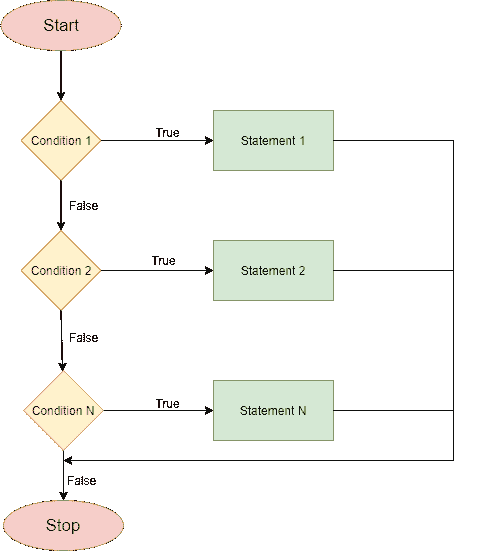

# Dart if else-if 语句

> 原文：<https://www.javatpoint.com/dart-if-else-if-statement>

Dart if else-if 语句提供了检查一组测试表达式并执行不同语句的工具。当我们必须从两种以上的可能性中做出决定时，就会用到它。

### dart if if if 语句流程图



### 句法

```

if (condition1) {
   // statement(s)
}
else if(condition2) {
   // statement(s)
}
else if (conditionN) {
   // statement(s)
}
.
.
else {
   // statement(s)
}

```

在这里，这种类型的结构也被称为。如果梯子。该条件从上到下进行评估。只要找到真实条件，就会执行与该条件相关联的语句。当所有给定的条件评估为假时，则执行 else 块。

让我们理解下面的例子。

### 示例-编写一个程序，根据学生的分数打印结果。

```

void main() {
var marks = 74;   
if(marks > 85)
{
       print("Excellent");
}
 else if(marks>75)
{
      print("Very Good");
} 
else if(marks>65)
{
      print("Good");
}
else
 {
      print("Average");
}
}

```

**输出:**

```
Average

```

**解释-**

上述程序根据测试中的分数打印结果。我们用 if else if 来打印结果。我们已经用整数值 74 初始化了 marks 变量。我们已经检查了程序中的多个条件。

由于第一个条件为假，因此将使用第一个条件检查标记，然后移动标记以检查第二个条件。

它与第二个条件进行比较，发现是真的，然后在屏幕上打印输出。

该过程将继续，直到计算完所有表达式；否则，如果打印了梯形和默认语句，控件将从 else 中转移出来。

您应该修改上面的值并注意结果。

## 嵌套的 If else 语句

[Dart](https://www.javatpoint.com/dart-programming) 嵌套的 if else 语句意味着一个 if-else 位于另一个 if-else 内部。当我们需要一系列决策时，这是有益的。让我们理解下面的例子。

### 例子——写一个程序，找出最大的数字。

```

void main() {
  var a = 10;
  var b = 20;
  var c = 30;

  if (a>b){
       if(a>c){
            print("a is greater");
        }
       else{
            print("c is greater");
               }       
   }
else if (b>c){
     print("b is greater");
}
else {
     print("c is greater");
}
}

```

**输出:**

```
C is greater

```

在上面的程序中，我们已经用值 10、20 和 30 声明了三个变量 a、b 和 c。在外部 if-else 中，我们提供了条件，它检查 a 是否大于 b。如果条件为真，它将执行内部块，否则将执行外部块。

在内部块中，我们有另一个条件来检查变量 a 是否大于 c。如果条件被评估为真，那么内部块将被执行。

我们的程序在第一个条件中返回 false，然后跳过内部块检查另一个条件。如果满足条件并在屏幕上打印输出。

* * *