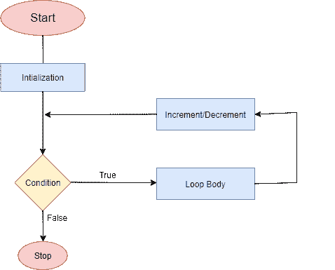

# 环镖

> 原文：<https://www.javatpoint.com/dart-for-loop>

Dart for loop 是在我们熟悉一段代码的执行次数时使用的。类似于 [C](https://www.javatpoint.com/c-programming-language-tutorial) 、 [C++](https://www.javatpoint.com/cpp-tutorial) 、 [Java for loop](https://www.javatpoint.com/java-for-loop) 。开始循环执行需要一个初始变量。它执行一个代码块，直到它符合指定的条件。执行循环时，每次迭代都会更新迭代器的值，然后计算测试表达式。这个过程将继续，直到给定的测试表达式为真。一旦测试表达式为假，for 循环就终止了。

### 循环流程图的Dart



**语法:**

```

for(initialization, condition, incr/decr)

```

*   初始化用作循环中的初始值，并且只执行一次。
*   条件或测试表达式返回布尔值-真或假。for 循环将一直执行，直到条件为真。
*   一旦条件评估为假，循环就结束了。
*   incr/decr 是增加或减少变量的计数器。

让我们理解下面的例子。

**例 1:**

```

void main() {
    //for loop iteration 
    for(int i = 1; i < =10;i++)
    {
        print(i);
}
}

```

**输出:**

```
1
2
3
4
5
6
7
8
9
10

```

**说明:**

在上面的例子中，我们初始化了一个整型变量 **i** 作为初始值。我们给变量赋值 1，在条件部分，我们定义了执行的循环，直到 I 的值小于或等于 10。每次循环迭代时，它的值都会增加 1。

在循环的第一次迭代中，I 的值增加 1，它将变成 2。现在，如果条件为真，则重新检查条件，然后循环将在下一次迭代中移动。循环的迭代将继续，直到值变为 10。

我们可以跳过 for 循环中的初始值。考虑下面的例子。

```

void main() {
     var i = 1;
    //for loop iteration skipping the initial value from for loop
    for(; i < =10;i++)
    {
        print(i);
}
}

```

它将给出与之前代码相同的输出。

此外，我们可以通过使用分号来跳过条件、增量或减量。

## 循环嵌套

嵌套 for 循环意味着“for 循环在另一个 for 循环内部”。在另一个循环内部的 for 称为内部循环，外部循环称为外部循环。在外循环的每次迭代中，内循环将迭代到其整个循环。让我们理解以下嵌套 for 循环的例子。

**示例-**

```

void main() 
{
int i, j;
int table_no = 2;
int max_no = 10;
for (i = 1; i <= table_no; i++) { // outer loop
  for (j = 0; j <= max_no; j++) { // inner loop
    print("${i} * ${j} = ${i*j}");
  //print("\n"); /* blank line between tables */
}}

}

```

**输出:**

```
1 * 0 = 0
1 * 1 = 1
1 * 2 = 2
1 * 3 = 3
1 * 4 = 4
1 * 5 = 5
2 * 0 = 0
2 * 1 = 2
2 * 2 = 4
2 * 3 = 6
2 * 4 = 8
2 * 5 = 10

```

让我们理解嵌套 for 循环的工作原理。

**示例- 2 了解内环循环**

```

void main(){
for(int i = 1; i <=5; i++) {

    print("Outer loop iteration : ${i}" );

         for (int j = 1; j <= i; ++j) {
            print("i = ${i} j = ${j}");
         }

      }
   }

```

**输出:**

```
Outer loop iteration : 1
i = 1 j = 1
Outer loop iteration : 2
i = 2 j = 1
i = 2 j = 2
Outer loop iteration : 3
i = 3 j = 1
i = 3 j = 2
i = 3 j = 3
Outer loop iteration : 4
i = 4 j = 1
i = 4 j = 2
i = 4 j = 3
i = 4 j = 4
Outer loop iteration: 5
i = 5 j = 1
i = 5 j = 2
i = 5 j = 3
i = 5 j = 4
i = 5 j = 5

```

观察上面的代码，我们已经定义了内部循环的工作方式。内环将在外环的每次迭代中重复。

* * *