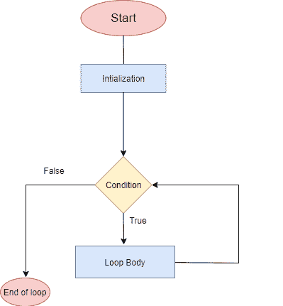

# 边环边镖

> 原文：<https://www.javatpoint.com/dart-while-loop>

当一个代码块的执行次数未知时，使用 while 循环。只要条件为真，它就会执行。它首先检查给定的条件，然后执行 while 循环中的语句。while 循环主要用于创建无限循环。

### 边循环边 Dart 流程图



语法如下。

**语法:**

```

while(condition){
       //statement(s);
      // Increment (++) or Decrement (--) Operation;
}

```

这里，如果条件返回真，则执行循环体并再次计算条件。如果条件返回假，则循环终止，控制转移到循环外。

让我们理解下面的例子。

**示例- 1**

```

void main() 
{
    int i = 1;
    while (i <= 5)
    {
        print( i);
        ++i;
    }
}

```

**输出:**

```
1
2
3
4
5

```

**说明:**

上例中，我们分别用值 1 初始化了整数变量 I，在下一个语句中，我们定义了 while 循环，检查 I 的值在每次迭代中小于或大于 5 的条件。

如果条件返回真，那么当循环体被执行并且条件被重新检查时。它将一直持续到条件为假。

之后，违反条件的 I 值为 6；然后，循环终止。它在控制台上打印了 1 到 5 的序列。

## 无限循环

当 while 循环执行时，一个无穷的时间称为无限 while 循环。让我们看看无限循环的例子。

**示例-**

```

void main() 
{
    int i = 1;

    while (i <= 5)
    {
        print( i);
        --i;
    }
}

```

我们只对上面的代码做了一处修改。我们减少了 while 循环每次迭代的 I 值。所以它永远不会与指定的条件匹配，成为一个无限循环。

**示例- 2**

```

void main() 
{ 
    while (true)
    {
        print("Welcome to JavaTpoint");
    }
}

```

它将无限长时间打印给定的语句。当我们在 while 循环中声明 Boolean 为 true 时，那么它就自动变成了一个无限循环。

## 循环时的逻辑运算符

有时我们需要在 while 循环中检查多个条件。我们可以通过使用逻辑运算符来做到这一点，例如(||，&&，和！).让我们看看下面的概念。

*   **while(n1<5&&N2>10)**-如果两个条件都成立，则执行。
*   **while(n1<5 | | N2>10)-**如果其中一个条件为真，则执行。
*   **趁着(！n1 = 10)-**n1 不等于 10 时执行。

考虑下面的例子。

**示例-**

```

void main() {
int n1=1;
int n2=1; 
   // We are checking multiple condition by using logical operators.
   while (n1 <= 4 && n2 <= 3)
   {
	print("n1 : ${n1}, n2: ${n2}");
	n1++;
	n2++;
   }
} 

```

**输出:**

```
n1 : 1, n2: 1
n1 : 2, n2: 2
n1 : 3, n2: 3

```

**说明:**

在上面的代码中，我们分配了两个变量 n1 和 n2，两者的值都是 1。现在我们在 while 循环中检查了多个条件，其中 **n1** 小于或等于 4， **n2** 小于或等于 3。

在第一次迭代中，它检查两个值并打印结果。当 n1 和 n2 的值等于 4 时。n1 满足条件 1，但 n2 不满足第二个条件，因此循环终止，并将结果打印到屏幕上。

* * *