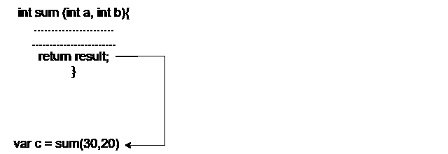

# Dart 功能

> 原文：<https://www.javatpoint.com/dart-function>

Dart 函数是一起执行特定任务的一组代码。它用于将大代码分解成更小的模块，并在需要时重用。函数使程序可读性更强，易于调试。它改进了模块化方法，增强了代码的可重用性。

假设，我们编写了一个简单的计算器程序，当用户输入值时，我们需要多次执行运算。我们可以为每个计算器运算符创建不同的函数。通过使用这些函数，我们不需要反复编写加法、减法、乘法和除法的代码。我们可以通过调用。

该函数提供了使用不同值多次运行代码的灵活性。一个函数可以在任何时候作为它的参数被调用，并返回一些值到它被调用的地方。

## 功能的优势

[镖](https://www.javatpoint.com/dart-programming)功能的几个好处如下。

*   它增加了解决问题的模块方法。
*   它增强了程序的可重用性。
*   我们可以进行程序的耦合。
*   它优化了代码。
*   这使得调试更加容易。
*   它使开发变得容易，并降低了复杂性。

让我们理解函数的基本概念。

## 定义函数

可以通过为函数的名称提供适当的参数和返回类型来定义函数。函数包含一组称为函数体的语句。语法如下。

**语法:**

```

return_type func_name (parameter_list):
{
    //statement(s)
   return value;
}

```

让我们理解定义函数的一般语法。

*   **return_type -** 可以是 void、integer、float 等任意数据类型。返回类型必须与函数的返回值匹配。
*   **func_name -** 应该是一个合适有效的标识符。
*   **parameter_list -** 表示参数的列表，我们调用函数时需要用到。
*   **返回值-** 函数在完成执行后返回一个值。

让我们理解下面的例子。

**示例- 1**

```

int mul(int a, int b){
     int c;
     c = a+b;
     print("The sum is:${c}");
}

```

## 调用函数

创建函数后，我们可以调用或调用 [main()函数](dart-main-function)体内定义的函数。一个函数只需通过它的名字和一个参数列表(如果有的话)来调用。语法如下。

**语法:**

```

fun_name(<argument_list>);
or
variable = function_name(argument);

```

#### 注意-调用函数必须以分号(；).

当我们调用一个函数时，控制转移到被调用的函数。然后被调用的函数执行所有定义的语句，并将结果返回给调用函数。控制返回到 main()函数..

**示例:**

```

mul(10,20);

```

## 将参数传递给函数

当一个函数被调用时，它可能有一些信息，因为函数原型被称为参数(自变量)。函数调用期间传递的参数数量和数据类型必须与函数声明期间的参数数量相匹配。否则，它将抛出一个错误。参数传递也是可选的，这意味着在函数声明期间传递参数不是强制性的。参数可以是两种类型。

**实际参数-** 在函数定义期间传递的参数称为实际参数。

**形式参数-** 在函数调用期间传递的参数称为形式参数。

我们将在下一个教程中了解有关该参数的更多信息。

## 从函数中返回值

一个函数总会返回一些值作为它被调用的结果。 **return** 关键字用于返回值。return 语句是可选的。一个函数只能有一个 return 语句。语法如下。



**语法:**

```

return 
```

**示例-**

```

return result;

```

## 功能示例

让我们用一个用函数加两个数的程序来理解函数。

### 带参数和返回值的 Dart 函数

在下面的例子中，我们创建了一个 sum()函数来添加两个数字。

**示例- 1**

```

void main() {
  print("Example of add two number using the function");  
  // Creating a Function

  int sum(int a, int b){
            // function Body
            int result;
            result = a+b;
            return result;
}
// We are calling a function and storing a result in variable c
var c = sum(30,20);
print("The sum of two numbers is: ${c}");
}

```

**输出**

```
Example of add two number using the function
The sum of two numbers is: 50

```

**说明:**

在上面的例子中，我们声明了一个名为 **sum()** 的函数，并传递了两个整数变量作为实际参数。在函数体中，我们声明了一个**结果**变量来存储两个数的和并返回结果。

为了添加两个值，我们调用了一个同名的函数，传递了形式参数 30 和 20。 **sum()** 返回了一个值，我们将该值存储在变量 c 中，并将该值打印在控制台上。

### 无参数和返回值的 Dart 函数

正如我们前面所讨论的，在定义函数时，参数是可选的。我们可以创建一个没有参数返回值的函数。语法如下。

**语法:**

```

return_type func_name() 
{
       //Statement(s);
       return value;
}

```

让我们理解下面的例子。

**示例- 2**

```

void main(){
// Creating a function without argument
String greetings(){
   return "Welcome to JavaTpoint";
}
// Calling function inside print statement
print(greetings());
}

```

**输出**

```
Welcome to JavaTpoint

```

**说明:**

在上面的例子中，我们创建了一个名为**问候()**的无参数函数，并将字符串值返回给调用函数。然后，我们在 print 语句中调用了 hello()函数，并将结果打印到控制台。

### 无参数无返回值的 Dart 函数

我们可以声明一个没有参数和返回值的函数。语法如下。

**语法:**

```

func_name() {
 //statement
}
Or
void fun_name() {
  //statement(s)
}

```

在上面的通用语法中-

**void -** 表示函数没有返回类型。

**fun_name -** 代表功能名称。

让我们理解下面的例子。

**示例- 3**

```

// Creating a function without argument
void greetings()
{
   print("Welcome to JavaTpoint");
}
void main() {
  print("The example of Dart Function");
  // function callling
  greetings();
}

```

**输出**

```
The example of Dart Function
Welcome to JavaTpoint

```

**说明:**

在上面的例子中，我们在 **main()** 函数之外创建了一个名为**问候语()**的函数，并编写了 print 语句。在 **main()** 函数中，我们调用了定义的函数，并将输出打印到控制台。

### 带参数和不带返回值的 Dart 函数

我们正在创建一个函数来查找给定的数字是偶数还是奇数。让我们理解下面的例子。

**示例- 4**

```

void main() 
{
  void number(int n){
           // Check the given number is even or odd
           if (n%2 ==0){
                   print("The given number is even");
             }
           else {
                  print("The given number is odd");
            }
}
   number(20);
}

```

**输出**

```
The given number is even

```

* * *