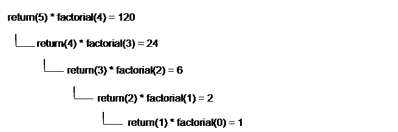

# 什么是递归？

> 原文：<https://www.javatpoint.com/dart-recursion>

Dart 递归是一个函数调用自己作为其子程序的方法。它用于通过将复杂的问题分成子部分来解决它。一个函数一次又一次或递归地调用自己，那么这个过程就叫做递归。

迭代器可以是解决问题的一种选择，但是递归被推荐给程序员来处理复杂的问题，因为它是解决问题技术的一种有效方法。评估同样复杂的任务需要更少的时间和代码。

递归对同一个函数进行多次调用；但是，应该有一个基本案例来终止递归。

递归使用除法和征服技术来解决复杂的数学计算任务。它把大任务分成小块。

不建议使用递归来解决所有类型的问题。但是，它最适合一些问题，如搜索、排序、有序/前序/后序、树遍历和图的 DFS 算法。但是，在使用递归时，必须小心地实现它；否则，它会变成无限循环。

## 递归中的基条件是什么？

```

void main() {
   int factorial(int num){

  if(num<=1) { // base case
        return 1;
  else{
         return n*fact(n-1);
 }
}    
}
}

```

在上面的例子中，基本情况被定义为 n<=1，并且一个数字的较大值可以通过改变为较小的值直到基本情况匹配来解决。

#### 注意-递归函数中需要基本情况或有效的终止条件；否则，它将变成一个无限循环。

## Dart 递归函数

递归函数与其他函数非常相似，但不同的是递归调用自己。递归函数重复多次，直到返回最终输出。它允许程序员用最少的代码解决复杂的问题。

## 递归是如何工作的？

让我们理解给定数的阶乘例子的递归概念。在下面的例子中，我们将计算 n 个数字的阶乘。它是乘法的级数如下。

```

Factorial of n (n!) = n*(n-1)*(n-2)........1

```



## 递归函数的特征

递归函数的特征如下。

*   递归函数是函数调用自身的唯一形式。
*   终止递归函数需要有效的基本情况。
*   由于堆栈开销，它比迭代慢。

让我们看看递归语法:

**语法:**

```

void recurse() {
  //statement(s)
 recurse();
//statement(s);
}
void main(){
   //statement(s)
  recurse();
 //statement(s)
}

```

让我们理解下面的例子。

**示例- 1**

```

int factorial(int num){

  //base case of recursion. 
  if(num<=1) { // base case
        return 1;
}
  else{
         return num*factorial(num-1);    //function call itself.
 }
}
void main() {
  var num = 5;
  // Storing function call result in fact variable.
  var fact = factorial(num);
  print("Factorial Of 5 is: ${fact}");
}

```

**输出:**

```
Factorial Of 10 is: 120

```

**说明:**

在上面的例子中，**阶乘()**是一个递归函数，因为它调用自己。当我们通过传递整数值 5 来调用**阶乘()**函数时，它会通过减少数值来递归调用自己。

每次都会调用阶乘()函数，直到它与基本条件匹配，或者等于 1。它把这个数乘以这个数的阶乘。考虑下面对递归调用的解释。

```

factorial(5)              # 1st call with 5
5 * factorial(4)          # 2nd call with 4
5 * 4 * factorial(3)      # 3rd call with 3
5 * 4 * 3 * factorial(2)  # 4th call with 2
5 * 4 * 3 * 2 * 1         # return from 2nd call
120                    # return from 1st call

```

当数减少到 1 时，递归结束，这是递归的基本条件。

递归函数必须有一个基本条件，以避免无限调用。

## 递归的缺点

*   递归调用消耗大量内存；这就是为什么这些效率低下。
*   递归函数很难调试。
*   有时候，很难理解递归背后的逻辑。

* * *