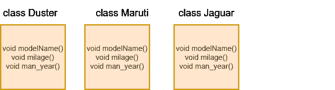
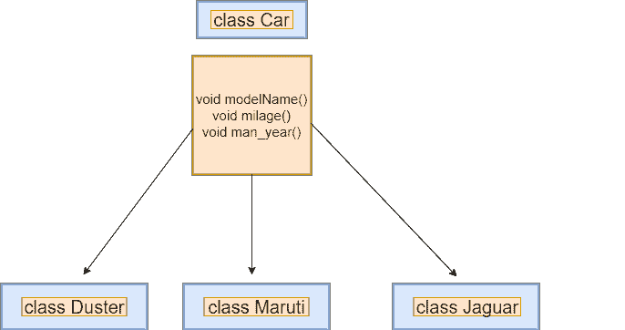
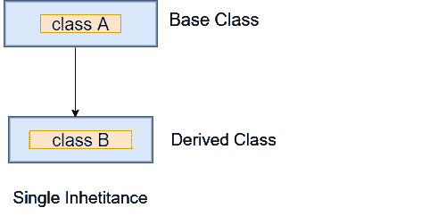
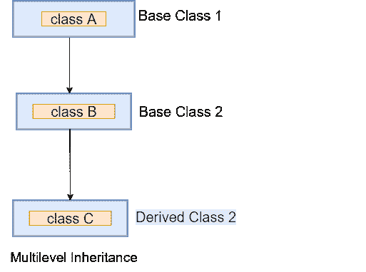
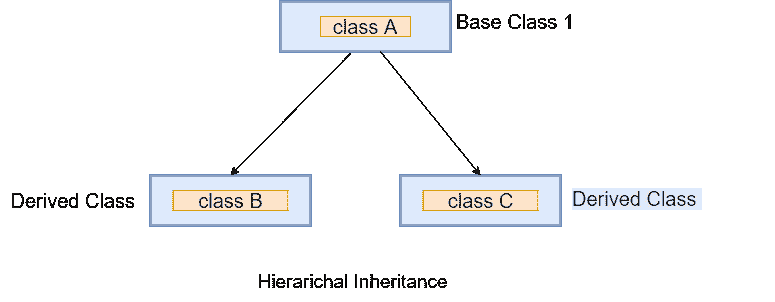

# Dart 继承

> 原文：<https://www.javatpoint.com/dart-inheritance>

Dart 继承被定义为派生另一个类的属性和特性的过程。它提供了从现有类创建新类的能力。这是面向对象编程方法最基本的概念。我们可以在新类中重用以前类的所有行为和特征。

*   **父类-** 被另一个类继承的类称为**超类**或**父类**。也被称为**基类**。
*   **子类-** 从其他类继承属性的类称为子类。也称为**衍生类**或**子类**。

假设我们有一个车队，我们创建了三个类别，分别是达斯特、马鲁蒂和捷豹。对于所有三个类，方法 modelName()、milage()和 man_year()都是相同的。通过使用继承，我们不需要在三个类中的每一个中编写这些函数。



如上图所示，如果我们创建类 Car，并在每个类中编写公共函数。然后，它会增加程序中的重复和数据冗余。继承用于避免这种情况。

我们可以通过在 Car 类中定义带有这些函数的 Car 类，并在 Car 类的其他类中继承这些函数来避免数据冗余。它增强了代码的可重用性。我们只需要一次写函数，而不是多次。让我们看看下面的图片。



语法如下。

**语法-**

```

class child_class extends parent_class {
    //body of child class
}

```

子类使用 extends 关键字继承父类的函数和变量或属性。它不能继承父类构造函数；我们将在后面讨论这个概念。

## 继承的类型

继承主要有四种类型。这些在下面给出。

*   单一继承
*   多重继承
*   多级继承
*   分级继承

### 单层继承

在单一继承中，一个类被一个类继承，或者子类被一个父类继承。在下面的例子中，我们创建了继承人类类的人。



让我们理解下面的例子。

**示例-**

```

class Bird{  
      void fly()
         {
            print("The bird can fly");
          }
   }  
      // Inherits the super class
class Parrot extends Bird{  
         //child class function
         void speak(){
             print("The parrot can speak");
                 }          
}
void main() {
      // Creating object of the child class
      Parrot p=new Parrot();  
      p.speak();  
      p.fly();  
}  

```

**输出**

```
The parrot can speak
The bird can fly

```

**说明:**

在上面的代码中，我们创建了父类 Bird，并在其中声明了 fly()函数。然后，我们创建了名为 Parrot 的子类，它使用 extends 关键字继承了父类的属性。子类有自己的函数 speak()。

现在子类有两个函数 fly()和 speak()。所以我们创建了子类的对象，并访问这两个函数。它将结果打印到控制台上。

### 多级继承

在多重继承中，一个子类被另一个子类继承，或者创建继承链。让我们理解下面的例子。



**示例-**

```

class Bird{  
      void fly()
         {
            print("The bird can fly");
          }
   }  
      // Inherits the super class
class Parrot extends Bird{  
         void speak(){
             print("The parrot can speak");
                 }

}

// Inherits the Parror base class
class Eagle extends Parrot {
          void vision(){
             print("The eagle has a sharp vision");
                 }
}
void main() {
      // Creating object of the child class
      Eagle e=new Eagle();  
      e.speak();  
      e.fly();  
      e.vision();
}  

```

**输出**

```
The parrot can speak
The bird can fly
The eagle has a sharp vision

```

**说明:**

在上面的例子中，我们创建了另一个新的类 Eagle，并继承了 Parrot 类。现在鹦鹉是鹰的父类，鹰类获得了两个父类的所有功能。我们创建了子类的对象，并访问了所有属性。它将输出打印到屏幕上。

#### 注意——Dart 不支持多重继承，因为它会增加程序的复杂性。

### 分级继承

在层次继承中，两个或多个类继承一个类。在下面的例子中，两个孩子的类彼得和詹姆斯继承了 Person 类。



**示例-**

```

// Parent Class
class Person {
  void dispName(String name) {
    print(name);
  }

  void dispAge(int age) {
    print(age);
  }
}

class Peter extends Person {

  void dispBranch(String nationality) {
    print(nationality);
  }
}
//Derived class created from another derived class.
class James extends Person {
          void result(String result){
              print(result);
}
}
void main() {
      // Creating Object of James class
      James j = new James();
      j.dispName("James");
      j.dispAge(24);
      j.result("Passed");

    // Creating Object of Peter class
      Peter p = new Peter();
      p.dispName("Peter");
      p.dispAge(21);
      p.dispBranch("Computer Science");

}

```

**输出**

```
James
24
Passed
Peter
21
Computer Science

```

* * *