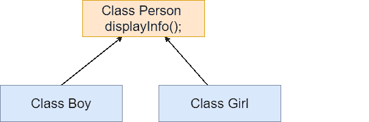

# 镖抽象类

> 原文：<https://www.javatpoint.com/dart-abstract-classes>

抽象类是 Dart 中具有一个或多个抽象方法的类。抽象是数据封装的一部分，功能的实际内部工作对用户隐藏起来。它们只与外部功能交互。我们可以通过使用抽象关键字来声明抽象类。抽象类可能有也可能没有抽象方法。

抽象方法是那些在没有实现的情况下声明的方法。具体方法或常规方法用实现来声明。抽象类可以包含两种类型的方法，但是普通类不允许有抽象方法。

我们不能创建抽象类的实例，这意味着它不能被实例化。它只能由子类扩展，子类必须被提供对当前类中存在的抽象方法的移植。那么就需要声明抽象子类。

### 抽象类的规则:

摘要的规则如下。

1.  抽象类可以有抽象方法(没有实现的方法)，也可以没有。
2.  如果至少有一个抽象方法，那么类必须声明为抽象的。
3.  抽象类的对象不能被创建，但是可以被扩展。
4.  抽象关键字用于声明抽象类。
5.  抽象类也可以包括普通或具体(带有主体的方法)方法。
6.  父类的所有抽象方法都必须在子类中实现。

## 声明抽象类

后跟类名的抽象关键字用于声明抽象类。抽象类主要用于为子类提供扩展和实现抽象方法的基础。

### 语法:

```

abstract class ClassName {
 // Body of abstract class
}

```

## 抽象类的用法

假设我们有一个类**人**有方法 **displayInfo()** ，我们要对其进行子类**男孩**和**女孩**。每个人的信息都因人而异，所以在父类中实现 **displayInfo()** 没有任何好处。因为每个子类都必须通过提供自己的实现来重写父类方法。因此，我们可以强制子类为该方法提供实现，这样做的好处是使方法抽象。我们不需要父类中的给定实现。



让我们通过下面的代码来理解上面的场景。

### 示例-

```

abstract class Person {
//declaring abstract method

void displayInfo();  //abstract method 

}
class Boy extends Person 
{
// Overriding method
void displayInfo() {
    print("My name is Johnathon");

       }

}

class Girl extends Person 
{
// Overriding method
void displayInfo() {
    print("My name is Grecia");

       }

}

void main() {
Boy b = new Boy();  // Creating Object of Boy class
Girl g = new Girl();  // Creating Object of Girl class

b.displayInfo();
g.displayInfo();
}

```

**输出**

```
My name is Johnathon
My name is Grecia

```

### 解释:

我们可以看到，在上面的代码中，我们根据抽象方法的要求在两个子类中实现了抽象方法，然后我们使用两个类的对象调用了 **displayInfo()** 方法。

* * *