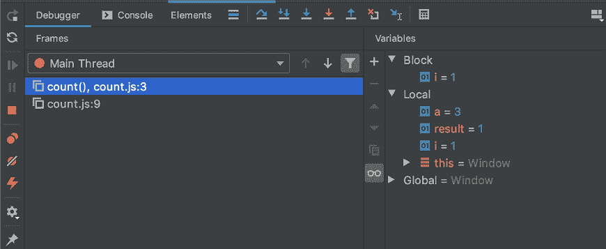

# Dart Typedef

> 哎哎哎:# t0]https://www . javatppoint . com/dart-typedef

在 Dart 中，typedef 用于生成函数类型的别名，我们可以将它用作类型注释，用于声明该函数类型的变量和返回类型。函数类型的别名可以用作变量声明或函数返回类型中的类型注释。当我们将函数类型赋给变量时，typedef 存储类型信息。

## 声明 typedef

一个 **typedef** 关键字用于创建一个与实际函数相同的函数别名。我们还可以创建一个带有参数列表的函数原型。语法如下。

### 语法:

```

typedef function_name(parameters) 

```

### 示例-

让我们创建一个包含两个整数类型参数的 **MultiOperation(int n1，int n2)** 的别名。

```

typedef MultiOperation(int n1, int n2);   // function signature

```

## 分配 typedef 变量

我们可以将任何具有相同参数的函数赋给 typedef 变量。语法如下。

### 语法:

```

type_def var_name = function_name;

```

让我们理解下面的例子，其中我们定义了两个具有相同签名的函数作为**多操作**。

```

Sum(int n1, int n2) {
      print("Sum of the two number:${n1+n2}");
}
Sub(int n1, intn2 ) {
      print("Subtraction of the two number:${n1-n2}");

}

```

## 用 typedef 调用函数

我们可以通过使用**typedef**变量传递相同的参数来调用函数。语法如下。

### 语法:

```

var_name(parameter);

```

### 示例:

```

MultiOperation mp;
mp = Sum;
mp(20,10);
mp = Sub;
mp(30,20);

```

**mp** 是一个 typedef 变量，可以用来引用任何接受两个整数参数的方法。可以在运行时使用 typedefs 来切换函数引用。

## 使用 typedef 完成程序

让我们看看下面的例子。

```

typedef MultiOperation(int num1, int num2);  // typedef function signature
Sum(int n1, int n2) {
      print("Sum of the two number:${n1+n2}");
}
Sub(int n1, int n2 ) {
      print("Subtraction of the two number:${n1-n2}");

}

void main() {
MultiOperation mp = Sum;
print("JavaTpoint - Dart typedef Example");

mp(20,10);
mp = Sub;
mp(30,20);
}

```

**输出:**

```
JavaTpoint - Dart typedef Example
Sum of the two numbers: 30
Subtraction of the two numbers: 10

```

### 解释:

在上面的代码中，我们使用 **typedef** 关键字创建了 **MultiOperation()** 函数的别名。我们定义了另外两个函数 **Sum()** 和 **Sub** ()，它们具有与 typedef 函数相同的签名。

然后，我们分配了 typedef 变量 **mp** ，它引用了两个函数 **Sum()** 函数和 **Sub()** 函数。现在，我们通过传递所需的参数来调用函数，并将结果打印到屏幕上。

## 作为参数的 Typedef

我们可以使用 typedef 方法作为参数。在下面的例子中，我们为上面的程序**创建了一个额外的函数，使用两个整数变量和 typedef **ManyOperation mp** 作为参数。**

### 示例-

```

typedef MultiOperation(int num1, int num2);  // typedef function signature

Sum(int n1, int n2) {
      print("Sum of the two number:${n1+n2}");
}
Sub(int n1, int n2 ) {
      print("Subtraction of the two number:${n1-n2}");
}

NumericOperation(int n1, int n2, MultiOperation mp){
      print("Inside Operation");
      mp(n1,n2);
         }

void main() {
print("JavaTpoint - Dart typedef Example");
NumericOperation(20, 10, Sum);
NumericOperation(20, 10, Sub);
}

```

**输出:**

```
JavaTpoint - Dart typedef Example
Inside Operation
Sum of the two number: 30
Inside Operation
Subtraction of the two number: 10

```

在上面的代码中，我们不需要创建一个 typedef 变量来引用每个方法；我们只是通过传递所需的值和 typedef 变量 **mp** 来调用 **NumericOperation()** 函数。它执行给定的操作并打印结果。

## Dart调试

调试是识别和消除 Dart 程序中存在的和可能存在的错误的过程，这些错误可能会在程序执行过程中引起歧义和不确定性。调试对于检测和修复 bug 以平稳或不间断地运行程序至关重要。

如果您将 IDE 用于 Dart 程序，调试将变得更加容易。这里我们假设您已经在系统中安装了最常见和最合适的 IDE WebStorme。网络风暴编辑器允许我们逐步调试。

## 什么是断点？

断点是程序的检查点，用于在特定点中断程序以检查其行为。我们可以在程序中添加断点来检查特定区域内的错误。

## 如何在 WebStorm 中添加断点？

我们可以在 WebStorm 中添加断点，只需单击左侧栏中的行号即可添加断点。添加断点后，在调试模式下运行程序，它会给调试器窗口，在那里我们可以验证断点是如何工作的。我们还可以更改值，并在手表窗口中查看差异。



* * *