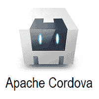

# Apache Cordova 教程

> 原文：<https://www.javatpoint.com/apache-cordova>

Apache Cordova 被定义为一个开源平台，用于使用 **HTML、CSS 和 JavaScript 构建移动应用。**它由一组预先开发的插件组成，可以访问设备的摄像头、全球定位系统、文件系统等。我们可以将 Cordova 视为一个应用程序容器，它具有覆盖设备整个屏幕的网络视图。

2011 年，Adobe 收购 Nitobi，并将开源核心捐赠给 Apache 软件基金会，并更名为 **Apache Cordova。**

ApacheCordova 的用户如下:

*   如果您是移动开发人员，并且希望让您的应用程序在多个平台上兼容，而不需要用每个平台的语言重新实现它。
*   如果您是 web 开发人员，并且希望在不同的商店门户上部署您的 web 应用程序。
*   如果您是一名移动开发人员，并且希望将本机应用程序组件与用于访问设备级应用程序接口的网络视图混合使用。您还可以使用它来开发本机组件和 WebView 组件之间的插件接口。

我们的 Apache Cordova 教程是为学生和专业人士设计的。涵盖了 **PhoneGap、架构、安装**等所有基础和高级主题。，它将指导您如何轻松创建移动应用程序。

## 什么是 ApacheCordova？

Apache Cordova 被定义为一个开源平台，用于使用 HTML、CSS 和 JavaScript 构建移动应用程序。它充当一个容器，负责将我们的 web 应用程序与本地移动功能连接起来。它主要提供了一个定义 web 应用程序和移动设备之间连接的桥梁。

Apache Cordova 提供了一组 API，负责提供对本机设备功能的访问，如摄像头、SIM 卡或联系人列表。我们可以将 Cordova 视为一个应用程序容器，它具有覆盖设备整个屏幕的网络视图。Cordova 使用的网络视图与本地操作系统相同。在 iOS 中，默认情况下使用 **UIWebView** 或自定义 **WKWebView** 类，而在 Android 中，使用 **android.webkit.WebView** 。

Apache Cordova 由一组预先开发的插件组成，这些插件提供对设备摄像头、全球定位系统、文件系统等的访问。以下是我们可以使用 Cordova 开发应用的平台:

*   **安卓**
*   IOs
*   **窗户**
*   **Firefox OS**
*   **黑莓**
*   **输入**
*   **网络 OS**
*   **塞班**
*   **Ubuntu**

## 谁能用 Cordova？

ApacheCordova 的用户如下:

*   如果您是一名移动开发人员，并且希望让您的应用程序在多个平台上兼容，而不需要用每个平台的语言重新实现它
*   如果您是 web 开发人员，并且希望在不同的商店门户上部署您的 web 应用程序。
*   如果您是一名移动开发人员，并且希望将本机应用程序组件与用于访问设备级应用程序接口的网络视图混合使用。您还可以使用它来开发本机组件和 WebView 组件之间的插件接口。

## ApacheCordova 的演变

Nitobi 在 2009 年创建了一个开源 API，即 **PhoneGap** ，用于访问本地移动资源。 **PhoneGap** 负责使用标准网络技术创建移动应用程序。

2011 年，Adobe 收购了 Nitobi，并将开源核心捐赠给 Apache 软件基金会，并将其更名为 **Apache Cordova** 。

## ApacheCordova 的特点

现在，ApacheCordova 的特点如下:

*   **Cordova 核心组件:**
    Cordova 提供每个移动应用需要的不同核心组件。这些组件创建了一个应用程序的基础，帮助我们专注于实现自己的逻辑。
*   **命令行界面:**
    这个工具负责为不同平台搭建流程和安装插件。它用于启动项目并简化开发过程。
*   **Cordova 插件:**
    它为我们的 JavaScript 应用程序提供了实现本地移动功能的 API。这些插件提供对应用程序中的设备功能的访问，如相机、电池、联系人等。

## ApacheCordova 的优势

ApacheCordova 的优势如下:

*   它是一个开源平台。
*   很容易学习，用于开发**跨平台应用。**
*   它提供了为多个平台构建应用程序的灵活性，而无需学习新的编程语言。
*   Cordova 的应用程序开发速度很快，因为它可以转化为其他平台支持的应用程序。
*   原型制作非常快。
*   它由一组预先开发的插件组成，可以访问设备的摄像头、全球定位系统和文件系统。
*   有许多社区插件提供了一些库和框架。

## ApacheCordova 的缺点

ApacheCordova 的缺点如下:

*   这对于大型应用程序来说不是最佳选择，因为混合应用程序比本地应用程序慢。
*   因为在 web 视图中运行它的代码，它的性能变得很慢。
*   不适合游戏应用开发，因为需要一些目前没有的高端插件。

## ApacheCordova 框架的重要方面

### 单一代码库:

Cordova 框架能够支持不同的平台，如 iOS、安卓、Ubuntu 和视窗。因此，开发人员可以通过瞄准多个移动平台来构建单个移动应用。

Cordova 框架允许开发人员用 HTML5、CSS3 和 JavaScript 开发应用程序。开发人员可以编写一次源代码，并通过使用特定的设备安装程序格式为各个移动平台打包。这种格式使应用程序能够通过访问本地设备功能(如全球定位系统、蓝牙、摄像头、联系人等)来提供本地用户体验。

### 应用程序模板

Cordova 应用程序模板用于通过使用预先存在的代码来加速混合移动应用程序的开发。开发人员可以从各种来源选择模板，即 **npm、Git 存储库等。**

### 各种开发工具

Cordova 框架旨在兼容不同的移动应用开发框架和 ide。开发人员可以通过使用流行的工具(如 Ionic Frameworks)和 ide(如 Visual Studio)来创建不同的移动应用程序。

### 缺点

Cordova 框架有自己的缺点。为了构建混合移动应用程序，移动应用程序开发人员解决了 Apache Cordova 的缺点。Cordova Framework 用于减少混合移动应用程序开发时间和成本。

## 先决条件

在学习 Apache Cordova 之前，您需要熟悉 **HTML、CSS 和 JavaScript。**

## 观众

我们的 Apache Cordova 教程旨在帮助初学者和专业人士。

## 问题

我们向您保证，您不会在本 Apache Cordova 教程中发现任何问题。但是如果有任何错误，请在联系表格中发布问题。

* * *