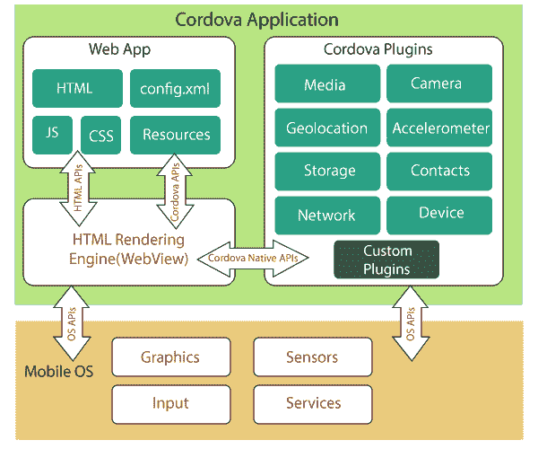

# Cordova建筑

> 原文：<https://www.javatpoint.com/cordova-architecture>

Apache Cordova 提供了一组 API，可用于访问和激发本机移动操作系统功能，如相机、存储、加速度计、地理定位等。为了访问设备的本机功能，通过调用 Apache Cordova APIs 来使用 JavaScript 应用程序对象。下图显示了Cordova建筑的高级设计:

基本上，Apache Cordova 在本机应用程序中创建一个屏幕，该屏幕由一个保存设备屏幕上可用空间的网络视图组成。Cordova 使用本机应用程序 WebView 来加载应用程序及其相关的 JavaScript 和 CSS 文件。

## 基本组件

Cordova应用程序依赖于公共的 **config.xml** 文件。该文件提供了有关应用程序的信息，并指定了影响其工作的参数。它遵循 W3C 的打包网络应用程序。

默认情况下，该应用程序的实现方式类似于名为**index.html**的网页，该网页引用了运行该应用程序所需的资源(图像、媒体文件)。该应用程序作为带有本机应用程序包装器的网络视图执行，该包装器可以分发到应用程序商店。

### WebView:

一个**网络视图**提供了一个Cordova应用程序的用户界面，它也可以是一个更大的混合应用程序中一些平台的组件。这些应用程序混合了网络视图和本地应用程序组件。

### 网络应用:

网络应用程序被定义为应用程序代码所在的核心部分。它只是一个使用 **HTML、CSS** 和 JavaScript 创建的网页。默认情况下，本地文件(即 index.html)用于引用运行应用程序所需的 CSS、JavaScript、媒体文件和其他资源。该应用主要在分发到应用商店的原生应用包装内的**网络视图**中执行。

这个容器包含一个密钥文件，即 **config.xml** ，负责提供关于应用程序的信息。

Cordova创建了一个应用程序，其中网络应用程序在网络视图中初始化，即 HTML 渲染引擎。

### 插件:

插件被定义为Cordova生态系统的一个组成部分，它为Cordova和本地组件提供了相互通信的接口。它还为绑定标准设备 API 提供了一个接口。它允许您从 JavaScript 调用本机代码。

基本上，Apache Cordova 项目定义了一组核心插件，称为**核心插件。**这些插件提供对应用程序中设备功能的访问，如相机、电池、触点等。

通过使用这些插件，开发人员可以轻松地将 JavaScript 代码链接到后端运行的本机代码。除了这些核心插件之外，还有几个第三方插件可以提供额外的绑定功能，这些功能不一定在所有平台上都可用。

## 它实际上是如何工作的？

当应用程序启动时，首先，Apache Cordova 在应用程序的网络视图中加载应用程序的默认启动页面(通常是 index.html)，并将其控制权传递给网络视图。**网络视图**允许用户通过在输入字段中输入数据、点击操作按钮以及在应用程序的网络视图中查看结果来与应用程序交互。

为了访问手机的本地功能，如音频或相机，Cordova提供了一套 JavaScript APIs，开发人员可以从他们的 JavaScript 代码中使用这些 API。对 Cordova JavaScript APIs 的调用将通过使用特殊的桥接层转换为本机设备 API 调用。本地 API 可以从 Apache Cordova 插件中访问。

## Cordova开发工作流程:

开发Cordova时，您可以遵循两个基本路径:

*   跨平台工作流用于将您的应用程序部署到不同的平台，很少或没有特定于平台的开发。Cordova命令行界面被定义为支持这个工作流的工具，并作为一个更高级别的抽象，用于构建兼容不同平台的应用程序。
*   以平台为中心的工作流用于为特定平台开发应用程序，并通过将本机组件与 Cordova 组件混合来帮助在较低级别修改代码。

## 命令行界面:

**命令行界面** (CLI)负责创建一个新的 Cordova 应用程序，并将其部署到各种原生移动平台中。它是一个基于文本的界面，主要在各种软件和操作系统上运行。我们还可以使用命令行界面来初始化项目代码，您可以使用各种平台的软件开发工具包来进一步开发应用程序。

如果您想为任何平台添加任何支持或重建项目，您必须要求从支持该平台的 SDK 的同一台机器上运行命令行界面。

基本上可以在 PC 上**配件**下的**命令提示符**上找到。它还维护一个远程源代码存储库，您可以通过它从不同的机器上运行 CLI。

命令行界面包含一些特定的命令，用于加速移动应用程序的开发、测试以及将应用程序部署到各种移动平台。它还可以执行命令，用真实设备和模拟器测试混合移动应用程序。

在使用 CLI 工具之前，您必须为每个目标移动平台安装 SDK。这些工具可以通过将其安装为 **npm** 包来快速使用。

## CLI 在Cordova扮演什么角色？

ApacheCordova完全依赖命令行界面。没有命令行界面，它无法执行单个进程。基本上，它用于以下情况:

*   创建一个Cordova项目。
*   产生了 APK。
*   添加插件。
*   提供一个我们可以开发应用的平台。

* * *