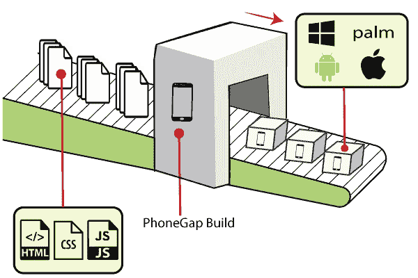

# Cordova语音间隙

> 原文：<https://www.javatpoint.com/cordova-phonegap>

PhoneGap 是ApacheCordova的一个分支。所以你可以看到 Apache Cordova 是一个引擎，为 PhoneGap 提供动力，就像 **WebKit** (一个能够为 Chrome 和 Safari 提供动力的引擎)。PhoneGap 之前是 Adobe 的产品。由于始终将 PhoneGap 作为开源软件，它的代码库由 Apache 处理。

PhoneGap 被定义为用于访问本地移动资源的应用编程接口，它使开发者能够使用标准的网络技术创建移动应用程序。它由ApacheCordova提供动力，并由一些额外的土坯材料组成。

PhoneGap 发行版包括一些与其他 Adobe 服务(如 PhoneGap Build 和 Adobe Shadow)相关联的附加工具。它始终是一个开源软件，仍然是 Apache Cordova 的免费发行版。

一家名为 Nitobi 的初创公司在 2009 年创建了 PhoneGap。大多数移动应用程序都是使用 PhoneGap 开发的。最近，移动应用开发者使用 Cordova 框架进行混合移动应用开发。也可以用 **HTML5、CSS3** 和 **JavaScript** 构建跨平台移动应用。

## Cordova和 PhoneGap 的区别

PhoneGap 和 Cordova，这两个都是移动开发中最常用的术语。Cordova和 PhoneGap 的区别如下:

*   在线构建服务在 PhoneGap 中可用，而在Cordova，没有在线构建服务可用。
*   目前，区别在于下载包的名称，这可能只是暂时的。

如果你开发一个混合移动应用，你可以通过使用两者，Cordova或 Adobe 的生态系统，通过使用Cordova的 PhoneGap 发行版来创建它。

这两种技术都是开源的，由 Apache 提供。

Adobe 还提供一些付费服务，如 **PhoneGap Build Service** ，允许开发人员在云中构建应用程序，而不需要安装额外的本地 SDK。

## PhoneGap 和Cordova的未来:

当跨平台应用出现时，它突出了 PhoneGap 的使用，提供了更好的功能和新功能。正因为如此，移动用户的增加导致了应用程序开发的增加。PhoneGap 被许多用户使用，它主要专注于创建易于重用的多平台应用程序和软件。

最近，PhoneGap 的需求越来越大，并增加了一些新的丰富功能，使其使用起来更加容易和方便。所以，在即将到来的未来，PhoneGap 的用户将会增加，因为它不仅会提供跨平台，还会增加一些新功能。

## 语音间隙插件

PhoneGap 插件被定义为增强 PhoneGap 功能的附加功能。它提供了一个用户友好的环境来访问本地应用程序和云服务。

## 电话差距能力

本节定义了 PhoneGap 的具体功能，如下所示:

**1。PhoneGap 构建服务:**

Adobe 创建了 **PhoneGap 构建服务**来帮助非本地移动开发人员交付 Cordova 应用程序。这是一项商业服务，提供了一个基于云的环境，用于将 web 应用程序打包到 Cordova 容器中。

为了使用该服务，开发人员应该将 web 应用程序资源(HTML、CSS、JavaScript)打包到一个归档文件中，并将其上传到构建服务中。此服务执行本机编译，并为每个选定的目标平台创建本机应用程序。

**2。PhoneGap 开发者应用程序:**

Adobe 创建了免费的 **PhoneGap 开发者应用程序**，以简化 PhoneGap 应用程序的测试和调试过程。通过 **PhoneGap 构建服务**的共享基础设施构建 PhoneGap 应用程序是一个耗时的过程。当开发人员更新应用程序时，大部分时间都花在等待完成构建过程上。这种时间延迟会影响应用程序的工作效率。

为了解决这个问题，PhoneGap Developer 通过提供一个预先构建的应用程序来构建应用程序，开发者可以使用该应用程序来测试他们的应用程序。开发者可以在一个或多个测试设备上安装 PhoneGap 开发者应用程序。它使用命令行工具将更新的 web 应用程序内容部署到预先构建的应用程序中。

* * *