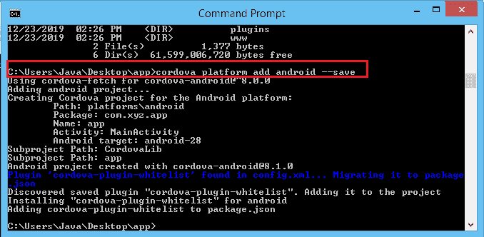

# 创建第一个 Cordova 应用程序

> 原文：<https://www.javatpoint.com/creating-first-cordova-application>

创建 Cordova 应用程序所需的所有组件都已安装。那么，让我们创建第一个 Cordova 应用程序。要创建 Cordova 应用程序，您必须遵循以下步骤:

**第一步:**首先在命令提示符下检查 node.js 版本，检查是否安装正确。

在命令提示符 **- >节点-版本**中键入以下命令


如果它显示了 node.js 应用程序的当前版本，则意味着 node.js 已正确安装在您的系统上。


**第二步:**然后，在命令提示符下键入 **npm** 。


如果 **npm** 模块正确安装在您的系统上，那么将执行以下命令:


**步骤 3:** 我们已经在系统中安装了 Cordova。如果您没有安装它，您可以简单地通过这个特定的命令- >

```

npm install -g cordova 

```

这个命令在你的系统中安装 Cordova。您也可以使用以下命令检查 Cordova 的版本:

```

cordova --version

```


**步骤 4:** 现在，在桌面上创建 Cordova 应用程序。首先，我们必须将默认目录更改为桌面。

在命令提示符下键入以下命令以更改默认目录。

```

cd Desktop

```

上面的命令负责在桌面上创建我们的应用程序。

**步骤 5:** 要创建我们的第一个 Cordova 应用程序，我们必须在命令提示符下编写下面的命令。

```

cordova create app com.xyz.app app

```

上面的命令在桌面上创建了我们的第一个应用程序，其中包含必要的文件、文件夹和目录结构。


*   **com.xyz.app** 反向标注指定应用的域名。
*   **app** 定义应用名称。

上面的命令在桌面上创建一个包含这些文件夹的新文件夹**应用程序**:


### 添加平台

如果我们想在我们的应用程序中添加任何平台，我们可以简单地按照以下步骤进行:

**第五步:**首先，我们必须移动到为构建应用程序而创建的目录，即**应用程序**并键入**目录**以显示当前目录。


**第 6 步:**通过添加新平台，我们可以简单地部署我们的应用程序。键入以下命令创建一个安卓平台。

```

cordova platform add android --save

```



**第 7 步:**我们还需要安装 PhoneGap 为应用服务。要安装 PhoneGap 模块，我们必须键入以下命令:

```

npm install -g phonegap

```


**第八步:**安装 PhoneGap 之后，我们还需要安装 Android SDK，为我们的应用增加一个平台。我们可以从它的官方网站[https://developer.android.com/studio.](https://developer.android.com/studio)安装

在页面底部，我们可以找到**命令行工具**，下载适用于 windows 平台的 Android SDK 工具包。


为我们的应用安装安卓平台后，我们可以看到在**平台**文件夹中创建了一个新文件夹。


**第九步:**转到系统中已安装**安卓 SDK** 的文件夹，点击**工具**文件夹，复制其路径。


**第十步:**现在，在系统中打开**环境变量**，点击**路径**变量。


**步骤 11:** 通过在**路径**变量中粘贴路径来添加新路径。

**步骤 12:** 之后，复制**平台-工具**路径，粘贴到路径变量中。


**第 13 步:**完成所有操作后，通过在命令提示符下键入以下命令，在浏览器中运行应用程序:

```

phonegap serve

```

该命令启动服务器并监听 IP 地址和端口号。要在浏览器中运行应用程序，请复制 IP 地址并将其粘贴到浏览器中。

这将在浏览器中运行您的应用程序:


* * *