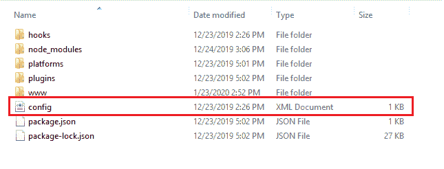

# Config.xml 文件

> 原文：<https://www.javatpoint.com/cordova-config-xml-file>

Config.xml 可以定义为 Cordova 应用程序的全局配置文件，我们可以在其中更改我们的应用程序的配置。在前面的部分，我们已经创建了我们的第一个 Cordova 应用程序，在这里我们设置了反向域名和名称。如果您想更改这些现有值，您可以使用 **config.xml** 文件轻松更改它们。

这是一个**平台无关的 xml** 文件，包含了[Cordova](https://www.javatpoint.com/apache-cordova)将 **[www](https://www.javatpoint.com/www-full-form)** 文件夹中的代码转换为平台特定的安装程序所需的所有必要信息。该文件基于 W3C 打包的网络应用程序控制 Cordova 的行为。它还指定了应用程序的元数据。这是一个默认文件，是在创建任何 Cordova 应用程序时自动创建的。

该文件可以手动编辑，也可以使用命令行界面的特定命令编辑。我们可以在这个文件中添加两个配置，即**全局**和**平台专用**。

**全局配置**指定所有设备通用的配置，而**平台特定配置**特定于平台。

配置被解析成一个应用程序，然后内容被转换成一组功能。这些功能负责生成访问本机设备 API 的策略，并显示应用程序与 web 域的交互。

此文件位于应用程序的顶级目录中:

**app/config.xml**

在 3.3.1- 0.2.0 版本之前，config.xml 文件存在于 **app/www/config.xml** 中。

当我们使用命令行界面构建任何应用程序时，config.xml 文件的版本会被复制到各种**平台/子目录**中。

## config.xml 文件的配置表:

下表定义了 config.xml 文件中使用的元素:

| 元素 | 描述 |
| 小部件 | 它定义了创建应用程序时应该指定的应用程序的反向域值。 |
| **名称** | 它定义了应用程序的名称。 |
| **描述** | 它代表应用程序的描述。 |
| **作者** | 它代表可以在应用商店列表中显示的联系信息。 |
| **内容** | 它表示顶级 web 资产目录中应用程序的起始页。默认值为出现在顶级 **www** 目录的**index.html**。 |
| 插件 | 这是增强 Cordova 能力的附加功能。它可以被定义为一个有助于与原生平台通信的代码包。 |
| **进入** | 它用于控制特定网络域的访问。它有默认的**原点**值 ***，**，表示访问对任何域开放。 |
| **发动机** | 它指定了平台的详细信息，在实现过程中会恢复这些信息。 |
| **允许-意图** | 它用于使特定的网址要求应用程序打开。 |
| **勾** | 它代表您的自定义脚本，当特定操作发生时，Cordova 会调用该脚本。这对于扩展默认的 Cordova 功能很有用。 |
| **平台** | 它代表了我们构建应用程序的平台。 |
| **资源文件** | 它将资源文件安装到系统中。 |

## 小部件:

小部件是 config.xml 文件的根元素。widgets-config.xml 文件存储了 widget 定义、widget 属性、页面定义和默认 widget 模板的信息。我们可以编辑 **config.xml** 的配置设置来执行几个任务。例如，如果我们想要启用自定义小部件，我们可以通过在 config.xml 文件中定义小部件来轻松实现。它由以下列出的一些属性组成:

| 属性(类型)仅适用于平台 | 说明 |
| id(字符串) | 指定应用程序反向域标识符的必需属性。 |
| 版本(字符串) | 必需的属性定义了以次要/主要/补丁符号表示的完整版本号。 |
| IOs-
【cfbundesntifer(string)
**【IOs】** | 它代表了 **iOS** 平台的可选捆绑包 id。它覆盖了 **id** 。 |
| IOs-
【cfbundeslevation(string)
**【IOs】** | 它代表了 iOS 的替代版本。 |
| android-
activityName（字符串）
**Android** | 它代表了 AndroidManifest.xml 中的活动名称，注意可以在添加安卓平台后进行设置。 |
| android-
软件包名称(字符串)
**Android** | 它为 android 定义了可选的包名。它会覆盖 **id。** |
| windows-
packageName(字符串)
**Windows** | 它定义了 windows 的包名。
默认:**Cordova。示例** |
| windows-
packageVersion(字符串) | 它定义了窗口的替代版本。 |
| OSX-
【cfbundleion(string)
**【OS x】** | 它定义了操作系统 x 的替代版本。 |
| xmlns:cdv(字符串) | 定义命名空间前缀的必需属性。 |
| xmlns(字符串) | 定义 config.xml 文件的命名空间的必需属性。 |

**首选项:**用于将各种选项设置为名称/值属性对的元素。首选项的名称不区分大小写。许多偏好特定于各个平台。**偏好**的一些属性如下:

| 属性 | 类型 | 说明 |
| **方位** | 线 | 它允许您锁定方向。因此，它不会随着方向的变化而旋转。允许的值有默认值、横向和纵向。其默认值为**默认值**。 |
| **启用视图端口比例** | 布尔代数学体系的 | 如果我们将该值设置为 **true** ，它将阻止用户通过视口元标签缩放范围。其默认值为**假**。 |
| uiwebviewdeclaration speed | 线 | 用于控制动量滚动的减速速度。其默认值为**正常**。 |
| **备份网络风暴** | 线 | 允许的值有无、本地和云。其值设置为 cloud，通过 iCloud 备份网络存储数据。 |

### 功能:

如果您想使用命令行界面来构建应用程序，您必须使用插件命令来启用设备应用程序接口。因此，顶层的 **config.xml** 文件没有变化。因此，该元素不会应用于工作流。如果您直接在 SDK 中工作，并且使用特定于平台的 config.xml 源文件，则必须使用标记来启用设备级 API 和外部插件。

**名称:**定义要启用的插件名称的**字符串**类型的**特征**的属性。

* * *