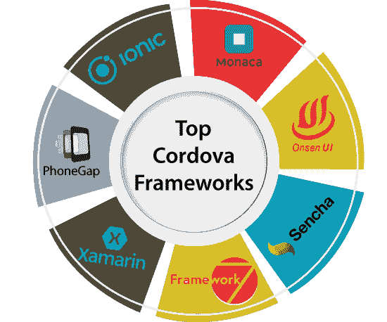
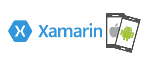
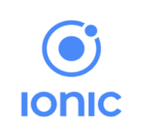
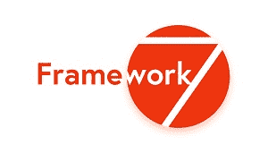
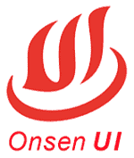
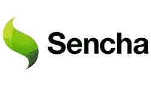
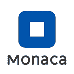

# 混合移动应用开发的顶级Cordova框架

> 原文：<https://www.javatpoint.com/top-cordova-frameworks-for-hybrid-mobile-app-development>

如今，由于对移动应用程序的需求不断增加，人们使用桌面应用程序的趋势已经下降。许多企业正在实施有效的发展战略，将其业务升级到在线环境。正因为如此，企业家们更喜欢移动应用来扩大他们对目标用户的影响。

开发混合移动应用程序对开发人员来说并不是一项耗时的任务，因为开发人员可以轻松地一次性编写代码，并构建一个在主平台上运行的移动应用程序，而无需任何额外的努力。

开发人员还可以重用主要运行在安卓和 iOS 上的渐进式网络应用和桌面应用的代码。**electronic**是一个开源框架，它将代码适配于桌面环境。

但是我们需要最好的框架来设计各种应用程序。市场上有几种框架；我们已经定义了可用于混合移动应用的顶级框架。

## 为什么使用框架进行Cordova应用？

有时候[Cordova](https://www.javatpoint.com/apache-cordova)技术会因为以下一些问题而被忽略:

*   处理触摸事件时的问题。
*   不能处理固定位置的元素目标。
*   面临跟随本土设计和动画的困难。
*   长列表中的性能问题。
*   复杂的过渡动画效果。

因此，框架通常用于消除这些问题，并将 [HTML](https://www.javatpoint.com/html-tutorial) 应用的设计和性能尽可能更新为本机应用。

## 本地和混合移动应用程序开发

## 本地应用程序:

开发人员创建移动应用程序有两种方法，即**原生**和**混合移动应用程序开发。**本部分介绍**原生应用。**

**原生 App 开发**主要依靠专为一个平台设计的工具和编程语言。当我们创建本地应用程序时，开发人员使用特定的[操作系统](https://www.javatpoint.com/os-tutorial)要求在计算设备上安装应用程序。

然而，在使用原生应用程序开发时，我们可能会面临一些重大问题。

### 面临的问题:

*   对于创建运行在多个平台上的应用程序来说，本地应用程序开发并不可取。
*   我们还需要为每个目标平台开发各种应用程序，这是一项耗时且经济高效的任务。

## 原生移动应用开发的利弊:

### 优点:

*   与混合应用程序相比，它提供了最佳性能。
*   它提供应用商店的全面支持。
*   它使开发人员能够访问选定操作系统的所有功能。
*   它提供了更好的用户体验。
*   它有更好的速度和性能。
*   它提供高级定制。
*   它比 web 应用程序更强大，因为它直接与硬件交互。
*   本地应用程序由相应的操作系统批准，这些操作系统提供安全性、质量和设备兼容性。

### 缺点:

*   在原生应用程序中，使用了困难的编程语言。因此，开发人员必须了解编程语言。
*   与混合应用相比，原生应用更贵。
*   原生应用不适合简单的应用。

## 混合应用:

**混合应用开发**或**跨平台开发**用于将原生代码与能够在多个平台上运行代码的独立代码相结合。它允许开发者创建跨平台的移动应用。

混合软件是用不同的语言编码的，比如 **HTML、CSS 和 JavaScript** 。这些语言不是操作系统和设备的原生语言。因此，应用程序被打包到本机容器中，并集成到多个平台中。它具有与本机应用程序相同的外观和感觉。

### 混合移动应用开发的利弊:

现在，我们将讨论混合应用程序的优缺点:

### 优点:

*   这是在多个平台上启动应用程序的最佳解决方案。
*   80%的代码可以与另一个节点共享。
*   由于代码的可重用性，它消耗的时间更少。
*   它具有与原生应用程序相同的外观和感觉。
*   混合应用程序消除了构建独立解决方案的需要。

### 缺点:

*   它在设备上占据了更大的空间。
*   它的动画平滑度有限。
*   加载应用程序时会消耗时间。
*   它不能共享完整的代码；需要编写一些本机代码。

现在，是时候讨论混合移动应用开发的顶级Cordova框架了:

## 混合移动应用开发的顶级Cordova框架

## 沙马林

**[【Xamarin】](https://www.javatpoint.com/xamarin)**是构建混合应用程序的最佳框架。这是一家总部位于加州的软件公司，由**微软**拥有。成立于【2011 年 5 月，兼容多个平台。它像本机解决方案一样提供高效的性能。主要依靠 [C#编程语言](https://www.javatpoint.com/c-sharp-tutorial)配合[。NET 框架](https://www.javatpoint.com/net-framework)。

开发人员可以使用 Xamarin 工具，通过使用 C#共享代码库来开发带有本机用户界面的本机和 Windows 应用程序。可以从其官网下载:[https://dotnet.microsoft.com/apps/xamarin](https://dotnet.microsoft.com/apps/xamarin)。

其开发工具集由下列重要组件组成:

*   Xamarin SDK
*   Xamarin 测试云
*   可视化工作室
*   霍克亚普

### Xamarin 的优缺点

**优点:**

*   它是一个开源平台，有更好的用户体验。
*   它提供全面的硬件支持。
*   接近原生应用的出色性能。
*   单一技术兼容多个平台。
*   成本低，维护简单。
*   开发人员不需要在开发环境之间切换。

cons:t1]

*   它的设计应用程序占用大量内存空间。
*   用户对开源库的访问权限有限。
*   开发人员应该了解本地语言。

## 语音间隙

PhoneGap 被定义为由 Cordova 发行的**开源平台**。它允许开发人员使用兼容多个平台的单一代码库构建应用程序。它为开发人员提供了重用各种语言(如 HTML、 [CSS](https://www.javatpoint.com/css-tutorial) )支持的旧 web 开发技能来创建混合应用程序的便利。

它是最流行的**跨平台框架**，使用桌面和开发者应用程序，在几分钟内将我们的 HTML、CSS 和 [JavaScript](https://www.javatpoint.com/javascript-tutorial) 文件覆盖到一个应用程序中。它提供了本地插件和容器，使开发人员能够访问移动资源，如相机、指南针等。在构建了应用程序之后，我们可以在一个 WebView 浏览器中运行它，该浏览器保留在合适平台上的原生容器中。可以从其官网下载:[https://phonegap.com/](https://phonegap.com/)

### PhoneGap 的优缺点

**优点:**

*   它是一个开源平台，使用单个代码库构建应用程序。
*   PhoneGap 中使用的插件允许访问像相机、联系人等移动资源。
*   它的用户界面类似于所有平台。
*   这是一个开发者友好的平台。

cons:t1]

*   大量的图形元素会影响应用程序的性能。
*   测试应用程序需要大量的测试。
*   PhoneGap 的文档描述性不是很强。

要了解 PhoneGap 的更多信息，您可以点击给定的链接:[**【https://www.javatpoint.com/cordova-phonegap】**](https://www.javatpoint.com/cordova-phonegap)

## Ionic的

Ionic被定义为**麻省理工学院许可的**免费**和**开源项目**。**由**漂移股份有限公司**于 **2012** 开发，建在**角形**之上。它用于使用不同的网络技术开发混合应用程序，如 **HTML5、CSS 和 SASS** 等。它由 120 个原生功能组成，如蓝牙、指纹认证、健康工具包等。

Ionic 的命令行界面用于创建、构建、测试应用程序并将其部署到多个平台中。这些应用程序可以通过使用本地存储分布在不同的节点上。

它是一个用于构建跨平台移动应用的前端 SDK。它有一个庞大的开发者社区，数百万个应用程序都是使用 Ionical 开发的。ion 还提供了一个平台，用于集成推送通知和分析等服务。这个框架由一个名为**的图标包组成。**

它提供了额外的功能和服务，如可维护性、可伸缩性，使交互式网络应用程序。它还提供了一组 web 服务，有助于提高构建、测试、调试和更新应用程序的速度。可以从其官网下载:[https://ionicframework.com/](https://ionicframework.com/)

### Ionic液体的利弊

**优点:**

*   这是一个开源平台，由列表、标签、标题栏和卡片组成。
*   原型的快速实现。
*   设计好的很容易使用。
*   很容易设置。
*   它有一个庞大的开发者社区。

cons:t1]

*   不适合游戏开发。
*   它不能提供高性能。

## 框架 7

该框架可以快速构建原型并开发用户友好的移动应用程序，从而提供交互式用户体验。这是一个由简单的“T2”HTML 布局“T3”组成的“T0”开源平台“T1”。它不兼容多个平台。

这是一个构建混合移动应用和网络应用的 HTML 框架。这些应用程序提供了安卓和 iOS 原生的外观和感觉。

由 **2014** 俄罗斯工作室 iDangero 开发。对于创建 iOS 和安卓应用，该框架主要使用 **iOS** 和**谷歌材质设计**。可以从其官网下载:[https://framework7.io/](https://framework7.io/)。框架 7 的一些主要[特性如下:](https://www.javatpoint.com/framework7-tutorial)

*   本地滚动
*   多视图支持
*   页面过渡动画
*   浏览历史记录
*   预加载

### 框架的利弊 7

**优点:**

*   这是一个可以轻松定制的开源平台。
*   它由许多现成的用户界面元素组成。
*   这很容易学。

cons:t1]

*   它不兼容多个平台。
*   必须有一个内置的 F7 MVC 框架。

## Onsen UI

这是另一个由**阿帕奇**授权的**开源框架**。它是**框架不可知的，**这意味着你可以在不同的框架之间切换，比如 Angular 或者 React 来开发混合应用。

这是一个基于定制元素的 **HTML5** 框架，提供大量组件选择和响应布局支持。这个框架是新的，但给了Ionic激烈的竞争。所有商业项目也是**免费的。**

它允许开发人员开发多平台应用程序，而不需要额外的技能。可以从其官网下载:[https://onsen.io/](https://onsen.io/)

Onsen UI 的特点如下:

*   这是一个完全开源的框架。
*   它基于 Angular JS 和 jQuery。
*   现有模板可用于登录、配置文件等。
*   它包含页眉、页脚、列表视图等的 CSS 组件。
*   由用于滑动拉取刷新的 JavaScript 控制器组成。
*   它使开发人员能够通过Cordova和 PhoneGap 用 HTML、JavaScript 编写代码。

### Onsen 用户界面的优缺点:

**优点:**

*   使用预定义的组件。
*   最佳文档。

cons:t1]

*   它不包括Cordova/PhoneGap 构建器。

## 森查

该框架是企业级应用产品的领导者，用于用 **HTML5 和 JavaScript** 构建**跨平台应用**。为用户提供跨多个平台的原生观感是更好的选择。如果你有一个大的组织，这应该是你的第一选择。您可以使用**森查**使用 [HTML5](https://www.javatpoint.com/html5-tutorial) 和 JavaScript 创建移动和网络应用程序。

一个名为 **ExtJS** 的 JavaScript 框架是基于 Sencha 平台的最流行的框架。该框架构建了具有本地用户体验的高性能应用。它还为所有领先的平台使用一些小部件，如 [iOS](https://www.javatpoint.com/ios-development-using-swift) 、安卓、黑莓。可以从其官网下载:[https://www.sencha.com/](https://www.sencha.com/)

使用 Sencha 框架，我们可以使用拖放功能来构建 HTML5 可视化应用程序。几个模板也可用于应用程序的简单实现。此外，它还提供了一套用于各种平台的主题，如[安卓](https://www.javatpoint.com/android-tutorial)、黑莓、iOS 等。

### 森茶的利弊

**优点:**

*   这是一个完全开源的平台，提供了跨多个平台的原生外观和感觉。
*   它主要提供了一个 UI 组件库和一个可扩展的 API。

cons:t1]

*   它不适合单一的开发者和自由职业者。
*   使用 Sencha 时会面临性能问题。

## 莫妮卡（女名）

Monaca 是一个云驱动的框架，支持混合应用的在线和离线开发。它可以直接将你的应用投放到应用市场。

它是一套与框架无关的工具，由许多现成的模板组成，有助于更容易地构建和部署应用程序的过程。这款 app 开发工具可以单独使用，也可以与 [Git](https://www.javatpoint.com/git) 、崇高文字等其他工具集成使用。

它是在日本发展起来的，但它的增长扩展到了几个国家，如美国、墨西哥、意大利、中国和委内瑞拉。可以从其官网下载:[https://monaca.io/](https://monaca.io/)

### 莫纳卡的利弊

**优点:**

*   它支持在线**和离线**混合应用的开发。****
*****   您可以使用**实时重装功能**和**云构建体验**调试应用。*   由于 Monaca 完整的云开发环境，不需要设置。*   由于云同步的本地开发，您可以使用您的环境。*   这是一个与 **Onsen 框架**紧密集成的**框架不可知**工具。然而，它提供了选择任何 JavaScript 框架的灵活性。*   它提供了对 Angular 1、2+、React 和 Vue.js 的支持，你也可以使用你的框架。*   它依赖于 **Onsen UI JavaScript 框架**，这有助于更快地开发基于 HTML 5 的混合移动应用。*   许多模板可用于简化应用程序开发过程。****

 ****cons:t1]

*   不适合日活跃用户 1000 以上。

* * *****