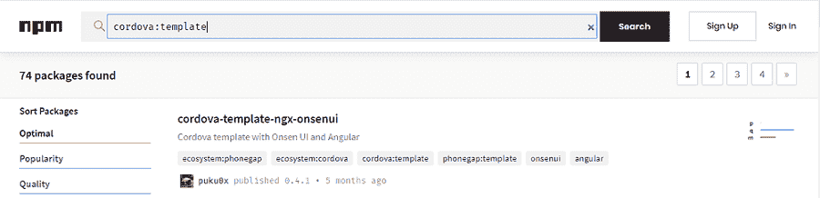

# Cordova 应用程序模板

> 原文：<https://www.javatpoint.com/cordova-app-templates>

ApacheCordova 版本 **6.0.0** 于 **2016** 在犹他州发布。该版本为 Cordova 应用程序增加了一项新功能。随着默认平台版本的更新，新的**模板**功能被添加到 Cordova 命令行界面，允许用户使用模板创建应用程序。

构建用户界面是任何移动应用程序的关键部分。已经有一套 UI 组件、工具和框架可用于使用本机开发构建任何移动应用程序。但是在[Cordova](https://www.javatpoint.com/apache-cordova)的情况下，我们没有足够的工具可以用来开发移动应用。因此，模板的使用成为简化移动应用程序开发过程的必要条件。

这些模板使用预先存在的代码来帮助用户从特定的点开始一个项目。它从模板中创建一个新的应用程序，以一种简单得多的方式共享示例应用程序。它可以用于培训目的，在开发的不同阶段保留演示应用程序的副本。

## 下载模板

这些模板托管在 **npm** 和**git URL**上。您可以通过搜索 npm 上的关键字**Cordova:模板**从官方网站轻松下载这些模板。您也可以使用本地文件系统中的模板。

## 支持的 Cordova 版本



在为您的应用程序使用模板之前，首先，您必须检查系统中安装的 Cordova 版本，因为该功能是在 6.0.0 版本中添加的，因此，我们必须使用相同或更高版本来支持该功能。以下是显示 cordova 当前版本的命令:

```

cordova --version

```

如果返回的版本是 **6.0.0** 或更高版本，您可以将此功能用于您的应用程序。

## 创建 Cordova 模板:

我们可以通过在**创建**命令中指定 **-模板**并跟随模板源来创建一个新的 Cordova 项目。

以下命令从 NPM 包、 [Git 存储库](https://www.javatpoint.com/git-repository)或本地路径创建一个 cordova 项目:

```

$ cordova create app com.example.app FirstApplication --template <npm-package-name>
$ cordova create app com.example.app FirstApplication --template <git-remote-url>
$ cordova create app com.example.app FirstApplication --template <path-to-template>

```

这些特定的命令在一个同名的文件夹中创建一个名为“ **app** ”的新 Cordova 应用程序，并使用来自上述来源(即 npm、 [git](https://www.javatpoint.com/git) 或本地文件系统)的模板。

应用程序的内容将设置为下面的结构。使用模板时， **template_src** 中所有可用的内容都用于创建新的应用程序。

**模板 _ 包/**

**├──指数. js(必填)**

**──package . JSON(可选)**

**──template _ src/(required)**

**app 模板**的└──数据

*   **index.js** 文件必须定义对**模板 _src** 的引用
*   **package.json** 必须定义对 **index.js** 的引用

最后，要结束模板，只需操作 **package.json** 文件，键入关键字“ **cordova:template** ”。

您已经成功地为 Cordova 应用程序制作了一个模板。您还可以在 npm 上共享您的模板，以便用户能够以简化的方式开发应用程序。

## 使用 Git 存储库创建 Cordova 模板

在本节中，我们将使用 Git 存储库创建一个 Cordova 模板。但是在继续之前，首先，我们必须创建一个可以用作模板的应用程序，并需要以 git 存储库的相应格式存储它。

为此，我们通过在命令提示符下键入以下命令来创建一个新的 Cordova 项目:

```

cordova create project com.example.project New Project

```

在这里，我们通过键入以下命令为 Cordova 应用程序添加 iOS 和安卓平台:

```

cd project
cordova platform add ios --save 
cordova platform add android --save

```

注意这里我们使用的是 **-为每个平台保存**。This - save 关键字在应用的 **config.xml** 文件中添加一个条目。该文件负责通知 Cordova 该应用程序使用的平台。

如果您想使用 Git 存储库中的模板创建 Cordova 应用程序，请在命令提示符下键入以下命令:

```

$ cordova create project com.example.projectNew Project --template <git-remote-url>

```

当我们执行上述命令时，Cordova 命令行界面创建了一个新的应用程序，并显示了以下输出:

```

Creating a new cordova project.
Retrieving template-source
Repository "template-source" checked out to git ref "template"

```

确保 git 存储库的根目录中存在以下内容:

**www** -这个文件夹包含了像 [HTML](https://www.javatpoint.com/html-tutorial) 、 [CSS](https://www.javatpoint.com/css-tutorial) 和 [JavaScript](https://www.javatpoint.com/javascript-tutorial) 这样的应用程序的必要文件。

**config.xml** -这个文件存储了一个应用的基本插件和平台。如果你想了解更多关于 **config.xml** 文件的信息，你可以点击链接:[https://www.javatpoint.com/cordova-config-xml-file](https://www.javatpoint.com/cordova-config-xml-file)

如果你想在应用程序中做任何改变，你可以简单地在 [www](https://www.javatpoint.com/www-full-form) 文件夹中应用这些改变。

要运行这个应用，我们需要下载正确的插件和平台依赖。键入以下命令运行应用程序:

```

cd app
cordova prepare

```

如果 Cordova 没有所需的平台和插件，它会为我们下载:

```

cordova prepare
Restoring platform ios@~4.0.1 referenced on config.xml
Adding ios project...
iOS project created with cordova-ios@4.0.1
Discovered plugin "cordova-plugin-whitelist" in config.xml. Installing to the project
Fetching plugin "cordova-plugin-whitelist@1" via npm
Installing "cordova-plugin-whitelist" for ios
Discovered plugin "cordova-plugin-device-orientation" in config.xml. Installing to the project
Fetching plugin "cordova-plugin-device-orientation@~1.0.2" via npm
Installing "cordova-plugin-device-orientation" for ios
Discovered plugin "cordova-plugin-statusbar" in config.xml. Installing to the project
Fetching plugin "cordova-plugin-statusbar@~2.1.0" via npm
Installing "cordova-plugin-statusbar" for ios
Restoring platform android@~5.1.0 referenced on config.xml
Adding android project...
Creating Cordova project for the Android platform:
    Path: platforms/android
    Package: com.example.project
    Name: project
    Activity: MainActivity
    Android target: android-23
Android project created with cordova-android@5.1.0
Installing "cordova-plugin-device-orientation" for android
Installing "cordova-plugin-statusbar" for android
Installing "cordova-plugin-whitelist" for android

```

上述命令为应用程序安装所需的插件和平台。

* * *