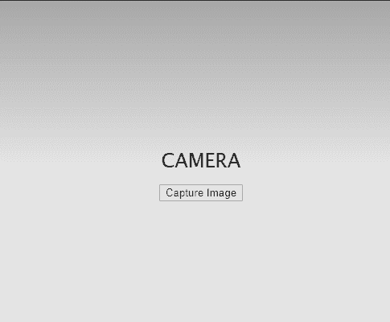

# Cordova 相机外挂程式

> 原文：<https://www.javatpoint.com/cordova-plugin-camera>

需要一个插件摄像机来访问设备的摄像机功能。这个插件使用户能够从设备上拍摄任何照片，并从图像库中访问文件。如果想给用户看图片，可以使用 **FILEURI** 或者 **DATAURI** 对象。

它包含一个代码脚本，使您的应用程序能够使用设备摄像头及其相关硬件功能。要启用设备的相机功能，我们需要设置一个全局 **navigator.camera** 对象，该对象执行从设备图库中拍照和选择图像的任务。但是在**设备就绪**事件没有进行之前，我们不能使用这个对象。

我们可以在以下情况下使用这个插件:

*   它用于访问设备的图像库。
*   它使用户能够访问设备的摄像头功能。
*   它可以访问图像的本地路径。

## 装置

要在您的[科尔多瓦](https://www.javatpoint.com/apache-cordova)应用程序中添加相机插件，请键入以下命令:

```

cordova plugin add cordova-plugin-camera

```

此命令仅适用于科尔多瓦 5.0+版本。旧版本可以使用**放弃** id 来安装插件。

```

Cordova plugin add org.apache.cordova.camera

```

## 方法

插件相机中使用了两种方法。下面列出了这些方法:

*   **navigator . camera . getpicture(camera access，cameraError，[ cameraOptions ])**
*   **导航器.摄像机.清理(成功，失败)**

### 1.navigator.camera.getPicture

此方法用于启用相机功能，我们可以从相机捕获图像并从本地设备库中访问图像。之后，这个特殊的图像作为 base64 编码的字符串被传递给成功回调函数。我们也可以传递一个图像作为图像文件的 URI。作为回报，你还会得到一个物体，即**摄像头上手按**。此对象用于重新定位图像文件。

### 工作

调用此方法时，它会打开设备的默认相机应用程序，并允许用户捕获图像。如果**摄像机.源类型**等于**摄像机，则以默认方式执行该动作。PictureSourceType.CAMERA** 。捕捉到照片后，相机会关闭，应用程序也会恢复。

要从现有设备库中访问图像，**摄像机.源类型**应等于**摄像机。PictureSourceType . photo library**或**camera . PictureSourceType . savedphotoalbum .**你还会得到一个物体作为回报，即**camera poophandle**。此对象用于重新定位图像文件。

此后，返回值将以指定的格式发送到**camerassaccess**回调函数。主要取决于指定的对象，即**摄像机选项。**返回值有两种可用的**格式**，如下所示:

*   它是由字符串对象组成的默认格式。该字符串对象表示本地存储中图像文件的路径。
*   它是一个字符串对象，由 base64 编码的图像组成。

这种方式在**安卓**、 **iOS** 、**蒂森**、 **Windows 8、**等不同平台都有支持。

### 2.导航器.摄像机.清理(成功，失败)

**相机**的一种静态方法，主要工作是调用**相机. getPicture** 方法后，移除临时设备存储器中存储的中间图像文件。要应用此功能，**摄像机.源类型**应等于**摄像机。PictureSourceType.CAMERA** 和 **Camera.destinationType** 对象也应该等于 **Camera。目的地类型.文件 _URI** 。

#### 注意:此方法仅支持 iOS 平台。

### 示例:

```

navigator.camera.cleanup(onSuccess, onFail);
functiononSuccess() {
console.log("success cleanup image")
}
functiononFail(message) {
alert('cleanup can't be done because: ' + message);
}

```

## 相机。成功

**相机**的静态 typedef 方法，主要用于提供图像数据。

**参数:**

**imageData:** 它是一个字符串类型的对象，主要提供图像数据或图像文件 URI 的 Base64 编码。

## 相机. onError

这也是相机的静态 typedef 方法，用于提供错误消息。

**参数:**

**消息:**它是一个字符串类型的对象，其中消息由设备本机代码提供。

## 照相机。摄像机选项

这是一个**可选参数**，用于自定义设备的摄像头设置。

## 性能

| 名字 | 默认 | 类型 | 说明 |
| 编码类型 | 联合图像专家组 | 编码类型 | 它选择图像文件的返回编码。 |
| 媒体类型 | 画 | 媒体类型 | 它主要用于选择媒体类型。仅当**图片来源类型**为**照片图书馆**或**保存照片相册时适用。** |
| 资源类型 | 照相机 | PictureSourceType | 它的主要任务是设置图像的来源。 |
| 目标类型 | FILE_URI | 目标类型 | 它用于选择返回值的格式。 |
| 质量 | Fifty | 数字 | 它表示保存图像的质量，以 0 到 100 之间的范围表示，其中 100 表示全分辨率屏幕，不会因文件压缩而丢失。 |
| 允许它 | 错误的 | 布尔代数学体系的 | 它允许用户在选择之前简单地编辑图像。 |
| targetWidth |  | 数字 | 它以像素为单位表示图像的宽度，用于缩放图像。必须应用于**目标高度**对象。 |
| targetHeight |  | 数字 | 它以像素为单位表示图像的高度，用于缩放图像。 |
| 正确方向 |  | 布尔代数学体系的 | 它用于旋转图像。 |
| 保存相册 |  | 布尔代数学体系的 | 捕获图像后，他的对象会将图像保存在现有的照片库中。 |
| 摄像机方向 | 背部 | 方向 | 它用于选择相机(正面或背面)。 |
| popoverOptions |  | 摄像头选项 | 仅适用于主要指定 popover 位置的 iOS 平台。 |

## 代码:

## HTML:

```

<html>
<head>
    <meta name="format-detection" content="telephone=no">
    <meta name="msapplication-tap-highlight" content="no">
    <meta name="viewport" content="user-scalable=no, initial-scale=1, maximum-scale=1, minimum-scale=1, width=device-width">
    <link rel="stylesheet" type="text/css" href="css/index.css">
    <title>Cordova Project</title>
</head>
<body>
    <div class="app">
        <h1>Camera</h1>
        <p>
            <button id="btn">Capture Image</button>
        </p>
        <p></p>
    </div>
    <script type="text/javascript" src="cordova.js"></script>
    <script type="text/javascript" src="js/index.js"></script>
</body>
</html>

```

## CSS:

```

* {
    -webkit-tap-highlight-color: rgba(0,0,4,1); /* make transparent link selection, adjust last value opacity 0 to 1.0 */
}
body {
    -webkit-touch-callout: none;                /* prevent callout to copy image, etc when tap to hold */
    -webkit-text-size-adjust: none;             /* prevent webkit from resizing text to fit */
    -webkit-user-select: none;                  /* prevent copy paste, to allow, change 'none' to 'text' */
    background-color:#E4E4E4;
    background-image:linear-gradient(top, #A7A7A7 0%, rgb(211, 28, 28) 51%);
    background-image:-webkit-linear-gradient(top, #A7A7A7 0%, #E4E4E4 51%);
    background-image:-ms-linear-gradient(top, #A7A7A7 0%, #E4E4E4 51%);
    background-image:-webkit-gradient(
        linear,
        left top,
        left bottom,
        color-stop(0, #A7A7A7),
        color-stop(0.51, #E4E4E4)
    );
    background-attachment:fixed;
    font-family:'Lucida Sans-Light', 'Lucida Grande', 'Lucida Sans', 'Lucida Sans Regular', 'Lucida Grande', 'Lucida Sans Unicode', Geneva, Verdana, sans-serif, Arial, sans-serif;
    font-size:15px;
    height:70%;
    margin:20px;
    padding:0px;
    text-transform:uppercase;
    width:100%;
}
/* Portrait layout (default) */
.app {
    background:url(../img/logo.png) no-repeat center top; /* 170px x 200px */
    position:absolute;             /* position in the center of the screen */
    left:50%;
    top:50%;
    height:50px;                   /* text area height */
    width:225px;                   /* text area width */
    text-align:center;
    padding:180px 0px 0px 0px;     /* image height is 200px (bottom 20px are overlapped with text) */
    margin:-115px 0px 0px -112px;  /* offset vertical: half of image height and text area height */
                                   /* offset horizontal: half of text area width */
}
/* Landscape layout (with min-width) */
@media screen and (min-aspect-ratio: 1/1) and (min-width:400px) {
    .app {
        background-position:left center;
        padding:75px 0px 75px 170px;  /* padding-top + padding-bottom + text area = image height */
        margin:-90px 0px 0px -198px;  /* offset vertical: half of image height */
                                      /* offset horizontal: half of image width and text area width */
}
}
h1 {
    font-size:24px;
    font-weight:normal;
    margin:0px;
    overflow:visible;
    padding:0px;
    text-align:center;
}
.event {
    border-radius:4px;
    -webkit-border-radius:4px;
    color:#FFFFFF;
    font-size:12px;
    margin:0px 30px;
    padding:2px 0px;
}
.event.listening {
    background-color:#333333;
    display:block;
}
.event.received {
    background-color:#4B946A;
    display:none;
}
@keyframes fade {
    from { opacity: 1.0; }
    50% { opacity: 0.4; }
    to { opacity: 1.0; }
} 
@-webkit-keyframes fade {
    from { opacity: 1.0; }
    50% { opacity: 0.4; }
    to { opacity: 1.0; }
}
.blink {
    animation:fade 3000ms infinite;
    -webkit-animation:fade 3000ms infinite;
}

```

## JavaScript:

```

// BatteryManager.
var battery = navigator.battery || navigator.mozBattery || navigator.webkitBattery;
var alert = document.getElementById('alert');
// battery meter.
var batteryMeter = document.getElementById('battery-meter');
// data cells in the table.
var batteryLevel = document.getElementById('battery-level');
var batteryStatus = document.getElementById('battery-status');
var batteryCharging = document.getElementById('battery-charging');
var batteryDischarging = document.getElementById('battery-discharging');
// Updating battery level meter and table value.
function updateBatteryLevel() {
  batteryMeter.value = battery.level;
  batteryLevel.innerHTML = (battery.level * 70) + '%';
}
// Updating battery charging status.
function updateBatteryStatus() {
  if (battery.charging) {
    batteryStatus.innerHTML = 'Charging';
  } else {
    batteryStatus.innerHTML = 'Not Charging';
  }
}
// Updating battery charging time value.
function updateBatteryChargingTime() {
  if (battery.chargingTime === Infinity) {
    // Not charging.
    batteryCharging.innerHTML = '-';
  } else {
    // Charging.
    batteryCharging.innerHTML = (battery.chargingTime / 60) + ' minutes';
  }
}
// Updating battery discharging time value.
function updateBatteryDischargingTime() {
  if (battery.dischargingTime === Infinity) {
    // Not discharging.
    batteryDischarging.innerHTML = '-';
  } else {
    // Discharging.
    batteryDischarging.innerHTML = (battery.dischargingTime / 60) + ' minutes';
  }
}
// Set event listeners and initial values.
function init() {
  // Set initial values.
  updateBatteryLevel();
  updateBatteryStatus();
  updateBatteryChargingTime();
  updateBatteryDischargingTime();
  // Set up event listeners.
  battery.onlevelchange = updateBatteryLevel;
  battery.onchargingchange = updateBatteryStatus;
  battery.onchargingtimechange = updateBatteryChargingTime;
  battery.ondischargingtimechange = updateBatteryDischargingTime;
}
// Checking browser compatibility.
if (battery) {
  // Support Battery Status API!
  msg.innerHTML = 'Your browser supports the Battery Status API.';
  // Initializing an app.
  init();
} else {
  // Does not supoort Battery Status API.
  msg.innerHTML = 'Your browser does not support the Battery Status API :(';
}

```

**输出:**



* * *