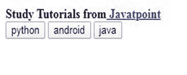

# Cordova 插件振动

> 原文：<https://www.javatpoint.com/cordova-plugin-vibration>

这个插件的主要任务是振动设备。该插件描述了全局对象，如**导航器。振动**，并与 W3C 振动规范 http://www.w3.org/TR/vibration/.保持一致。如果它在全局范围内，该插件在 deviceready 事件之后才可用。

```

document.addEventListener("deviceready", onDeviceReady, false);
function onDeviceReady() {
    console.log(navigator.vibrate);
}

```

**导航器.震动**对象在 **Windows、iOS、安卓**等各种平台都有支持。

### 安装:

如果您想在您的应用程序中添加此插件，您必须通过在命令提示符下键入以下命令来安装它:

```

cordova plugin add cordova-plugin-vibration

```

### Dart

这是一种基于传递的参数由不同功能组成的方法。

### 标准振动

如果您想指定振动设备的时间，您可以通过这一特定功能轻松实现。

您可以使用以下任何语法:

```

navigator.vibrate(time)

```

**或**

```

navigator.vibrate([time])

```

*   **-时间:**指定设备振动的时间，单位为毫秒。

### 示例:

```

// It vibrates the device for 5 seconds
navigator.vibrate(5000);
// It vibrates the device for 5 seconds
navigator.vibrate([5000]);

```

### iOS 怪癖:

*   **时间:**在 iOS 平台的**中，它会振动预设的时间，并忽略用户指定的时间。**

### 示例:

```

navigator.vibrate(5000);  // the time specified by the user i.e. 5000 is being ignored.

```

### Windows 怪癖:

*   **时间:**指最大时间即 **5s** 最小时间即，

### 示例:

```

navigator.vibrate(10000);  // the time specified by the user i.e. 10000 will be truncated to 5000.

```

### 随模式振动(仅适用于安卓和视窗平台):

只有**安卓**和 **Windows** 平台支持。如果您想指定振动设备的模式，可以使用它。

```

navigator.vibrate(pattern);

```

### 参数:

*   **模式:**该参数由一组数字组成**。它由用户指定，由以毫秒表示的持续时间序列组成。该持续时间序列可用于开启或关闭振动。**

### 示例:

```

// Vibrate for 7 second
// Pause for 2 second
// Vibrate for 4 seconds
// Pause for 5 second
// Vibrate for 6 seconds
navigator.vibrate([7000, 2000, 4000, 5000, 6000]);

```

### 取消振动(iOS 平台不支持):

它用于立即消除设备上当前运行的振动。

```

navigator.vibrate(0)

```

或者

```

navigator.vibrate([])

```

或者

```

navigator.vibrate([0])

```

第一个语法定义了我们可以通过参数 0 来消除任何振动。

第二个语法定义了我们可以通过一个空数组来消除任何振动。

第三个语法定义了我们可以传递一个第一个元素值为 0 的空数组来消除任何振动。

### * notification.vibrate(已弃用)

如果您想指定振动设备的时间，您可以使用**通知来轻松完成。振动**。

```

navigator.notification.vibrate(time)

```

### 参数:

*   **时间:**指定设备振动的时间，单位为毫秒。

### 示例:

```

// It vibrates the device for 7.5 seconds
navigator.notification.vibrate(7500);

```

### iOS 怪癖:

*   **时间:**在 iOS 平台的**中，它会振动预设的时间，并忽略用户指定的时间。**

### 示例:

```

navigator.notification.vibrate(); 
navigator.notification.vibrate(7500);   // the time specified by the user i.e. 7500 is being ignored.

```

### *notification .颤音模式(已弃用)

如果您想指定振动设备的模式，您可以使用**通知。振动模式**。

```

navigator.notification.vibrateWithPattern(pattern, repeat);

```

### 参数:

*   **模式:**该参数由一组**数字**组成。它由用户指定，由以毫秒表示的持续时间序列组成。该持续时间序列可用于开启或关闭振动。
*   **重复:**它由一个数字组成，该数字定义了它开始重复的模式数组的可选索引。它将重复，直到被取消。值-1 表示不重复(默认)。

### 示例:

```

// Immediately start vibrating the device
// Vibrate for 200ms,
// Pause for 300ms,
// Vibrate for 400ms,
// Pause for 700ms,
// Vibrate for 900ms,
// Pause for 1100ms,
// do not repeat 
navigator.notification.vibrateWithPattern([0, 200, 300, 400, 700, 900, 1100]);

```

### *通知.取消校准(已弃用)

它用于立即消除设备上当前运行的振动。

```

navigator.notification.cancelVibration()

```

### 代码:

### HTML:

```

<b>Study Tutorials from<a href="https://javatpoint.com/#feat=vibration">Javatpoint</a></b>
<br>
<button onclick="python()">python</button>
<button onclick="android()">android</button>
<button onclick="java()">java</button>

```

### CSS:

```

button {
  margin: 40px 0;
}

```

### JavaScript:

```

function python() {  navigator.vibrate([145,55,145,375,150,265,185,55,145,265,300,500,300,500])
}
function android() { navigator.vibrate([600,240,400,210,300,180,175,120,150,30,500,310,400,150,120,50,200])
}
function java() {
  navigator.vibrate([160,140,120,160,45,75,180,170,180,180,350])
}

```

**输出:**



当你点击以上任何一个按钮，你将被导航到 Javatpoint 的特定网页。

* * *