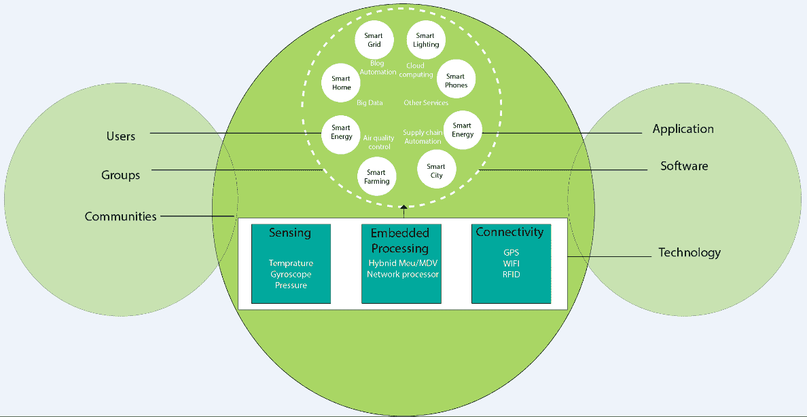

# 物联网生态系统

> 原文：<https://www.javatpoint.com/iot-ecosystem>

物联网生态系统不容易定义。由于其广阔性和新兴的可能性，以及它在整个部门迅速扩张的速度，也很难捕捉到它的恰当形象。然而，物联网生态系统是各种设备的连接，这些设备感知和分析数据，并通过网络相互通信。

在物联网生态系统中，用户使用智能手机、平板电脑、传感器等智能设备。通过网络向设备发送命令或信息请求。设备响应并执行命令，分析后通过网络将信息发送回用户。

下图显示了典型的物联网生态系统，其中智能设备在通过网络和云计算集成的环境中发送和接收来自设备本身的数据。

物联网本身就是一个传输数据的网络设备生态系统。它还与大数据和云计算紧密相连。

*   **感知、嵌入式处理、连接:**物联网生态系统感知其周围环境，如温度、陀螺仪、压力等。并使用设备进行嵌入式处理。这些设备通过任何类型的设备连接，如全球定位系统、无线网络、射频识别等。通过网络。
*   **智能设备和环境、云计算、大数据:**通过智能设备和环境传输或接收的数据通过云计算或其他服务器进行通信，并存储为大数据。
*   **技术、软件、应用:**物联网生态系统使用任何不同的技术、软件和应用与智能设备和环境进行通信和连接。
*   **社区用户或群体:**物联网生态系统产生的产品或服务被用户或社区群体消费，服务于智慧生活。