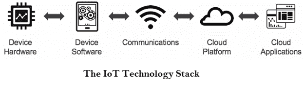
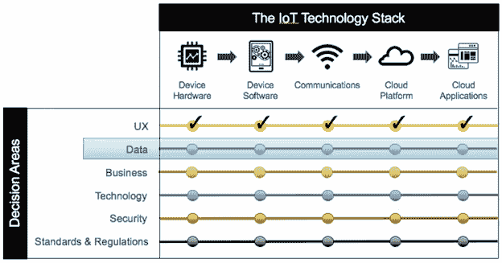

# 物联网决策框架

> 原文：<https://www.javatpoint.com/iot-decision-framework>

物联网决策框架提供了一种结构化的方法来创建强大的物联网产品战略。物联网决策框架是关于战略决策的。物联网决策框架帮助我们了解需要做出决策的领域，并确保我们所有战略业务决策、技术决策等的一致性。

物联网决策框架更为重要，因为通过网络进行通信的产品或服务要经历五个不同的技术复杂性层次。

1.  设备硬件
2.  设备软件
3.  通信
4.  云平台
5.  云应用

## 决策区

物联网决策框架关注任何物联网产品中的六个关键决策领域。这些决策领域是:

1.  用户体验(UX)
2.  数据
3.  商业
4.  技术
5.  安全
6.  标准和法规

每一个决策领域都在每一个物联网技术堆栈中进行评估。用户体验将在设备硬件、设备软件等方面进行评估，以提供更好的用户体验。然后在下一步数据决策领域，我们必须探索物联网技术堆栈所有阶段的数据考虑事项。

物联网决策框架的决策领域

让我们详细看看物联网决策框架的每个决策领域:

1.  **用户体验决策区:**这是我们关注用户是谁，他们的需求是什么，以及如何在物联网堆栈的每一步提供出色的体验，而不用担心技术细节的区域。
2.  **数据决策区:**在这个区域，我们制定了整个物联网堆栈上的数据流等整体数据策略，以满足用户的需求。
3.  **业务决策区:**基于之前的决策区，我们决定产品或服务将如何成为财务潜力。在每一个物联网堆栈级别，都是关于提供服务的成本的货币化。
4.  **技术决策区:**在该区域，我们与每一层的技术合作，以促进最终的解决方案。
5.  **安全决策区:**在完成技术实施后，决定并提供物联网堆栈每个阶段的安全性非常重要。
6.  **标准&法规决策区:**在物联网决策区的最后阶段，我们确定将在物联网堆栈的每一层影响您的产品的产品或服务的标准和法规。