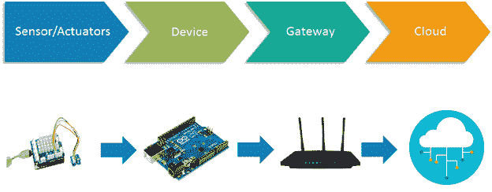
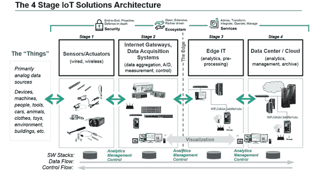

# 物联网架构

> 原文：<https://www.javatpoint.com/iot-architecture-models>

对于普遍定义的物联网架构，并没有这样一个独特或标准的共识。物联网架构与其功能领域和解决方案不同。然而，物联网架构技术主要由四个主要组件组成:

## 物联网架构的组件

*   传感器/设备
*   网关和网络
*   云/管理服务层
*   应用层

## 物联网解决方案架构的各个阶段

基于物联网元素的能力和性能，有几个物联网层，为企业和最终用户提供最佳解决方案。物联网架构是设计物联网各种元素的基本方式，因此它可以通过网络提供服务并满足未来的需求。

以下是为物联网架构提供解决方案的物联网主要阶段(层)。

1.  **传感器/执行器:**传感器或执行器是能够通过网络发射、接受和处理数据的设备。这些传感器或致动器可以通过有线或无线连接。这包括全球定位系统、电化学、陀螺仪、射频识别等。大多数传感器需要通过传感器网关进行连接。传感器或执行器的连接可以通过局域网或个人区域网进行。
2.  **网关和数据采集:**由于大量数据由该传感器和执行器产生，因此需要高速网关和网络来传输数据。该网络可以是局域网类型，如无线网络、以太网等。)，广域网(WAN，如 GSM、5G 等。).
3.  **边缘 IT:** 物联网架构中的边缘是硬件和软件网关，在将数据传输到云中之前，对数据进行分析和预处理。如果从传感器和网关读取的数据没有改变其先前的读取值，则它不会通过云传输，这将保存所使用的数据。
4.  **数据中心/云:**数据中心或云属于管理服务，管理服务通过分析、设备管理和安全控制来处理信息。除了安全控制和设备管理之外，云还将数据传输到终端用户应用程序，如零售、医疗保健、应急、环境和能源等。

