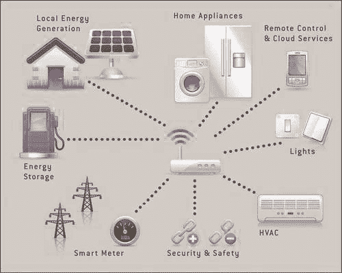
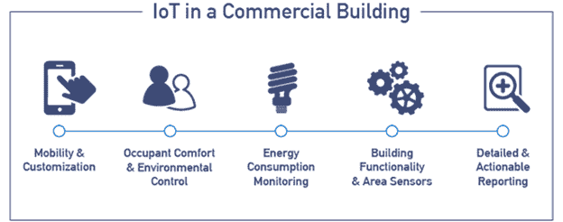

# 物联网能源领域

> 原文：<https://www.javatpoint.com/iot-energy-domain>

**物联网**在能源管理和监管领域发挥着至关重要的作用。用于此的术语是**智能能源系统**。物联网应用监控住宅和商业用途的各种能源控制功能。

## 住宅能源

随着技术的日益进步，它也提高了能源成本。消费者寻找降低和控制能源成本的途径。物联网提供了一种成熟的方法来分析和优化设备以及家庭整个系统的使用。它可能会改变设备设置，简单地打开/关闭或调暗灯光以优化能源使用。

## 商品能源

能源的浪费广泛地影响着任何商业企业的生产成本。物联网为监控和保持低成本和高水平的护理提供了一种特定的方式。物联网系统为管理能源消耗成本、优化企业产出提供了强有力的手段。它发现能源问题的方式与复杂业务网络中的功能问题相同，并提供解决方案。

## 可靠性

物联网技术通过分析和行动来确保系统的可靠性。它检测系统性能和稳定性的威胁，防止设备损坏、停机和人员受伤等损失。