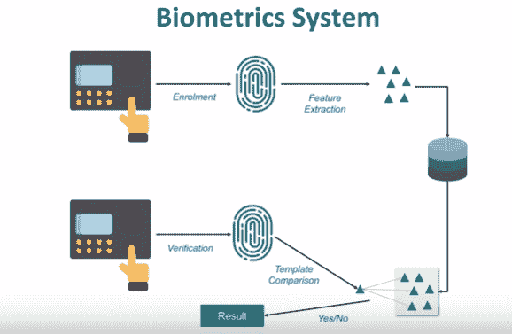

# 物联网生物识别领域

> 原文：<https://www.javatpoint.com/iot-biometric-domain>

物联网在指纹系统、语音识别系统、眼睛扫描系统等生物识别安全系统中起着至关重要的作用。

现在，生物识别系统是我们在日常生活中经常遇到的东西。我们总是使用指纹传感器或眼睛扫描系统，这取决于不同的组织。

让我们谈谈指纹扫描仪系统以及这些系统是如何工作的。现在，当一个人将手指放在指纹扫描仪上时，它会扫描指纹，并将其视为注册过程的一部分。从这个指纹模板中，设备提取出某些与众不同的关键特征，并将其存储到数据库中。此后，每当同一个人将手指放在指纹扫描仪的顶部时，它都会创建一个模板，并将其与数据库中的所有模板进行比较。如果它与相应的，比如说给那个人一个出席或者允许他进入一扇门相匹配，如果它不匹配，那么它会发出警报。

该生物识别系统可以是指纹或眼睛扫描，也可以是两者的结合。语音识别系统也是生物识别领域的关键产品之一。