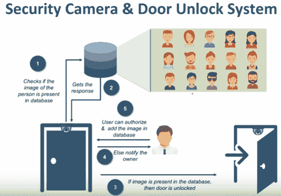

# 物联网在安全摄像头和车门解锁系统中的应用

> 原文：<https://www.javatpoint.com/iot-security-camera-and-door-unlock-system>

安全摄像头和车门解锁系统是非常有趣的物联网应用。这里简要地提到它的工作过程的现象。

## 这个系统是如何工作的？

在这里，我们把一个相机放在门的上脚，然后点击进入框架的人的照片。现在，这张照片被发送到一个分析系统，该系统再将其与它所拥有的所有照片进行比较，以确定是否让用户开门。

现在，如果它没有找到那个人的照片，那么它可以通知关注者有人试图进入这个门，你想授权这个人吗？还是要拒绝此人访问？

通常，安全摄像头和车门解锁系统用于存储高度敏感信息的区域。当我们想确定谁在我们不在家时来到我们家，并决定是否让他们进入我们的家时，安全摄像头和门解锁系统的另一个用途可以是在我们家。