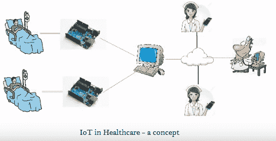

# 医疗保健中的物联网

> 原文：<https://www.javatpoint.com/iot-healthcare>

物联网技术在医疗保健领域带来了众多应用，从远程监控到智能传感器，再到医疗设备集成。它保证了病人的安全和健康，也提高了医生对病人的护理。

医疗保健设备从大量真实案例中收集各种数据，提高了医疗数据的准确性和规模。

* * *

## 影响物联网医疗应用因素

影响物联网医疗应用的因素有很多。下面提到其中一些:

*   **持续研究:**要求在各个领域(智能设备、快速通信通道等)持续研究。)为患者提供更快更好的设施。
*   **智能设备:**需要在医疗保健系统中使用智能设备。物联网开启了当前技术的潜力，引领我们走向新的、更好的医疗设备解决方案。
*   **更好的护理:**利用物联网技术，医护人员获取患者的海量数据，对数据进行分析，便于对患者进行更好的护理。
*   **医疗信息分发:**物联网技术使信息透明化，将准确、最新的信息分发给患者。这导致沟通不畅导致的事故减少，更好的预防护理，以及患者满意度的提高。

* * *

## 简单的医疗保健系统架构

物联网在医疗保健中的应用使其变得更加智能、快速和准确。医疗保健领域有不同的物联网架构，启动了医疗保健系统。

**产品基础设施:**硬件/软件组件等物联网产品基础设施读取传感器信号并显示到专用设备。

**传感器:**医疗保健中的物联网有不同的传感器设备，如脉搏血氧仪、心电图、温度计、液位传感器、血压计(血压)，它们读取当前患者的情况(数据)。

**连接性:**物联网系统提供更好的连接性(使用蓝牙、WiFi 等)。)从微控制器到服务器的设备或传感器，反之亦然，以读取数据。

**分析:**医疗保健系统分析来自传感器的数据并进行关联，以获得患者的健康参数，并根据其分析数据来升级患者健康。

**应用平台:**物联网系统可通过医疗保健专业人员的监控设备，为所有患者提供所有详细信息。

* * *

## 医疗保健领域的物联网挑战

*   数据安全和隐私
*   集成:多种设备和协议
*   数据霸主&准确性
*   费用