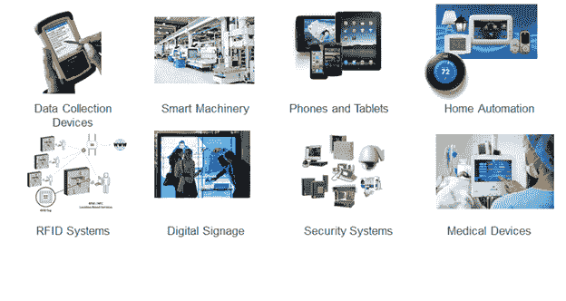

# 物联网中的智能对象是什么

> 原文：<https://www.javatpoint.com/iot-smart-objects>

物联网中的智能概念用于主动的、数字化的、网络化的、能够在一定程度上自主操作的、可重新配置的并且对资源具有本地控制的物理对象。智能物体需要能量、数据存储等。

一个**智能对象**是一个增强与其他智能对象以及人的交互的对象。物联网的世界是互联的异构对象(如智能设备、智能对象、传感器、执行器、RFID、嵌入式计算机等)的网络。)可唯一寻址并基于标准通信协议。

在日常生活中，人们有很多与互联网或无线或有线连接的对象。例如:

*   智能手机
*   药片
*   电视计算机

这些物体可以相互连接，方便我们的日常生活(智能家居、智能城市)，无论情况、位置、传感器的可及性、大小、场景或危险风险如何。

智能物体被广泛用于利用物联网技术将我们周围的物理环境转变为数字世界。

一个智能对象带有应用程序逻辑块，这些逻辑块对它们的本地情况有意义，并与人类用户交互。智能对象感知、记录和解释自身和环境中的事件，并相互交流和与人交换信息。

智能对象的工作集中在技术方面(如软件基础设施、硬件平台等)。)和应用场景。应用领域从供应链管理和企业应用(家庭和医院)到医疗保健和工业工作场所支持。至于智能对象技术的人机界面方面，刚刚开始受到环境的关注。