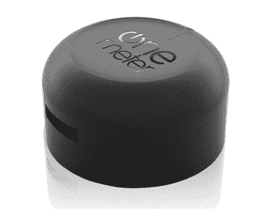

# 物联网设备

> 原文：<https://www.javatpoint.com/iot-devices>

物联网设备是非标准设备，它们通过无线方式相互连接到网络，并能够传输数据。物联网设备正在扩大互联网连接，超越智能手机、笔记本电脑、平板电脑和台式机等标准设备。将这些设备嵌入技术，使我们能够通过网络进行通信和交互，并且可以远程监控和控制它们。

基于 IEEE 802.15.4 标准的物联网设备种类繁多。这些设备从无线微尘、可连接传感器板到对研究人员和开发人员有用的接口板。

物联网设备包括计算机设备、软件、无线传感器和执行器。这些物联网设备通过互联网连接，能够在无人干预的情况下自动在物体或人之间传输数据。

一些常见和流行的物联网设备如下所示:

## Arduino 设备:

Arduino 设备是用于构建数字设备的微控制器和微控制器套件，这些设备可以感知和控制物理和数字世界中的对象。Arduino 电路板配有一组数字和模拟输入/输出引脚，可以与各种其他电路接口。一些 Arduino 板包括用于从个人计算机加载程序的通用串行总线。

## 英特尔伽利略:

英特尔伽利略第二代主板包括英特尔夸克系统芯片处理器、256 兆内存、多个端口和对 Arduino 设备的支持等部分。

## 三星齿轮配合:

三星齿轮冷杉设备是一种防尘、防水的设备，具有健身跟踪器功能、弯曲显示器和长效电池。这款设备接收电子邮件和短信提醒，并与三星的 S Health 应用程序集成。

## 传感器:

传感器是读取周围温度、湿度、光线、空气质量控制等的设备。有不同类型的传感器可以读取不同类型的数据。传感器通过网络或通过网络连接来传输这些数据。

## 蓝牙低能量(BLE)智能信标:

蓝牙低能量信标装置用于实时跟踪定位的物体。许多公司使用它来实时跟踪员工、资产、患者等的位置。这项服务主要侧重于制造、零售和医疗保健服务。

## 物联网设备的属性

物联网设备的一些基本属性如下:

*   **Sense:** 以温度、运动、事物外观等形式感知其周围环境的设备。
*   **发送和接收数据:**物联网设备能够通过网络连接发送和接收数据。
*   **分析:**设备能够分析通过互联网从其他设备接收的数据。
*   **受控:**物联网设备也可以从某个端点进行控制。否则，物联网设备本身无休止地相互通信会导致系统故障。