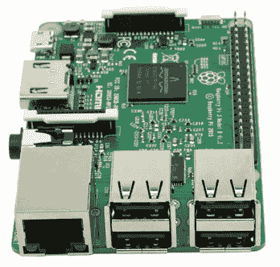
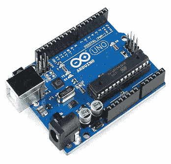
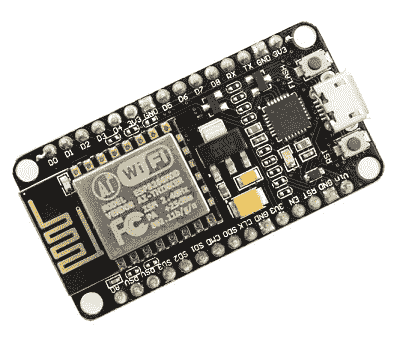
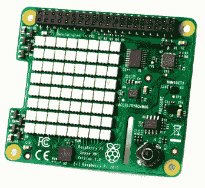
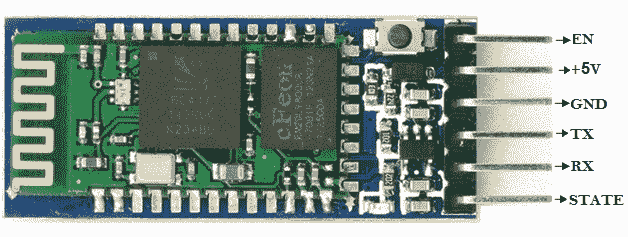

# 市场上的主要物联网板

> 原文：<https://www.javatpoint.com/major-iot-boards-in-market>

市场上有几种物联网板可用于构建该项目。一些主要的物联网板描述如下:

## 覆盆子皮:

树莓皮是构建物联网项目中非常流行的设备。最近推出的树莓 Pi 3 包括内置的 WiFi 和蓝牙，使最紧凑和独立的计算机。它提供了一个强大的环境来安装各种编程包，如 Python、Node.js、LAMP 堆栈、Java 等等。使用 40 个 GPIO 引脚和四个通用串行总线端口，您可以将许多外围设备和附件连接到 Pi。

* * *

## Arduino:

Arduino 板是微控制器和微控制器套件，用于构建数字设备，这些设备可以感知和控制物理和数字世界中的对象。Arduino 电路板配有一组数字和模拟输入/输出引脚，可以与各种其他电路接口。一些 Arduino 板包括 USB(通用串行总线)来从个人计算机加载程序。

* * *

## ESP8266:

ESP8266 是一款低成本的 Wi-Fi 微芯片，具有 32 位微控制器功能、标准数字外设接口。有不同类型的 ESP8266 板可用于不同的需求。该板的主要目标是通过 AT 命令处理内置的 Wifi(如果用作设备模块)，但是您可以使用 Arduino 板“编程”，但是它也读取和控制输入/输出，数字和模拟。

* * *

## Sense HAT 8x8 RGB LED 矩阵:

树莓 Pi Sense HAT 是一种集成传感器，可以测量湿度、温度、加速度和压力。8x8 LED 矩阵显示从树莓 Pi Sense HAT 传感器读取的数据。传感帽有一个 88 RGB 发光二极管矩阵，包括以下传感器:

1.  陀螺仪
2.  加速计
3.  磁力计
4.  温度
5.  大气压
6.  湿度

* * *

## 蓝牙模块 HC-05:

蓝牙模块 HC-05 设备是一个 6 针蓝牙设备，用于无线通信。通常，这种设备使用短程无线连接来连接手机、掌上电脑和电视等小型设备，以交换数据。它使用串行端口(USART)与微控制器通信。

## Pin 描述

*   **EN:** 是使能引脚，当连接到 3.3V 时，模型使能。
*   **+5V:** 这是连接+5V 的电源引脚。
*   **GND:** 是接地引脚。
*   **TX:** 是 UART 通信的发送器引脚。
*   **RX:** 是 UART 通信的接收器引脚。
*   **状态:**表示模块是否连接。它充当状态指示器。

